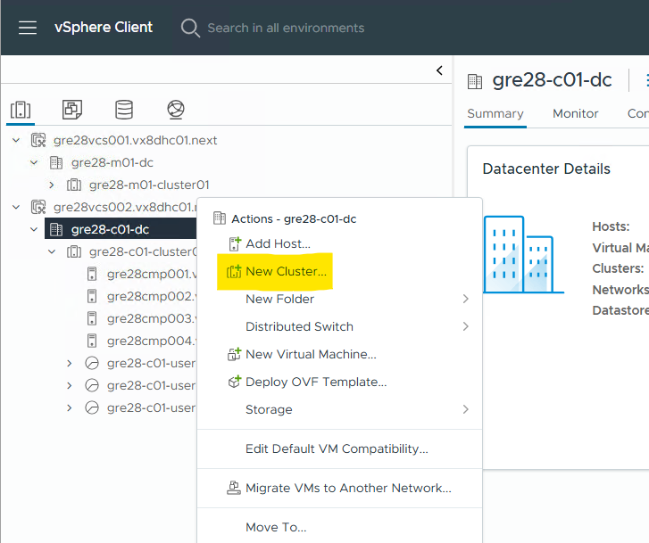
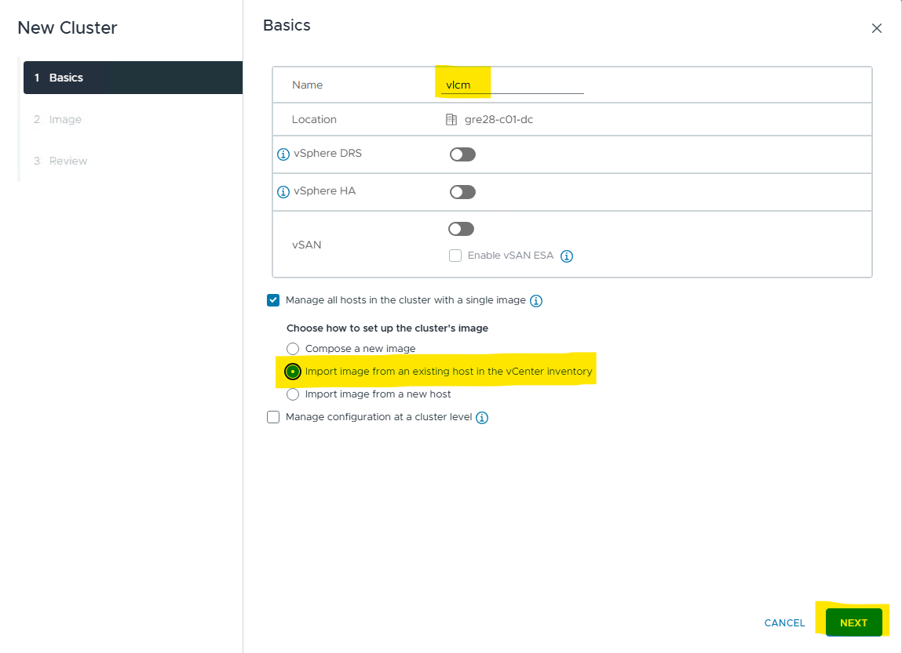
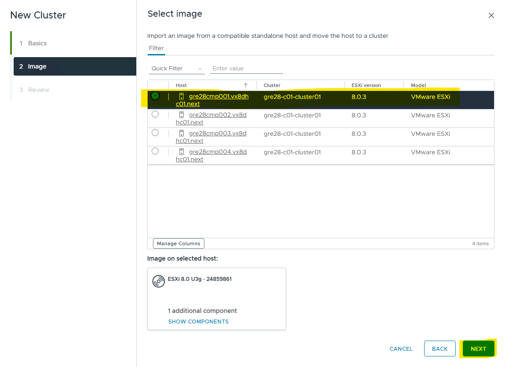
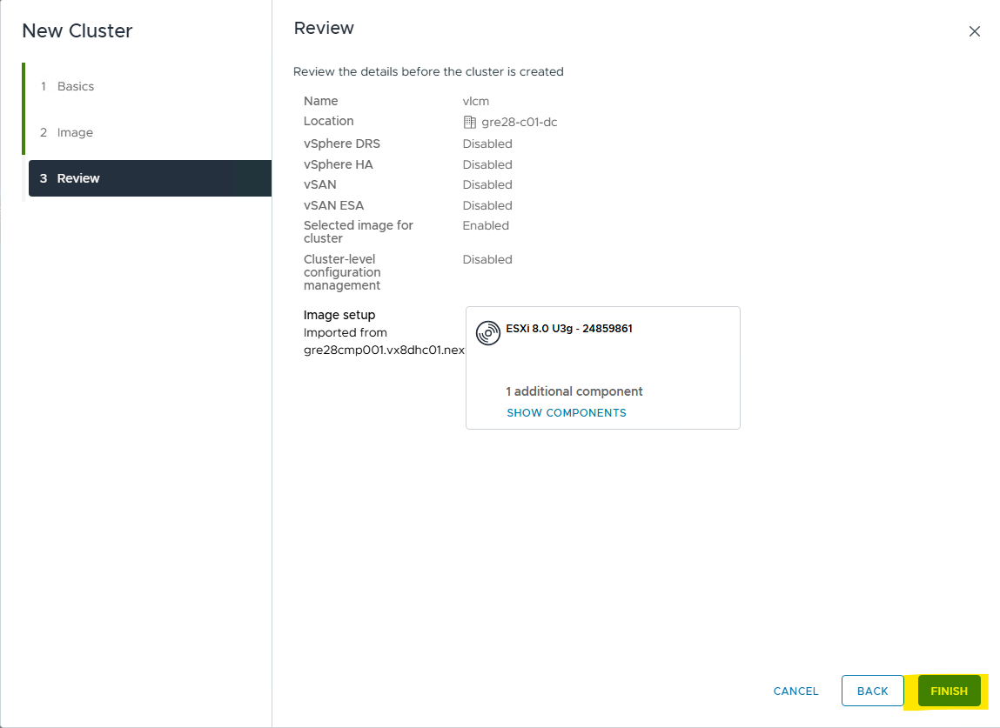
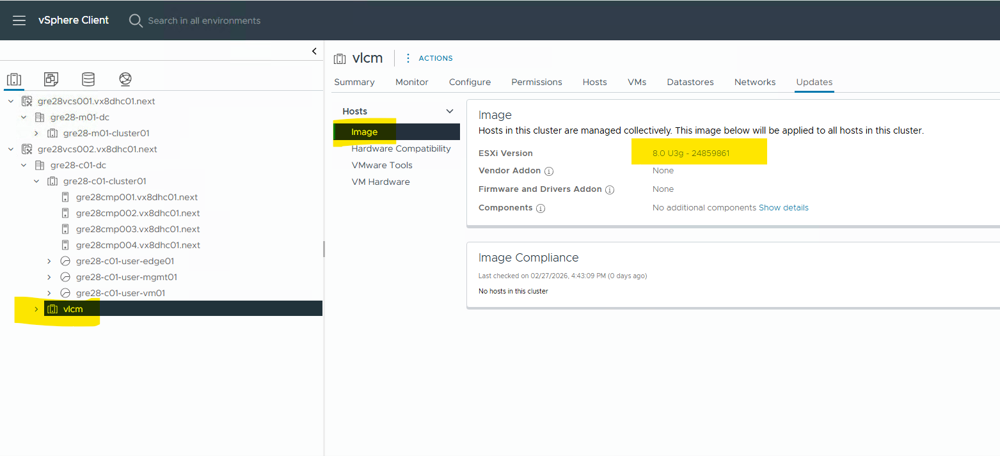
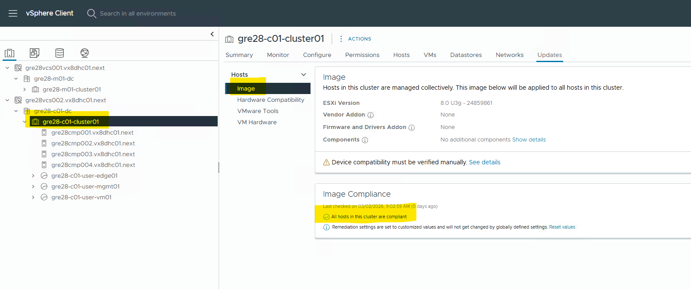

# List of Changes
  
| Version | Date       | Description      | Author       |
| ------- | ---------- | ---------------- | -------------|
| 0.1     | 27.02.2026 | First version    | Lukasz Tomaszewski |
| 0.2     | 13.03.2026 | Minor updates    | Lukasz Tomaszewski |

## Introduction

### Purpose

Transition to vSphere Lifecycle Manager Images Using the PowerShell Script Command-Line Interface.

### Audience

- DHC Operations

### Scope

- Execute Ansible prerequisite script
- Create temporary cluster with image imported from the host
- Execute PowerShell script to transit from VUM to vLCM

### Related Documents

<https://techdocs.broadcom.com/us/en/vmware-cis/vcf/vcf-5-2-and-earlier/5-2/vmware-cloud-foundation-lifecycle-management/vlcm-baseline-to-vlcm-image-cluster-transition-522-lifecycle/prerequisites-for-transitioning-to-vsphere-lifecycle-manager-images-522-lifecycle.html>

<https://techdocs.broadcom.com/us/en/vmware-cis/vcf/vcf-5-2-and-earlier/5-2/vmware-cloud-foundation-lifecycle-management/vlcm-baseline-to-vlcm-image-cluster-transition-522-lifecycle/transition-vlcm-baseline-clusters-to-vlcm-image-clusters-using-powercli-522-lifecycle/transition-to-vsphere-lifecycle-manager-images-using-the-powershell-script-command-line-interface-522-lifecycle.html>

### Prerequisites

Transitioning from vSphere Lifecycle Manager Baselines to vSphere Lifecycle Manager Images by using a PowerShell script is supported with VMware Cloud Foundation 5.2.2 and later.

ESXi servers running legacy BIOS are encouraged to move to UEFI. If Legacy boot is detected during transition pre checks, you will be asked to move to UEFI. Please refer to KB 84233 for more details. Please check it earlier so the transition process will go smoother.

### Important Considerations

You cannot combine the process of transitioning to vSphere Lifecycle Manager images with the process of upgrading ESX.

During the transition process, you cannot perform any other operations on the cluster or their underlying hosts until the transition is complete. This includes, but is not limited to ESX password rotation.

Please note that vSphere Supervisor (Workload Management) enabled clusters are not supported by VCF 5.2.2

### Transition procedure

#### Prepare environment

1. Run ansible playbook which prepares an environment for further operations.

   These operations are common for transition management and workload clusters.

   This playbook:

   - installs required PowerShell module

   - downloads VcfBaselineClusterTransition script

   - prepares script inputs

   Execute:

   ```bash
   cd /opt/dhc/update
   ansible-playbook prepareVumToVlcmInputs.yml
   ```

2. Create temporary cluster with image imported from existing host.

   This cluster will be automatically removed by PowerShell transition script once the process is successful.

   Execute on each cluster you need to convert. It is recommended to create one cluster per datacenter per transition script run. So if you're going to convert management cluster, first create that cluster on management datacenter.

   - Login to vCenter server.

   - In the Inventory view right click on Datacenter (in management or workload vCenter) and select "New Cluster...".
   

   - In the "New Cluster" wizard "Basics" step provide a cluster name (for example: workload_vlcm) and select "Import image from an existing host in the vCenter inventory". Click "Next".
   

   - In the "Image" step select first displayed host. Click "Next".
   

   - In the "Review" step click "Finish".
   

   - New cluster will be created with attached image.
   

#### VUM to vLCM transition using VcfBaselineClusterTransition.ps1 script

NOTE: If a second cluster is being transitioned to an image, steps 1-9 can be omitted. At this point, the temporary cluster should already be created and the image should be in the SDDC manager. The only remaining task is to transition the other cluster (management or VI, depending on which was done first). Note that if the transition process is not done for all clusters at the same time, step 5 (connection to vCenter) must be repeated when transitioning the second cluster.

1. Login to Ansible host VM.
2. Change directory to /tmp/VcfBaselineClusterTransition.

3. Run PowerShell:

   ```bash
   sudo pwsh
   ```

4. Set ParticipateInCEIP to false. When asked for performing operation accept defaults.

   ```bash
   PS /tmp/VcfBaselineClusterTransition> Set-PowerCLIConfiguration -Scope User -ParticipateInCEIP $false
   ```

   Response

   ```console
   Perform operation?
   Performing operation 'Update VCF.PowerCLI configuration.'?
   [Y] Yes  [A] Yes to All  [N] No  [L] No to All  [S] Suspend  [?] Help (default is "Y"): Y

   Scope    ProxyPolicy     DefaultVIServerMode InvalidCertificateAction  DisplayDeprecationWarnings WebOperationTimeout
                                                                                                     Seconds
   -----    -----------     ------------------- ------------------------  -------------------------- -------------------
   Session  UseSystemProxy  Multiple            Ignore                    True                       300
   User                     Multiple            Ignore
   AllUsers
   ```

5. Connect to SDDC Manager and vCenter servers. Execute VcfBaselineClusterTransition.ps1 script. When asked "Working with multiple default servers?" accept defaults.

   ```bash
   PS /tmp/VcfBaselineClusterTransition> ./VcfBaselineClusterTransition.ps1 -Connect -JsonInput ./Samples/SddcManagerCredentials.json
   ```

   Response

   ```console
   [INFO] Detected JSON input file "./Samples/SddcManagerCredentials.json".

   [INFO] Successfully connected to SDDC Manager "gre28sdm001.vx8dhc01.next".

   [INFO] Preparing to connect to vCenter(s)...

   [INFO] Successfully connected to vCenter "gre28vcs001.vx8dhc01.next".

   Working with multiple default servers?

       Select [Y] if you want to work with more than one default servers. In this case, every time when you connect to a different server using
   Connect-VIServer, the new server connection is stored in an array variable together with the previously connected servers. When you run a cmdlet and the
    target servers cannot be determined from the specified parameters, the cmdlet runs against all servers stored in the array variable.
       Select [N] if you want to work with a single default server. In this case, when you run a cmdlet and the target servers cannot be determined from
   the specified parameters, the cmdlet runs against the last connected server.

       WARNING: WORKING WITH MULTIPLE DEFAULT SERVERS WILL BE ENABLED BY DEFAULT IN A FUTURE RELEASE. You can explicitly set your own preference at any
   time by using the DefaultServerMode parameter of Set-PowerCLIConfiguration.

   [Y] Yes  [N] No  [S] Suspend  [?] Help (default is "Y"): Y
   [INFO] Successfully connected to vCenter "gre28vcs002.vx8dhc01.next".
   ```

6. Display baseline clusters. Execute VcfBaselineClusterTransition.ps1 script.

   ```bash
   PS /tmp/VcfBaselineClusterTransition> .\VcfBaselineClusterTransition.ps1 -ShowBaselineClusters
   ```

   Response

   ```console
   [INFO] Scanning for vLCM baseline (VUM) managed clusters...

   [INFO] vLCM Baseline (VUM) Managed Clusters:

     Cluster Name        vCenter Name              Workload Domain    Compliance Status SDDC Manager Image Name
     ------------        ------------              ---------------    ----------------- -----------------------
     gre28-m01-cluster01 gre28vcs001.vx8dhc01.next gre28-m01          NOT_CHECKED_YET   N/A
     gre28-c01-cluster01 gre28vcs002.vx8dhc01.next vx8-gre28-c01      NOT_CHECKED_YET   N/A
   ```

7. Display available vLCM images. Execute VcfBaselineClusterTransition.ps1 script.

   ```bash
   PS /tmp/VcfBaselineClusterTransition> .\VcfBaselineClusterTransition.ps1 -ShowImagesInVcenter
   ```

   Response

   ```console
   [INFO] Scanning vCenter(s) for vLCM images...

   [INFO] vLCM images in attached vCenter(s):

     vCenter Image Name vCenter Name
     ------------------ ------------
     vlcm               gre28vcs002.vx8dhc01.next
   ```

8. Import vSphere Lifecycle Manager images into SDDC Manager from connected vCenter instances. Execute VcfBaselineClusterTransition.ps1 script.

   Provide `VcenterImageName` and `VcenterName` parameters taken from previous step (task 7) output.

   ```bash
   PS /tmp/VcfBaselineClusterTransition> .\VcfBaselineClusterTransition.ps1 -ImportImagesFromVcenter -VcenterImageName vlcm -VcenterName gre28vcs002.vx8dhc01.next
   ```

   Response

   ```console
   [INFO] Beginning import of vCenter vLCM image "vlcm" into SDDC Manager "gre28sdm001.vx8dhc01.next"...
   Image import in progress [19 seconds elapsed (updates every 5 seconds).                                              ]
   ```

   Response once completed

   ```console
   [INFO] Beginning import of vCenter vLCM image "vlcm" into SDDC Manager "gre28sdm001.vx8dhc01.next"...

   [INFO] Successfully created SDDC Manager image "vlcm" into SDDC Manager "gre28sdm001.vx8dhc01.next"
   [INFO] Safety check passed - No ESX hosts detected in cluster "vlcm" in vCenter "gre28vcs002.vx8dhc01.next".
   [INFO] Deleted cluster "vlcm" in vCenter "gre28vcs002.vx8dhc01.next".
   ```

9. Review the images available in SDDC Manager. Execute VcfBaselineClusterTransition.ps1 script.

   ```bash
   PS /tmp/VcfBaselineClusterTransition> ./VcfBaselineClusterTransition.ps1 -ShowImagesInSddcManager
   ```

   Response

   ```console
   [INFO] vLCM images available in SDDC Manager "gre28sdm001.vx8dhc01.next":

   SDDC Manager Image Name   Base Image                      Components                      Addons                          Hardware Support
   -----------------------   ----------                      ----------                      -------                         ----------------
   vlcm                      8.0.3-24859861                  N/A                             N/A                             N/A
   ```

10. Check vSphere Lifecycle Manager baseline managed vSphere clusters for compliance with a vSphere Lifecycle Manager image. Execute VcfBaselineClusterTransition.ps1 script.

    Provide `ClusterName`, `WorkloadDomainName` and `SddcManagerImageName` parameters taken from previous steps (tasks 6 and 7) output.

    ```bash
    PS /tmp/VcfBaselineClusterTransition> .\VcfBaselineClusterTransition.ps1 -ComplianceCheck -ClusterName gre28-c01-cluster01 -WorkloadDomainName vx8-gre28-c01 -SddcManagerImageName vlcm
    ```

    Response

    ```console
    [INFO] Please wait while cluster "gre28-c01-cluster01" in workload domain "vx8-gre28-c01" is checked against image "vlcm"...
    Cluster compatibility check in progress [21 seconds elapsed (updates every 5 seconds).                               ]
    ```

    Example of a compliance check against a vSphere cluster with a specified vLCM image once completed.

    ```console
    [INFO] Please wait while cluster "gre28-c01-cluster01" in workload domain "vx8-gre28-c01" is checked against image "vlcm"...

    [INFO] Check image compliance of cluster gre28-c01-cluster01 completed successfully.
    WARNING: Resulting JSON is truncated as serialization has exceeded the set depth of 2.

    [INFO] Cluster "gre28-c01-cluster01" in Workload Domain "vx8-gre28-c01" has status "NON_COMPLIANT".

    [WARNING] Remediation is required.

    [INFO] Summary of compatibility check cluster "gre28-c01-cluster01" in Workload Domain "vx8-gre28-c01" against image "vlcm"

      Component Name Component Vendor Version Change Impact                    Severity Message
      -------------- ---------------- -------------- ------                    -------- --------
      N/A            N/A              No             MAINTENANCE_MODE_REQUIRED WARNING  The following VIBs on the host are missing from the image and will
                                                                                        be removed from the host during remediation:
                                                                                        vmware-fdm(8.0.3-24853646).
      -------------------------------------------------------------------------------------------------------------------------------------------------------
      N/A            N/A              No             N/A                       WARNING  These hosts have standalone vibs installed which may get removed on
                                                                                        remediating: gre28cmp001.vx8dhc01.next, gre28cmp002.vx8dhc01.next,
                                                                                        gre28cmp003.vx8dhc01.next, gre28cmp004.vx8dhc01.next. Review their
                                                                                        compliance details carefully before proceeding.
      -------------------------------------------------------------------------------------------------------------------------------------------------------
      N/A            N/A              No             MAINTENANCE_MODE_REQUIRED INFO     None
      -------------------------------------------------------------------------------------------------------------------------------------------------------
      NSX LCP Bundle VMware           Yes            MAINTENANCE_MODE_REQUIRED INFO     Components NSX LCP Bundle are removed in the image. They will be
                                                                                        removed from the host during remediation.
      -------------------------------------------------------------------------------------------------------------------------------------------------------
      N/A            N/A              No             MAINTENANCE_MODE_REQUIRED INFO     Quick Boot is supported on the host.
      -------------------------------------------------------------------------------------------------------------------------------------------------------
      N/A            N/A              No             MAINTENANCE_MODE_REQUIRED INFO     The host will be placed in maintenance mode before remediation.
      -------------------------------------------------------------------------------------------------------------------------------------------------------

    [INFO] Full compliance findings stored for cluster "gre28-c01-cluster01" in Workload Domain "vx8-gre28-c01" have been saved to /tmp/VcfBaselineClusterTransition/logs/cluster-compatibility-for-gre28-c01-cluster01-on-vx8-gre28-c01-with-vlcm.json
    ```

    Review the compliance findings to determine if a vSphere cluster is ready to be transitioned. Resolve any issues for vSphere clusters with a status of INCOMPATIBLE or UNKNOWN.

    Attention:
    You can safely ignore the following compliance check findings:
    Components NSX LCP Bundle are removed in the image. They will be removed from the host during remediation.
    The following VIBs on the host are missing from the image and will be removed from the host during remediation vmware-fdm (<ESX version>).
    This component and VIBs are managed by VMware solutions, NSX and vCenter HA, respectively, and not part of the vSphere Lifecycle Manager image. When the hosts are rebooted, the appropriate packages are re-added.
    Any other VIBs that are removed from the image must be reconciled.

11. Convert cluster from VUM baseline to vLCM image. Execute VcfBaselineClusterTransition.ps1 script.

    Provide `ClusterName` and `WorkloadDomainName` parameters taken from previous step (task 6) output.

    ```bash
    PS /tmp/VcfBaselineClusterTransition> ./VcfBaselineClusterTransition.ps1 -TransitionCluster -ClusterName gre28-c01-cluster01 -WorkloadDomainName vx8-gre28-c01
    ```

    Response

    ```console
    [INFO] Preparing for cluster transition(s)...

    [INFO] Beginning vLCM image transition for cluster "gre28-c01-cluster01" in Workload Domain "vx8-gre28-c01".
    Completed step 6 of 43        [Processing: Check base image availability in vCenter depot                            ]
    Cluster transition in progress [6 seconds elapsed (updates every 5 seconds).                                         ]
    ```

    Example of a cluster transition once completed.

    ```console
    [INFO] Preparing for cluster transition(s)...

    [INFO] Beginning vLCM image transition for cluster "gre28-c01-cluster01" in Workload Domain "vx8-gre28-c01".
    [INFO] Cluster "gre28-c01-cluster01" in Workload Domain "vx8-gre28-c01" has been successfully converted to vLCM image management.

    [INFO] Full details of the transition written to /tmp/VcfBaselineClusterTransition/logs/VcfBaselineClusterTransition-03-02-2026.log.

    ```

12. Disconnect from SDDC Manager and all vCenter instances and exit PowerShell. Execute VcfBaselineClusterTransition.ps1 script.

    ```bash
    PS /tmp/VcfBaselineClusterTransition> ./VcfBaselineClusterTransition.ps1 -Disconnect
    PS /tmp/VcfBaselineClusterTransition> exit
    ```

13. Check if cluster has been converted to image based and if all hosts in the cluster are compliant with an image.

    - In the vCenter Inventory view click on the cluster you've been converting and click "Updates" tab.
    

14. Remove directory with script content.

    Once you confirm all clusters have been successfully converted, please remove directory with script content. Execute on ansible host:

    ```bash
    sudo rm -R /tmp/VcfBaselineClusterTransition/
    ```
