# Velero Backup

- [Velero Backup](#velero-backup)
  - [Changelog](#changelog)
  - [Introduction](#introduction)
    - [Purpose](#purpose)
    - [Audience](#audience)
    - [Scope](#scope)
    - [1.4 Requirement](#14-requirement)
  - [2 Setting up MinIO as object storage](#2-setting-up-minio-as-object-storage)
    - [2.1 Initial-Setup](#21-initial-setup)
    - [2.2 Installation and enabling minio service](#22-installation-and-enabling-minio-service)
    - [2.3 Creation of Bucket](#23-creation-of-bucket)
  - [3 Install and Configure the Velero plugin for vsphere](#3-install-and-configure-the-velero-plugin-for-vsphere)
    - [3.1 Downloading the plugins required for velero backup and restore](#31-downloading-the-plugins-required-for-velero-backup-and-restore)
  - [3.2 Create a Dedicated Network for Backup and Restore Traffic](#32-create-a-dedicated-network-for-backup-and-restore-traffic)
    - [3.3 Install and Configure Data Manager](#33-install-and-configure-data-manager)
    - [3.4 Install the Velero-vsphere-operator service on Supervisor Cluster](#34-install-the-velero-vsphere-operator-service-on-supervisor-cluster)
    - [3.5 Install the Velero CLI tools on Jump host](#35-install-the-velero-cli-tools-on-jump-host)
    - [3.6 Installation of Velero on Supervisor Cluster](#36-installation-of-velero-on-supervisor-cluster)
      - [VALIDATION](#validation)
      - [Validation](#validation-1)
    - [4.2 Performing the Restore using Velero](#42-performing-the-restore-using-velero)
      - [Validation](#validation-2)

## Changelog

 |    Date    |  TOS   | Issue   | Author | Description |
 |------------|---------|-----------|--------|--------|
 | 09.01.2023 |  VCS 1.7   |   CESDHC-5479     | Aamod Aithal KB | Perform backup for Tanzu using Velero|

## Introduction

### Purpose

Backup and restore the Tanzu resources using Velero tool.

### Audience

- VCS Operations
- VCS Engineers

### Scope

This document covers the steps to set up the Velero to perform backup and restore operations on target Tanzu clusters.

### 1.4 Requirement

A Tanzu-ready environment should be ready and available with all the required configuration.

## 2 Setting up MinIO as object storage

MinIO offers high-performance, S3 compatible object storage. Native to Kubernetes, MinIO is the only object storage suite available on every public cloud, every Kubernetes distribution, the private cloud and the edge. MinIOis software-defined and is 100% open source under GNU AGPL v3 license.

### 2.1 Initial-Setup

The ability to store multiple workload backups requires a Linux VM with enough storage. On this VM, MinIO will be installed. Thus, one Linux virtual machine needs to be created for the MINO configuration.

- Create a VM from the linux template.

- Select the workload datacenter folder.

- Choose the cluster as the compute cluster.

- Select vSAN as the datastore type.

- Select the same network adapter that your Tanzu Jump host is using.

- Click Finsh

- Within the first nine IPs of the VLAN designated for the supervisor cluster, assign the minio server VM the freely available IP. (For instance, if your Tanzu Jump host (tkg001) is 172.22.137.7, give the Minio server 172.22.137.8 as its IP).

   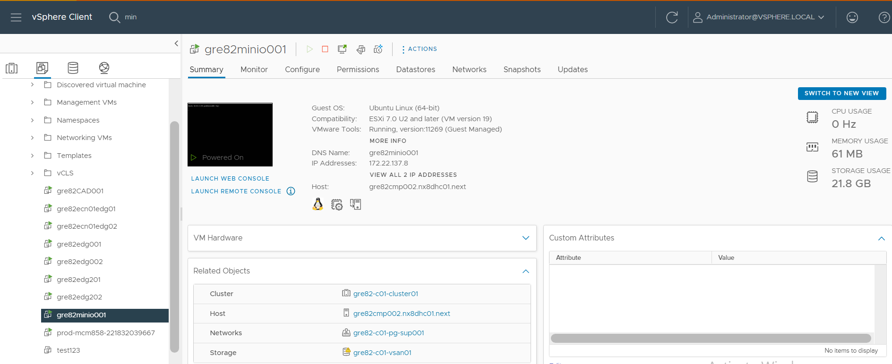

### 2.2 Installation and enabling minio service

- SSH into the Linux VM selected for Minio Server using the credentials for the `next` user from the Linux template from which the VM was deployed, and then execute the commands listed below to install and setup the Minio Service.

- Download the Minio server’s binary file

   ```shell
   curl -O https://dl.minio.io/server/minio/release/linux-amd64/minio
   ```

You can also download the file from <https://dl.minio.io/server/minio/release/linux-amd64/minio> and copy it to the MinIO host(/home/next) via winscp.

- A file named `minio` will be downloaded into your working directory. Make it executable

   ```shell
   sudo chmod +x minio
   ```

- Move the file into the `/usr/local/bin` directory where Minio’s systemd startup script expects to find it:

   ```shell
   sudo mv minio /usr/local/bin
   ```

- For security reasons, we don’t want to run the Minio server as `root`. And, since the systemd script we’ll use `minio.service` looks for a user account and group called `minio-user`, let’s create them now.

   ```shell
   sudo useradd -r minio-user -s /sbin/nologin
   ```

- Change ownership of the binary to minio-user

   ```shell
   sudo chown minio-user:minio-user /usr/local/bin/minio
   ```

- Next, we need to create a directory where Minio will store files. This will be the storage location for the buckets you’ll create in future step.

   ```shell
   sudo mkdir /usr/local/share/minio
   ```

- Give ownership of that directory to `minio-user`

   ```shell
   sudo chown minio-user:minio-user /usr/local/share/minio
  ```

- The `/etc` directory is the most common location for server configuration files, so we’ll create a place for Minio there.

   ```shell
   sudo mkdir /etc/minio
   ```

- Give ownership of that directory to `minio-user`, too:

   ```shell
   sudo chown minio-user:minio-user /etc/minio
   ```

- Use nano or your favorite text editor to create the environment file needed to modify the default configuration

   ```shell
   sudo nano /etc/default/minio
   ```

- And, add the following variables. Make sure you replace `your-server-ip` with minio server IP.

   ```shell
   MINIO_VOLUMES="/usr/local/share/minio/"
   MINIO_OPTS="-C /etc/minio --address your-server-ip:9000"
   ```

`MINIO_VOLUMES`: Points to the storage directory that you created earlier.

`MINIO_OPTS`: Modifies the behavior of the server. The -C flag points Minio to the configuration directory it should use, while the –address flag tells Minio the IP address and port to bind to. If the IP address is not specified, Minio will bind to every address configured on the server, including localhost and any Docker-related IP addresses, so it’s best to specify the IP address in this file explicitly. The default port is 9000, but you can choose another.

Finally, save and close the environment file when you’re finished making changes.Minio is now installed, so, next, we’ll configure the server to run as a system service.

- Now we’ll configure the Minio server to be managed as a systemd service.

   ```shell
   nano minio.service
   ```

- We'll copy paste the below configuration file in `minio.service`

   ```shell
   [Unit]
   Description=MinIO
   Documentation=https://docs.min.io
   Wants=network-online.target
   After=network-online.target
   AssertFileIsExecutable=/usr/local/bin/minio

   [Service]
   WorkingDirectory=/usr/local/

   User=minio-user
   Group=minio-user
   ProtectProc=invisible

   EnvironmentFile=/etc/default/minio
   ExecStartPre=/bin/bash -c "if [ -z \"${MINIO_VOLUMES}\" ]; then echo \"Variable MINIO_VOLUMES not set in /etc/default/minio\"; exit 1; fi"
   ExecStart=/usr/local/bin/minio server $MINIO_OPTS $MINIO_VOLUMES

   # Let systemd restart this service on-success
   Restart=on-success

   # Specifies the maximum file descriptor number that can be opened by this process
   LimitNOFILE=1048576

   # Specifies the maximum number of threads this process can create
   TasksMax=infinity

   # Disable timeout logic and wait until process is stopped
   TimeoutStopSec=infinity
   SendSIGKILL=no

   [Install]
   WantedBy=multi-user.target

   # Built for ${project.name}-${project.version} (${project.name})
   ```

Once you’re comfortable with the script’s contents, close your text editor.

- Systemd requires that unit files be stored in the systemd configuration directory, so move `minio.service` there

   ```shell
   sudo mv minio.service /etc/systemd/system
   ```

- Run the following command to reload all systemd units

   ```shell
   sudo systemctl daemon-reload
   ```

- Enable Minio to start on boot:

   ```shell
   sudo systemctl enable minio
   ```

- Start the Minio server

   ```shell
   sudo systemctl start minio
   ```

- You can verify Minio’s status, the IP address it’s bound to, its memory usage, and more with the below command

   ```shell
   sudo systemctl status minio
   ```

   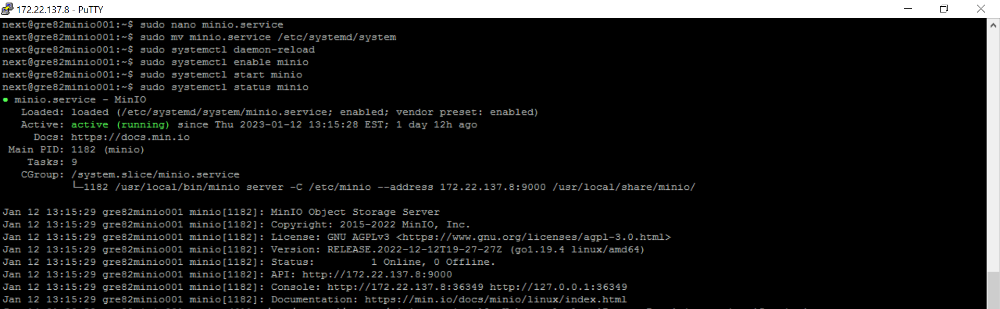

- Note down the endpoint url(for e.g 172.22.137.8:9000) and paste it in browser

   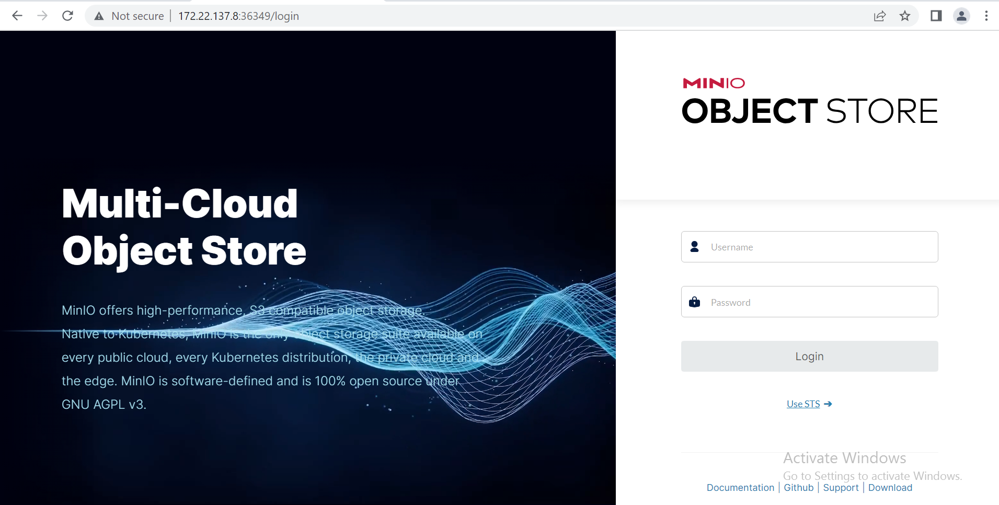

### 2.3 Creation of Bucket

Paste the endpoint URL that was previously noted into the browser. You will be forwarded to the Minio console by it. Use `minioadmin` as the username and password by default to access minIO and, if necessary, modify the password for the `minioadmin` user (but not mandatory).

- Go to `Buckets`-->Create Bucket--> Give the bucket a name, and note it. If the bucket doesn't already have R/W permission for that bucket, be sure to grant it.

   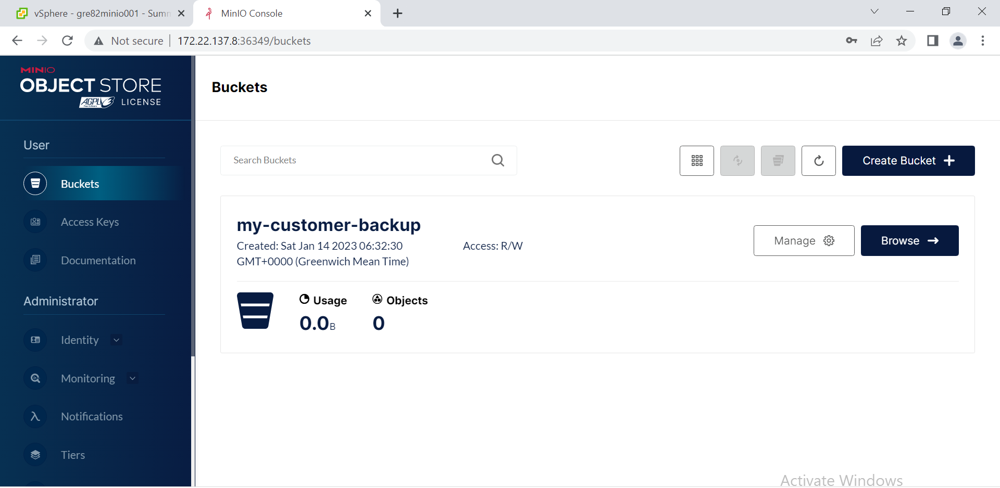

- Go to accesskeys to create an accesskey. Save the import file to your computer because it contains the access key and secret key that you will eventually require (or you can note down both the access key and secret key after creating them).

   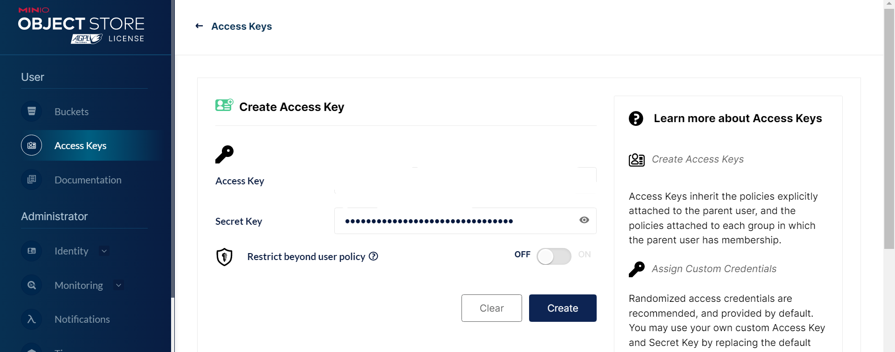

## 3 Install and Configure the Velero plugin for vsphere

In the supervisor cluster, first create a namespace called `velero`, then add rights for the administrator and platform administrators, grant owner privileges, and add storage as the VSAN default storage policy.

**Steps:**

- Go to `Menu`--> `workload management`-->`Namespaces`-->`New NameSpace`-->Specify the cluster as `grexx-cxx-cluster01`-->Name as `velero`

   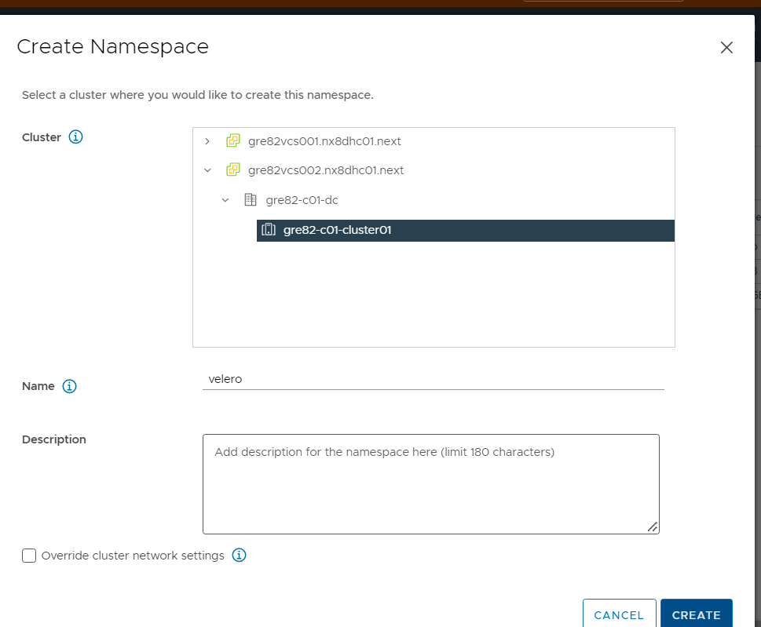

- To Assign permissions: Go to `Namespaces`-->`velero`-->`Permissions`-->specify domain as `vsphere.local`-->User/group as `Administrator`-->Role as `owner`

   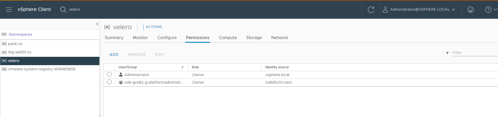

- To assign storage:  Go to `Namespaces`-->`velero`-->`Storage`-->`Edit storage policies`-->Choose `vSAN default storage policy`

   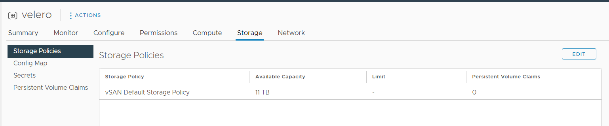

### 3.1 Downloading the plugins required for velero backup and restore

Velero requires specific plugins to be installed in order to perform backup operations. So that the supervisor cluster can readily access plugin images during the installation of the velero-vsphere-operator service on it, we will download all plugins (Docker images) from the internet and push them to the harbour registry( or container registry).

- Take the ssh to the Tanzu Jump host.

- Run the following command to log into the harbour registry, which will be required for Docker push operations.

   ```shell
   docker-credential-vsphere login <container-registry-IP> --user Administrator@vsphere.local
   ```

- Run the commands listed below one at a time in the order listed below.In place of `container-registry-IP` you should mention your harbour registry IP.

   ```shell
   sudo docker image pull vsphereveleroplugin/velero-vsphere-operator:1.1.0
   sudo docker tag vsphereveleroplugin/velero-vsphere-operator:1.1.0 <container-registry-IP>/velero/velero-vsphere-operator:1.1.0
   sudo docker push <container-registry-IP>/velero/velero-vsphere-operator:1.1.0
 
   sudo docker image pull velero/velero:v1.5.1
   sudo docker tag velero/velero:v1.5.1 <container-registry-IP>/velero/velero:v1.5.1
   sudo docker push <container-registry-IP>/velero/velero:v1.5.1
 

   sudo docker image pull velero/velero-plugin-for-aws:v1.1.0
   sudo docker tag velero/velero-plugin-for-aws:v1.1.0 <container-registry-IP>/velero/velero-plugin-for-aws:v1.1.0
   sudo docker push <container-registry-IP>/velero/velero-plugin-for-aws:v1.1.0
 
   sudo docker image pull vsphereveleroplugin/velero-plugin-for-vsphere:v1.4.0
   sudo docker tag vsphereveleroplugin/velero-plugin-for-vsphere:v1.4.0 <container-registry-IP>/velero/velero-plugin-for-vsphere:v1.4.0
   sudo docker push <container-registry-IP>/velero/velero-plugin-for-vsphere:v1.4.0
 
   sudo docker image pull vsphereveleroplugin/backup-driver:v1.4.0
   sudo docker tag vsphereveleroplugin/backup-driver:v1.4.0 <container-registry-IP>/velero/backup-driver:v1.4.0
   sudo docker push <container-registry-IP>/velero/backup-driver:v1.4.0
   ```

- Verify the images in the harbour registry under velero by logging in to harbour registry via GUI(<https://container-registry-IP>) under velero project.

   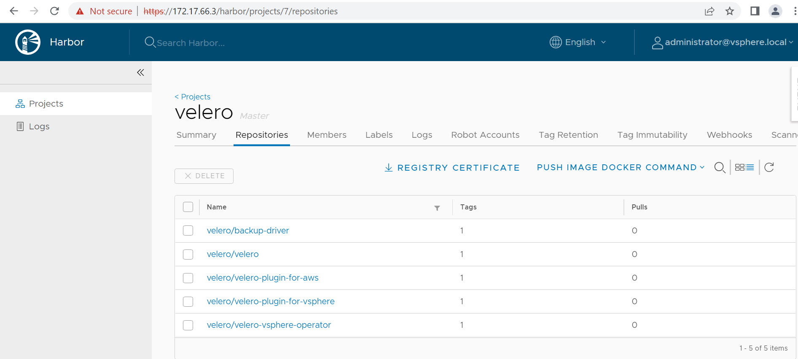

## 3.2 Create a Dedicated Network for Backup and Restore Traffic

- Separate the backup and restore traffic from the vSphere with Tanzu management network traffic. There are two aspects to this:

  - Tag the ESXi hosts to support network file copy (NFC)
  - Configure the backup and restore network using NSX-T Data Center

- We'll create the New distributed port group named `BackupRestoreNetwork` and attach it to the Esxi host as vmkernel adapter of service type `vSphere Backup NFC`.

  - In Vsphere client , Select `Menu`--> `Networking`
  - Select the existing vDS for the cluster
  - Right-click the vDS and select `Distributed Port Group` --> `New Distributed Port Group`
  - Create a new Distributed Port Group named `BackupRestoreNetwork`

- Select the compute Esxi host-->`Configure`-->`Network`-->`VMkernel adapter`--> `Add Networking`--> Add connection type `VMkernel Network Adapter`-->Select existing     Network `BackupRestoreNetwork`-->Enable the `vSphereBackupNFC tag`-->`Obtain IPv4 settings automatically`-->Finish
  
   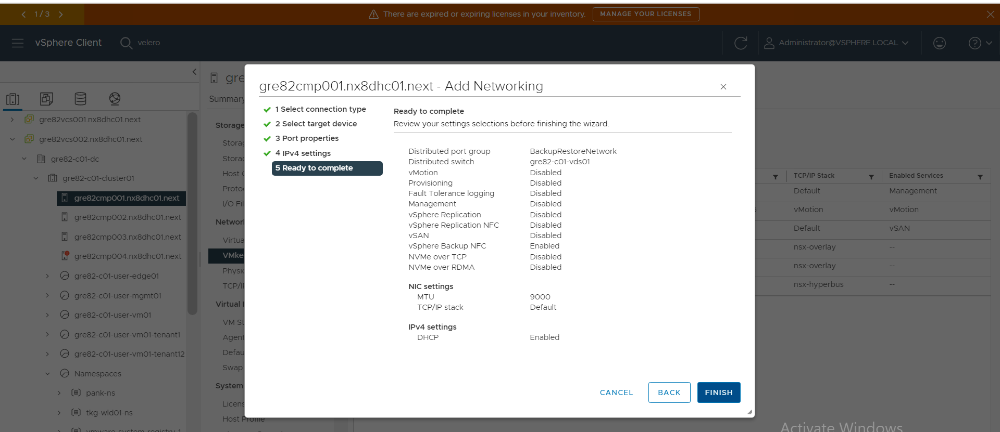

- Repeat the same procedures for all the ESXi hosts where workloadmanagement is enabled.

### 3.3 Install and Configure Data Manager

Deploy one or more Data Manager VMs to move persistent volume backup data into and out of S3-compatible object storage. It moves the volume snapshot data from the vSphere volume to the S3-compatible storage on backup, and vice versa.

To install Data Manager as a VM follow the steps given below : -

- Download the Data Manager OVA file
  <https://vsphere-velero-datamgr.s3-us-west-1.amazonaws.com/datamgr-ob-17253392-photon-3-release-1.1.ova>
- Login to vSphere Client, right-click `Datacenter`--> `Deploy OVF Template` ( where Workload Management is enabled )
- Select the Data Manager OVA file that you downloaded and upload it to the vCenter Server
- Name the virtual machine `i.e. velero-datamanger`
- Select `compute resource` ( which is the vCenter cluster where the Supervisor Cluster is configured )
- `Review Details` --> `Next`
- `Accept license agreements` --> `Next`
- Select `storage`  as vSan --> `Next`
- Select `Destination Network`
  - Select the `BackupRestoreNetwork` if you configured a dedicated backup and restore network
  - Select the `Management Network` if you did not configure a dedicated backup and restore network
- Verify all details > `Finish`

   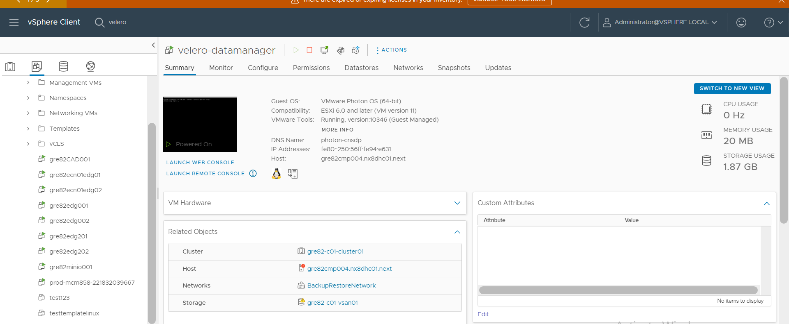

- Once the Data Manager VM is deployed, configure the input parameters for the VM
  - Right click the VM and select `Edit Settings`
  - In the Virtual Hardware tab, for `CD/DVD Drive`, change `Host Device` > `Client Device`
  - In `Edit Settings` > `VM Options tab` > `Advanced` > `Edit Configuration Parameters`
  - Configure the input parameters for each of the following settings :

      | Parameter | Value |
      | ---------- | -------- |
      | `guestinfo.cnsdp.vcAddress` | Enter the vCenter Server IP address or FQDN |
      | `guestinfo.cnsdp.vcUser` |  vCenter Server user name with sufficient privileges to deploy VMs. |
      | `guestinfo.cnsdp.vcPasswd` | Enter the vCenter Server user password. |
      | `guestinfo.cnsdp.vcPort` | The default is `443` |
      | `guestinfo.cnsdp.wcpControlPlaneIP` | Enter the Supervisor Cluster IP address , Get this value by navigating to the vCenter cluster where Workload Management         is enabled . Select `Configure`--> `Namespaces`--> `Network`--> `Management Network`--> `Starting IP Address` |
      | `guestinfo.cnsdp.updateKubectl` | The default is `false` |
      | `guestinfo.cnsdp.veleroNamespace` | The default is velero and you should leave it as such unless you have a compelling reason to change it. Previously we have created the vSphere Namespace on the Supervisor Cluster with the name velero. These names must match. |
      | `guestinfo.cnsdp.datamgrImage` | If not configured (unset), the system by default will pull the container image from Docker Hub at `vsphereveleroplugin/data-manager-for-plugin:1.1.0` |

      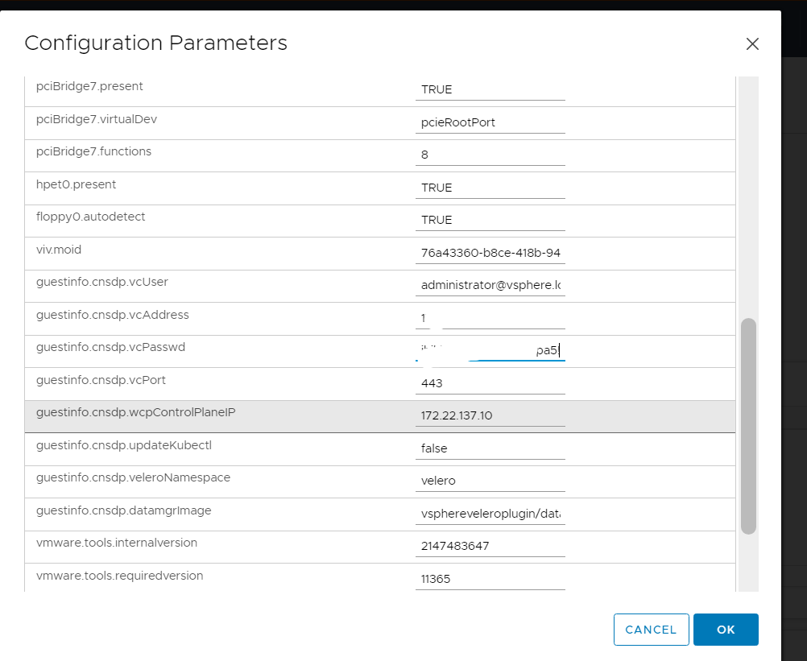

- Click OK to save the configuration and OK again to save the VM settings
- **Do not power on the Data Manager VM** until you enable the Velero vSphere Operator (that will be in the next section)

### 3.4 Install the Velero-vsphere-operator service on Supervisor Cluster

The Velero vSphere Operator is a vSphere service that is offered by vSphere with Tanzu. The Velero vSphere Operator service works with the Velero Plugin for vSphere to enable backup and restore of Kubernetes workloads, including snapshotting persistent volumes.

Complete the following operation to register the Velero vSphere Operator specification with the vCenter Server where Workload Management is enabled, and to install the Velero vSphere Operator as a service on the Supervisor Cluster.

- Download the YAML for the Velero vSphere Operator from the following location:
   <http://vmware.com/go/supervisor-service>
  The service specification file is named `velero-supervisorservice-1.0.0.yaml`.

- Go to `Menu`-->`Workload Management`-->`Services`-->`Select the target vcenter(vcs002)`-->`Add Service`-->Upload the service specification file `velero-supervisorservice-1.0.0.yaml` that you downloaded-->Click `Next` and `accept the licence agreement`-->`Finish`

    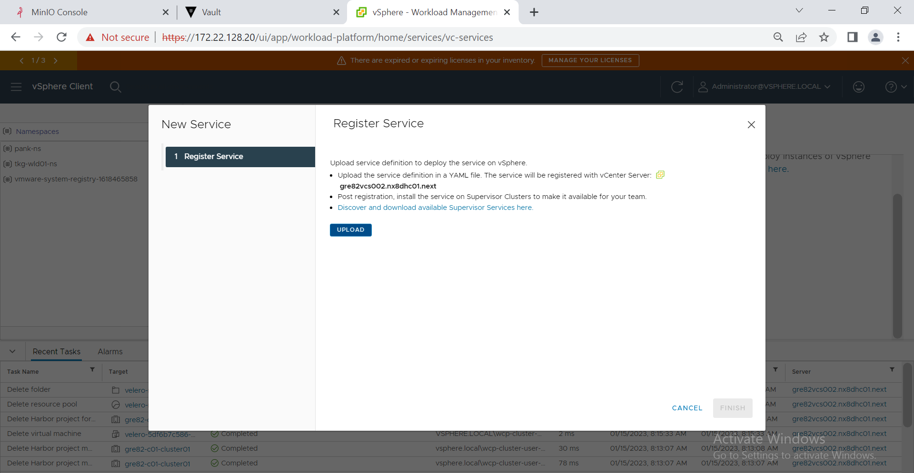

    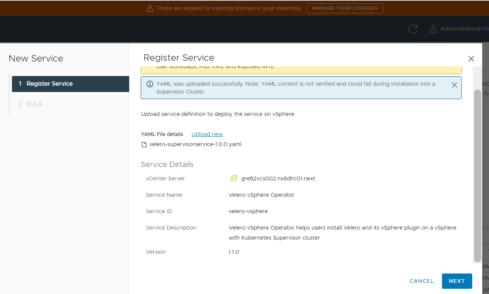

The Velero vSphere Operator is registered with vCenter Server. Verify that the service is in an Active state. You cannot install the service if it is Deactivated.

- Click `Actions`--> `Install on Supervisors`-->`Select the target Supervisor Cluster where you want to install the service`.

Configure the Velero vSphere Operator service installation as follows:

- Select the version from the drop-down: `1.1.0`.
  
- Specify the Repository endpoint as `container-registry-IP/velero`.
  
- Enter the username as `administrator@vsphere.local` and specify the password for the same in the password field.

    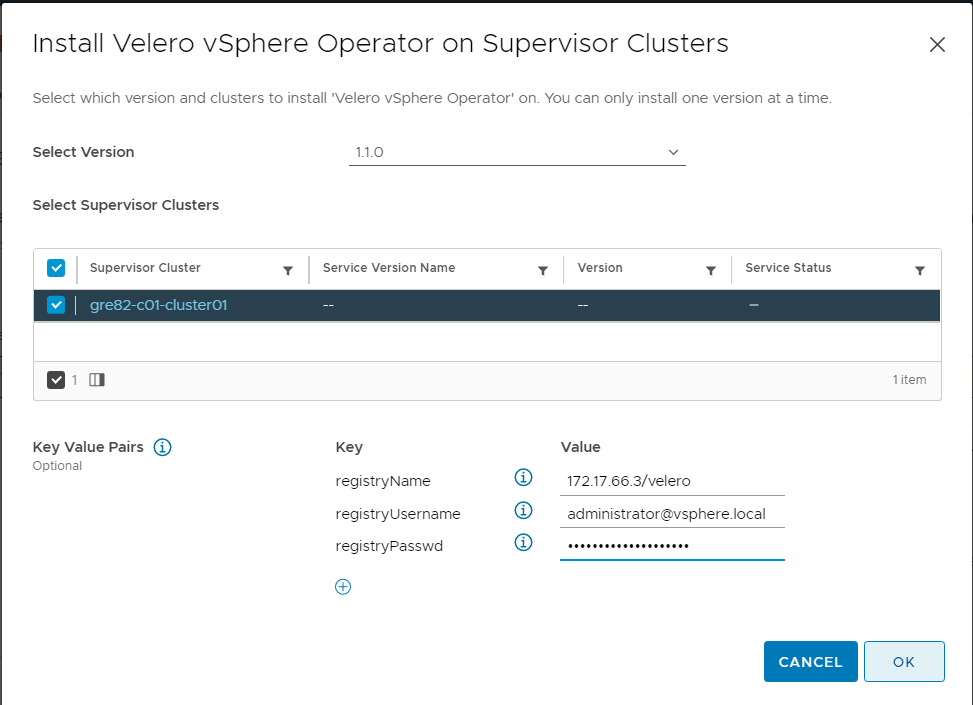
  
- Click `Next` and `Finish`.
  
Verify the Velero vSphere Operator service on the Supervisor Cluster and start the Data Manager VM(velero-datamanager).
  
- From the`vSphere Client home menu`--> select `Inventory`-->Select the vCenter cluster where Workload Management is enabled`(grexx-cxx-clusterxx)`-->Select    `Configure`--> `vSphere Services`--> `Overview`-->Verify that you see the `Velero vSphere Operator` installed and its status is Configured.

    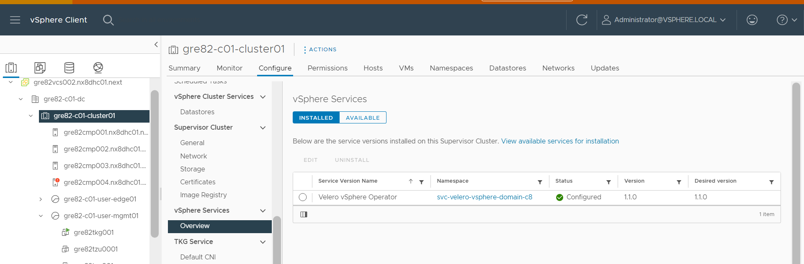

- In the `Namespaces` resource pool, verify that you see a new namespace named `svc-velero-vsphere-domain-xxx`, where xxx is a unique alphanumeric token. This is the namespace created by the system for the `Velero vSphere Operator`.

    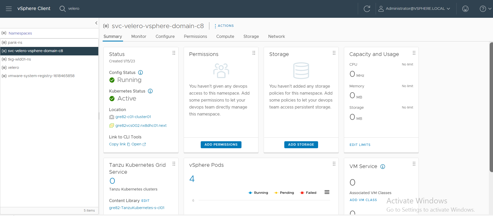

- Validate whether all vSphere pods are up and running. Go to `Namespaces` --> `svc-velero-vsphere-domain-xxx` -->`compute` --> `vsphere pods`.

    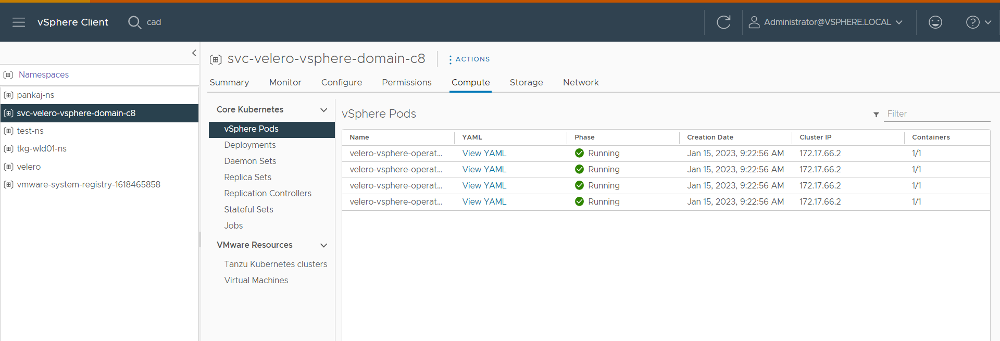

- In the Hosts and Clusters view, select the **Data Manager VM(velero-datamanager) and power it ON**.

### 3.5 Install the Velero CLI tools on Jump host

Now you are ready to install the Velero Plugin for vSphere. To do this, download and run the velero-vsphere and velero CLI.

velero-vsphere CLI tool is generally used for tanzu supervisor cluster to interface with velero and install velero plugins on vsphere.

velero CLI tool is used for tanzu workload cluster to interface with velero and install velero plugins on workload cluster.

- Download the Velero Plugin for vSphere CLI from the following location

  <https://github.com/vmware-tanzu/velero-plugin-for-vsphere/releases/download/v1.1.0/velero-vsphere-1.1.0-linux-amd64.tar.gz>

- Using WinSCP, move or copy it to the /home/next directory of the Tanzu Jump host (tkg001).

- Extract the velero-vsphere CLI and make it writable

   ```shell
   tar -xf velero-vsphere-1.1.0-linux-amd64.tar.gz
   ```

   ```shell
   chmod +x velero-vsphere-1.1.0-linux-amd64
   ```

- Make the velero-vsphere CLI globally available by copying it to the system path.

   ```shell
   sudo cp velero-vsphere-1.1.0-linux-amd64/velero-vsphere /usr/local/bin
   ```

- Download the Velero plugin for velero CLI from the following location

   <https://github.com/vmware-tanzu/velero/releases/download/v1.5.1/velero-v1.5.1-linux-amd64.tar.gz>

- Using WinSCP, move or copy it to the /home/next directory of the Tanzu Jump host (tkg001).

- Extract the velero CLI and make it writable.

   ```shell
   tar -xf velero-v1.5.1-linux-amd64.tar.gz
   ```

    ```shell
   chmod +x  velero-v1.5.1-linux-amd64
   ```

- Make the velero CLI globally available by copying it to the system path.

   ```shell
   sudo cp velero-v1.5.1-linux-amd64/velero /usr/local/bin
   ```

  Now, jump host can configure velero for backup and restore on the target cluster using the velero-vsphere and velero CLI tools.

  Before we begin installing Velero on target clusters, we must first prepare a credentials file in Jump host with credentials such as an access key and a secret key for MinIO.

- Open the new file with name `credentials-minio`

   ```shell
   sudo nano credentials-minio
   ```

- Copy the `accesskey` and `secretkey` from the import file that was downloaded as part of the minIO setup process, then paste them into the respective fields here.

   ```shell
   [default]
   aws_access_key_id = ACCESS-KEY-ID-STRING
   aws_secret_access_key = SECRET-ACCESS-KEY-STRING
   ```

- Save it.

### 3.6 Installation of Velero on Supervisor Cluster

- Login into tanzu jumphost via SSH.

- Run the below command to login into tanzu supervisor cluster.

   ```shell
   kubectl vsphere login --server=<supervisor-cluster IP> --vsphere-username Administrator@vsphere.local --insecure-skip-tls-verify
   ```

- Run the following velero-vsphere CLI command to install the Velero Plugin for vSphere into the velero namespace you created.

   ```shell
   velero-vsphere install \
       --namespace velero \
       --image <container registry IP>/velero/velero:v1.5.1 \
       --use-private-registry \
       --provider aws \
       --plugins <container registry IP>/velero/velero-plugin-for-aws:v1.1.0,<container registry IP>/velero/velero-plugin-for-vsphere:v1.4.0 \
       --bucket <Bucket-Name> \
       --secret-file credentials-minio \
       --snapshot-location-config region=minio \
       --backup-location-config region=minio,s3ForcePathStyle="true",s3Url=http://<MinIO server IP>:9000
   ```

   Specify your image registry IP in place of `<container registry IP>`, where you have kept the images of plugins previously.
  
   Specify the bucketname in place of `<Bucket-Name>`, which you have created as part of MinIo setup in previous section.

   Specify the miniIO server IP in place of `<MinIO server IP>` , which you allocated when you created the VM from Linux template in MinIO section.

- On the execution of the above CLI command , it gives the message `Sending the request to the operator about installing Velero in namespace velero`.It takes 4-5 minutes to complete its installation.

   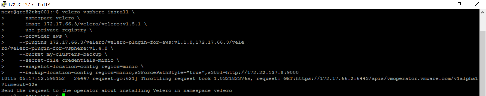

#### VALIDATION

1. List all the services and pods of `velero` namespace by the below command

    ```shell
   kubectl get all -n velero
   ```

   On successful execution, all the pods and services should be up and running.

   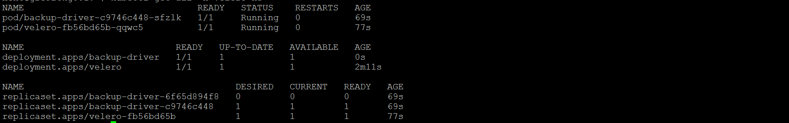

### 3.7 Installation of Velero on Tanzu Workload Cluster

- Login into tanzu jumphost via SSH.

- Run the below command to login to tanzu workload cluster

    ```shell
   kubectl vsphere login --server=<supervisor cluster IP> --vsphere-username Administrator@vsphere.local --insecure-skip-tls-verify --tanzu-kubernetes-cluster-name tkgs-cluster-01 --tanzu-kubernetes-cluster-namespace tkg-wld01-ns
   ```

- Create the namespace `velero` in the workload cluster by running the below command.

    ```shell
   kubectl create namespace velero
   ```

>NOTE: Don't confuse with the namespace `velero` we created earlier with this one. We created namespace `velero` in supervisor cluster via GUI in the early section of 3. In the section 3.6 we are creating the namespace `velero` in workload cluster. Workload cluster namespaces won't be visible and accessible via GUI.

- We'll just apply velero-vsphere configMap for this namespace by following below 2 steps.

    ```shell
   sudo nano velero-vsphere-config.yaml
   ```

- Copy paste the below content in the above file and save it.

    ```shell
   apiVersion: v1
   kind: ConfigMap
   metadata:
     name: velero-vsphere-plugin-config
   data:
     cluster_flavor: GUEST
   ```

- Apply this configmapping by running the below command.

    ```shell
   kubectl -n velero apply -f velero-vsphere-config.yaml
   ```

- Next, We'll run the below CLI command to install velero with its plugins on the target workload cluster.

    ```shell
   velero install \
   --provider aws \
   --plugins velero/velero-plugin-for-aws:v1.1.0,vsphereveleroplugin/velero-plugin-for-vsphere:v1.4.0 \
   --bucket <Bucket name> \
   --secret-file credentials-minio \
   --use-volume-snapshots=true \
   --use-restic \
   --default-volumes-to-restic \
   --backup-location-config \
   region=minio,s3ForcePathStyle="true",s3Url=http://<MinIO server IP>:9000,publicUrl=http://<MinIO server IP>:9000
   ```

Specify the bucketname in place of `<Bucket-Name>`, which you have created as part of MinIo setup in previous section.

Specify the miniIO server IP in place of `<MinIO server IP>` , which you allocated when you created the VM from Linux template in MinIO section.

   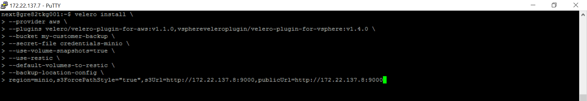

- On the execution of the above CLI command,it shows the message Velero is installed! Use `kubectl logs deployment/velero -n velero` to view the status

   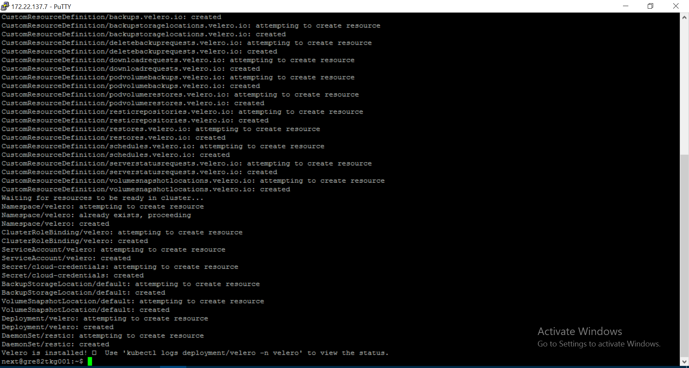

#### VALIDATION

1. Verify the installation of Velero and Restic.

   ```shell
   kubectl logs deployment/velero -n velero
   ```

   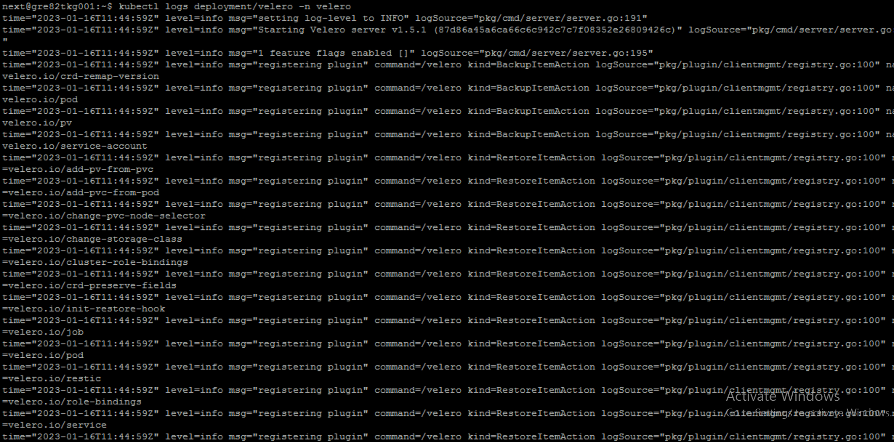

2. List all the services and pods of `velero` namespace by the below command

    ```shell
   kubectl get all -n velero
   ```

3. On successful execution, all the pods and services should be up and running.

   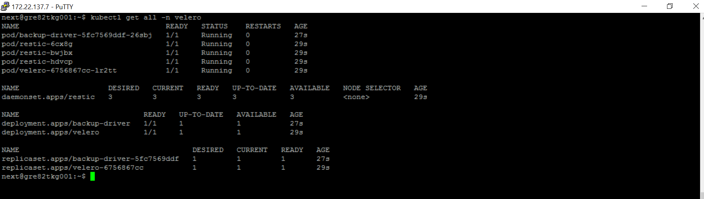

## 4 Performing the Backup and Restore Using Velero for Tanzu resources

Login to the supervisor cluster or workload cluster where you want to perform the backup operation.

### 4.1 Performing the Backup using Velero and Validating the Backup

- Below is an example command for creating a Velero backup.

  ```shell
  velero backup create <backup name> --include-namespaces=<namespace name>  --ttl 3h --exclude-resources namespacenetworkinfos.nsx.vmware.com,cnscsisvfeaturestates.cns.vmware.com,projects.registryagent.vmware.com,members.registryagent.vmware.com,contentsourcebindings.vmoperator.vmware.com -n velero
  ```

  Specify the namespace that you want to backup in place of `<namespace name>` in the above command.  

  Specify the backup name in place of `<backup name>`.  

  When you create a backup, you can specify a TTL (time to live) by adding the flag `--ttl <DURATION>`. If Velero sees that an existing backup resource is expired, it removes:  

  1. The backup resource
  2. The backup file from cloud object storage
  3. All PersistentVolume snapshots
  4. All associated Restores  

  The `ttl` flag allows the user to specify the backup retention period with the value specified in hours, minutes and seconds in the form --ttl 24h0m0s. If not specified, a default TTL value of 30 days will be applied.

   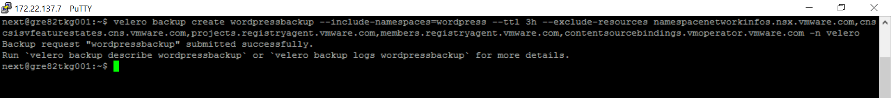

- Velero backup will be marked as Completed after all local snapshots have been taken.

#### Validation

1. Run the command below to check the backup's progress.

   ```shell
   velero backup describe <backup name>
   ```

   Post completion of backup it shows completed.

   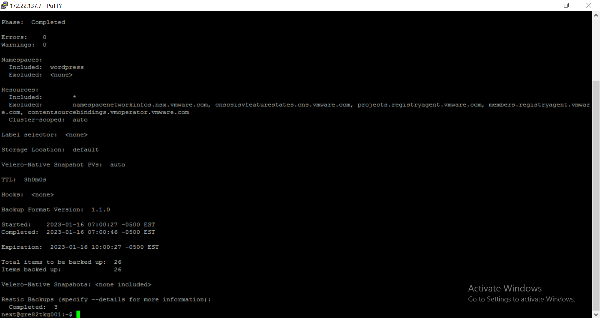

2. You can also check that status using

   ```shell
   velero get backup
   ```

   Above command lists all the backups created by velero and its status. You can check the status of your backup by checking the `<backup name>`.
  
   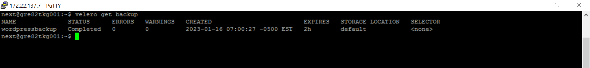

3. All the backups taken by velero is reflected in the bucket you created and specified in the velero install CLI command in the section 3.6 and 3.7 .

   Login to MinI0 console using default credentials(`username` and `password` both as `minioadmin`)
  
   Go to `Buckets`-->`<Bucket name>`-->`backups`-->`<backup name>`-->You'll get to see all the snapshots taken by velero.
  
     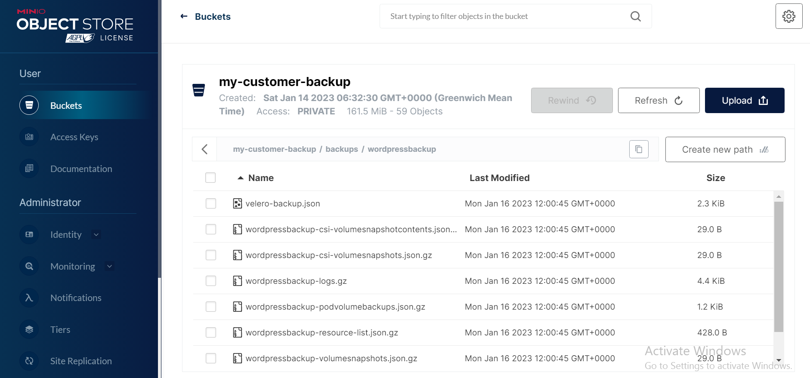
  
### 4.2 Performing the Restore using Velero
  
Only if you had completed a backup operation for the Tanzu resources and it got deleted accidentally. Then you can proceed to restore operations using Velero.
  
 >NOTE: In the course of testing I took a backup of the WordPress namespace in the previous stage, but I had to erase it in order to do a restoration operation.
  
- Below is an example command of Velero restore.

   ```shell
   velero restore create <restore name> --from-backup <backup name> --exclude-resources backups.velero.io,nsxlbmonitors.vmware.com -n velero
   ```
  
  Specify the restore name in place of `<restore name>`  and backup name which you have given while performing backup for this particular resource in place of `<backup name>`.
  
   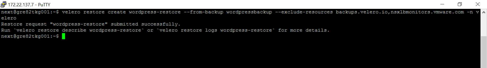
  
- Velero restore will be marked as Completed when volume snapshots and other Kubernetes metadata have been successfully restored to the current cluster.
  
#### Validation
  
1. Run the command below to see how the restore is progressing.

   ```shell
   velero restore describe <restore name>
   ```
  
   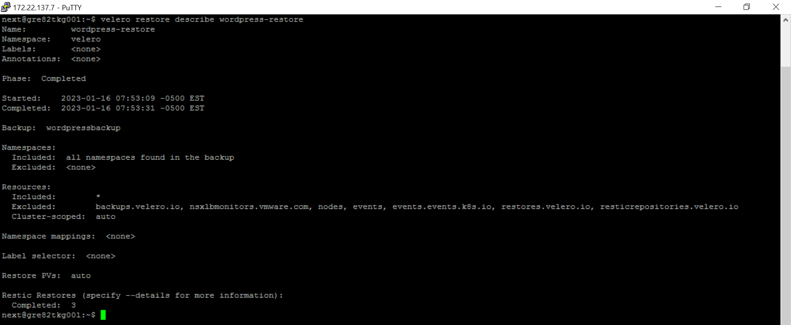
  
2. You can also check that status using

   ```shell
   velero get restore
   ```
  
   Above command lists all the restores performed by velero, you can search your restore status by `<restore name>`
  
   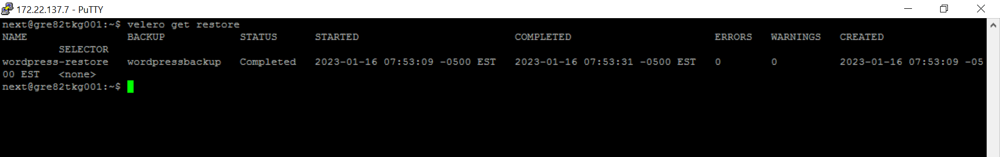

3. Use your login information to access the MINIO console and go to the bucket where you have your backup.
  
   Go to `Buckets`-->`<Bucket name>`-->`restores`-->`<restore name>`-->You'll get to see the files related to logs and results of restore operation.
  
   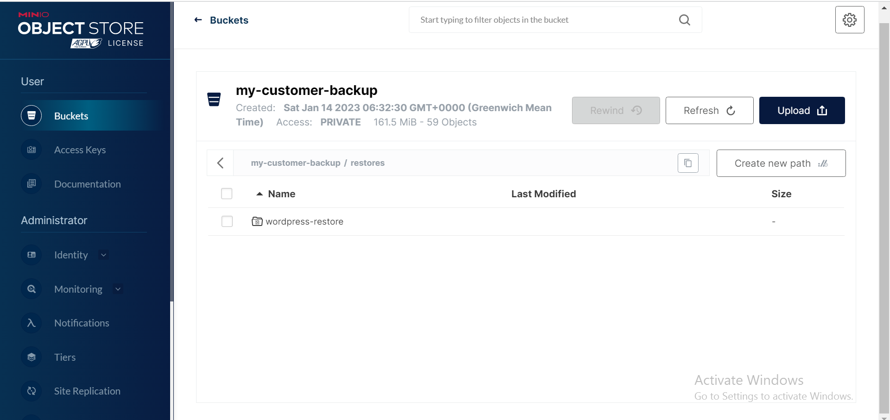
  
   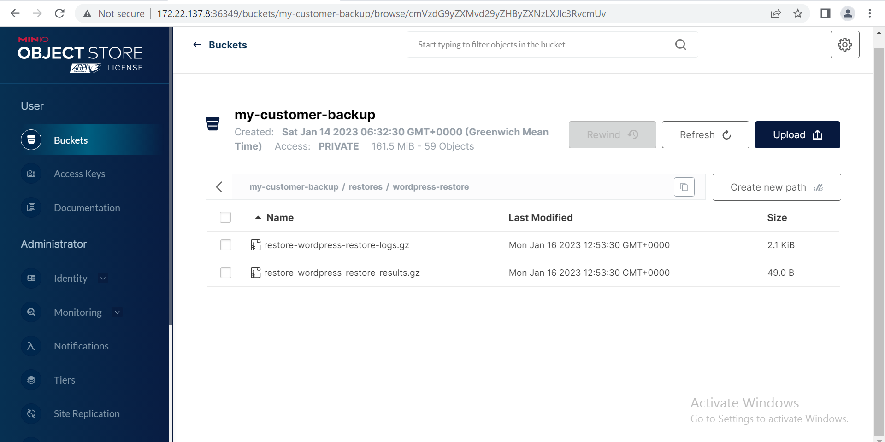
