# VMC on AWS Deployment Guide

Table of Contents:

- [VMC on AWS Deployment Guide](#vmc-on-aws-deployment-guide)
- [Changelog](#changelog)
- [Introduction](#introduction)
- [Purpose](#purpose)
- [Audience](#audience)
- [Scope](#scope)
- [Pre-requisite](#pre-requisite)
- [vSAN encryption and key storage](#vsan-encryption-and-key-storage)
- [Deployment of SDDC on VMC on AWS](#deployment-of-sddc-on-vmc-on-aws)
  - [Follow below steps to deploy VMC on AWS](#follow-below-steps-to-deploy-vmc-on-aws)
- [Connectivity Options from on-premises to VMC](#connectivity-options-from-on-premises-to-vmc)
- [Firewall rules for VMC Integration with On-Premises Products](#firewall-rules-for-vmc-integration-with-on-premises-products)
- [VMC Integration with On-Premises Product](#vmc-integration-with-on-premises-product)
  - [vRealize Operations](#vrealize-operations)
  - [VMware Aria Operations for Logs](#vmware-aria-operations-for-logs)
  - [VMware vRealize Automation](#vmware-vrealize-automation)
  - [SNOW Discovery Intergration](#snow-discovery-intergration)
  - [Nessus Professional Integration](#nessus-professional-integration)
    - [**Configure Nessus Scan**](#configure-nessus-scan)
    - [**Nessus Scan Running**](#nessus-scan-running)
    - [**Analyzing Scan Results**](#analyzing-scan-results)
- [vRealize Network Insight Integration](#vrealize-network-insight-integration)
- [VCS Automation for deploying Managed AWS Cloud Formation Templates](#vcs-automation-for-deploying-managed-aws-cloud-formation-templates)
      - [**Step 1: Create/Configure user in AWS**](#step-1-createconfigure-user-in-aws)
      - [**Step 2: Create Cloud Formation Template**](#step-2-create-cloud-formation-template)
      - [**Step 3: Configure S3 Bucket**](#step-3-configure-s3-bucket)
      - [**Step 4: Configure VMware Cloud Services – Service Broke**](#step-4-configure-vmware-cloud-services--service-broke)
      - [**Step 5: Deploy Cloud Formation via Service Broker**](#step-5-deploy-cloud-formation-via-service-broker)
- [Deploy Tanzu Kubernetes Cluster from On-Prem vRealize Automation](#deploy-tanzu-kubernetes-cluster-from-on-prem-vrealize-automation)
      - [**Step 1: Activate Tanzu Kubernetes Grid in an SDDC cluster**](#step-1-activate-tanzu-kubernetes-grid-in-an-sddc-cluster)
      - [**Step 2: Configuration settings for Tanzu Kubernetes Cluster deployment from vRealize Automation**](#step-2-configuration-settings-for-tanzu-kubernetes-cluster-deployment-from-vrealize-automation)
      - [**Step 3: Create a cloud template**](#step-3-create-a-cloud-template)
      - [**Step 4: Request Tanzu Kubernetes Cluster deployment in vRealize Automation**](#step-4-request-tanzu-kubernetes-cluster-deployment-in-vrealize-automation)
      - [**Step 5: Access the newly created Tanzu Kubernetes Cluster**](#step-5-access-the-newly-created-tanzu-kubernetes-cluster)
  - [**DNS settings for OS template Sync**](#dns-settings-for-os-template-sync)
- [VMC on AWS Hybrid Cloud Operations With HCX](#vmc-on-aws-hybrid-cloud-operations-with-hcx)
- [Avamar Backup Solution for VMC](#avamar-backup-solution-for-vmc)
- [Shared Responsibility with VMC on AWS](#shared-responsibility-with-vmc-on-aws)

# Changelog

| Date       | Author            | Issue               | Description                                                           |
|------------|-------------------|---------------------|-----------------------------------------------------------------------|
| 26.05.2023 | Chetan Patidar    | VCS-8107            | Document creation                                                     |
| 30.06.2023 | Abhishek H Sawant | VCS-9871 & VCS-9884 | Updated the Connectivity & Cloud Formation Templates                  |
| 04.07.2023 | Alpesh Kumbhare   | VCS-983             | Updated Details for vSAN encryption and key storage on VMC            |
| 18.07.2023 | Chetan Patidar    | VCS-9885            | Updated the steps to deploy Tanzu Kubernetes Cluster from On-Prem vRA |
| 01.09.2023 | Ajit Vakodkar     | VCS-10756           | Firewall rules document for VMC Integration with On-Premises Product  |
| 07.09.2023 | Ajit Vakodkar     | VCS-10756           | DNS settings for OS template Sync                                     |
| 18.10.2023 | Aroop Sethi       | VCS-10646           | Nessus and vRNI Integration & Shared Responsibility with VMC on AWS   |

# Introduction

This document describes below automation:

- The step-by-step instructions to deploy the SDDC Deployment on the VMware Cloud on AWS
- Integrating the various other VMware product to the SDDC deployed on the VMware Cloud on AWS

# Purpose

The purpose of this document is to describe the steps to deploy VMC on AWS and integrate VMware products into VMC on AWS

# Audience

This document is intended for Atos ESO Cloud Services Engineers and Architects responsible for the deployment of SDDC on VMC on AWS

# Scope

The scope of this document is to cover the deployment of SDDC on VMC on AWS and the integration of various other on-premises products

# Pre-requisite

- Ensure you have an AWS account created for cross-linking to your SDDC with admin rights
- Ensure you have VMware Cloud Console access and VMC on AWS service access is enabled to create SDDC
- Create a **VPC** and **Subnet** in the AWS console prior to deploying SDDC in VMC on AWS
  - When creating a new VPC, have a unique IPv4 CIDR block
  - The subnet must be in an AWS availability zone where VMware Cloud on AWS is available
  - Steps to create VPC are shared below:
    - Open the Amazon VPC console and choose **Create VPC** and provide the details like a Name tag, IPv4 CIDR block, etc.
    - Choose **Create VPC**

    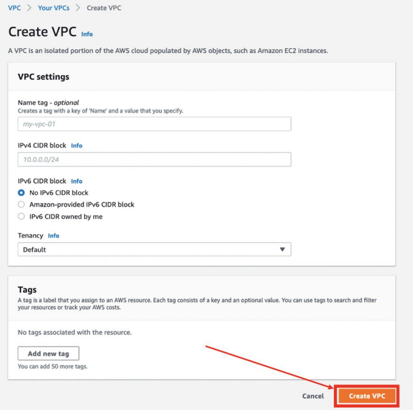

  - Steps to create a subnet are shared below:
    - Open the Amazon VPC console and choose **Subnets** and provide the details like a Name tag, CIDR block, Availability Zone, etc.
    - Choose **Create Subnet**

    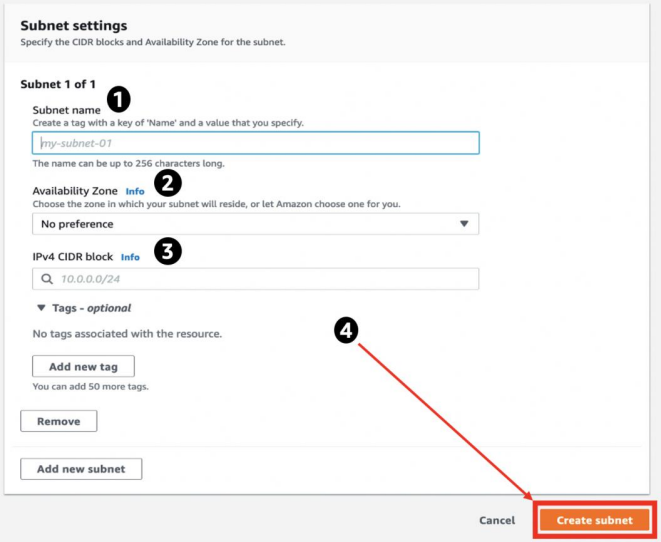

    - Configure Subnet in the SDDC based on the below screenshot:

    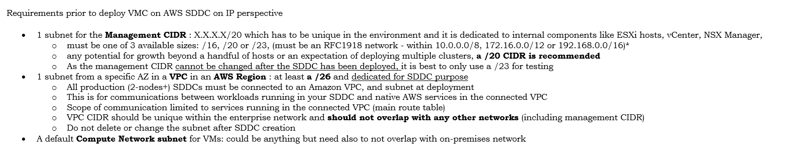

**Note**: Please follow the AWS Documentation for more details [Create VPC](https://docs.aws.amazon.com/vpc/latest/userguide/create-vpc.html) and [Create Subnet](https://docs.aws.amazon.com/vpc/latest/userguide/create-subnets.html)

# vSAN encryption and key storage

As per [VMware Documentation](https://docs.vmware.com/en/VMware-Cloud-on-AWS/services/com.vmware.vsphere.vmc-aws-manage-data-center-vms.doc/GUID-BA83AFC8-45AF-44DC-8295-E8D7DC168A49.html) -

- vSAN encrypts all user data at rest in VMware Cloud on AWS.
- Encryption is enabled by default on each cluster deployed in your SDDC, and can't be turned off.
- When you deploy a cluster, vSAN uses the AWS Key Management Service (AWS KMS) to generate a Customer Master Key (CMK), which is stored by AWS KMS. vSAN then generates a Key Encryption Key (KEK) and encrypts it using the CMK. The KEK is in turn used to encrypt Disk Encryption Keys (DEKs) generated for each vSAN disk.
- You can change KEKs by using either the vSAN API or the vSphere Client UI. This process is known as performing a shallow rekey. Changing the CMK or DEKs is not supported. If you must change the CMK or DEKs, create a new cluster and migrate your VMs and data to it.

# Deployment of SDDC on VMC on AWS

## Follow below steps to deploy VMC on AWS

| Steps                                                                                                                                                                                                | Screenshots                                                  |
|------------------------------------------------------------------------------------------------------------------------------------------------------------------------------------------------------|--------------------------------------------------------------|
| 1. To create **software define data center (SDDC)** go to Inventory and click on **Create SDDC** > When prompted provide the **SDDC Properties** like name, size, AWS region, etc. and click on Next | 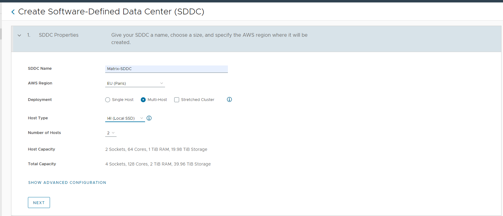   |
| 2. Provide the **AWS Account** which you would like to connect with and click on Next                                                                                                                | 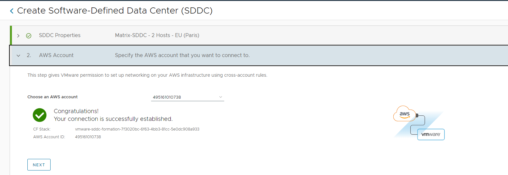   |
| 3. Provide the **VPC** and **Subnet** details to connect with AWS account and click on Next                                                                                                          | 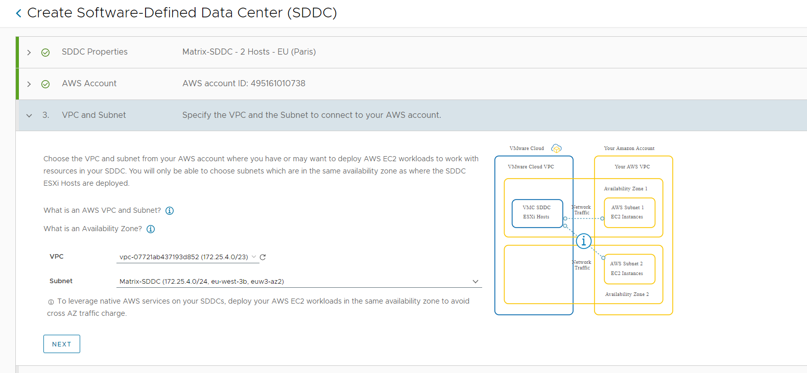 |
| 4. Configure the network by providing the **Management Subnet** details which is an optional field and click on Next                                                                                 | 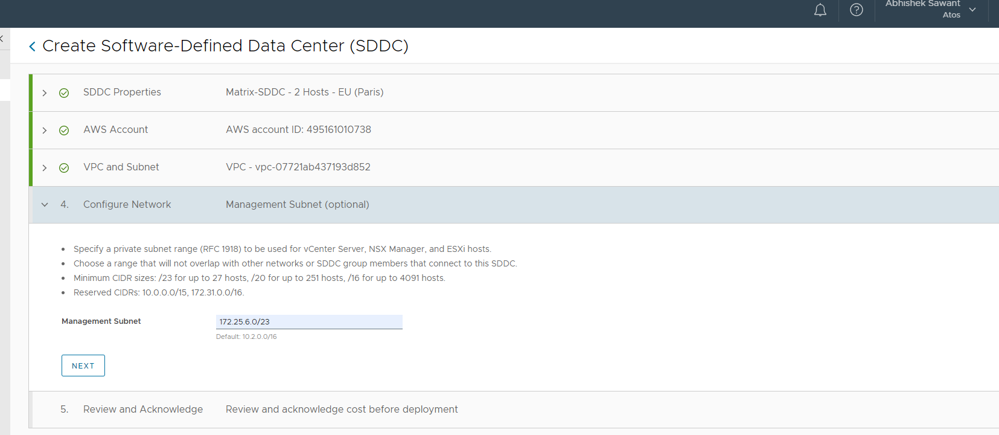      |
| 5. **Review** and **Acknowledge** before initiating the deployment and click Deploy                                                                                                                  | 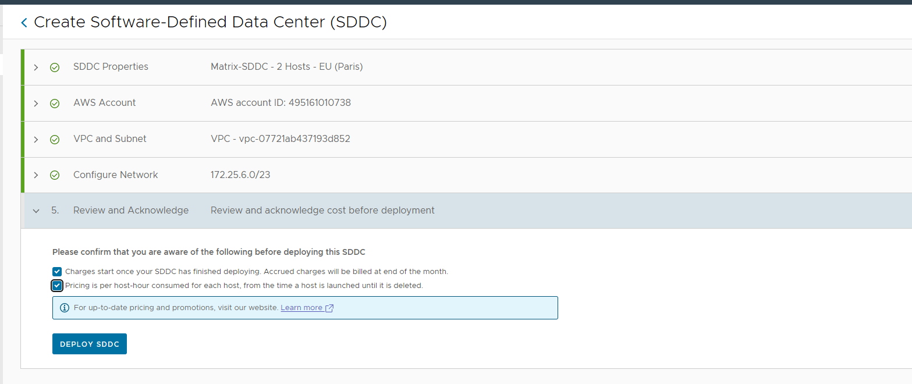       |

# Connectivity Options from on-premises to VMC

**1**. **Direct Connect** - Customer needs to create a private VIF and attach it to the Shadow AWS Account (managed by VMware) and the VIF will be terminated on the Virtual Private Gateway (VGW)

 All kind of VIFs are supported (in fact VLANs with BGP peering) <br />
• Private VIF are used to privately connect to the SDDC shadow VPC (in AWS) <br />

• Carries all traffic: ESX management, vMotion, Workload and Appliance traffic <br />

• Public VIF to connect to ALL AWS public services using public IP addresses <br />

• Can be used to create a VPN over public IP of SDDC Edge T0 <br />

• Transit VIF are used to connect to TGWs via Direct Connect Gateway <br />

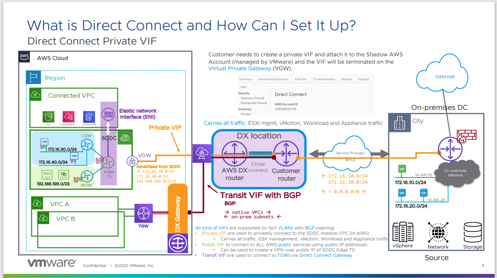

**Note -** The steps for Direct Connect are not described here; instead, we used a route-based IPSec VPN with BGP to connect an on-premises VCS to a VMC<br />

**2**. **Leveraging L3 VPN to connect to VMware Cloud on AWS**<br />

The following are the procedures for configuring a route-based IPSec VPN with BGP<br />

• With Route-based VPN the routes are dynamically updated across all tunnel interfaces via BGP (only!)<br />

• All Route-based VPN connections to an SDDC use the same single IP endpoint and BGP ASN <br />

• Any routes learned over one route-based VPN are advertised to all the other VPNs<br />

• Route based VPN is the recommended approach over Policy based as it provides redundancy<br />

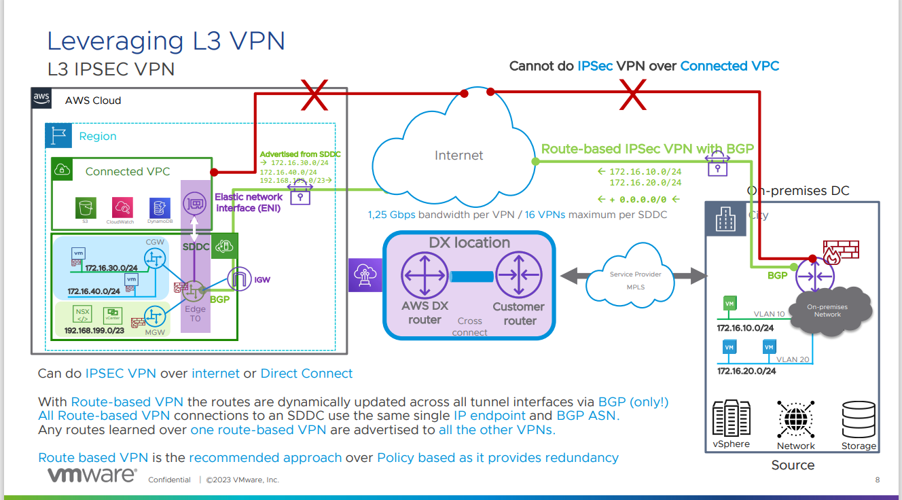

• The configuration for VPN from NSX-T of VMC is shown below<br />

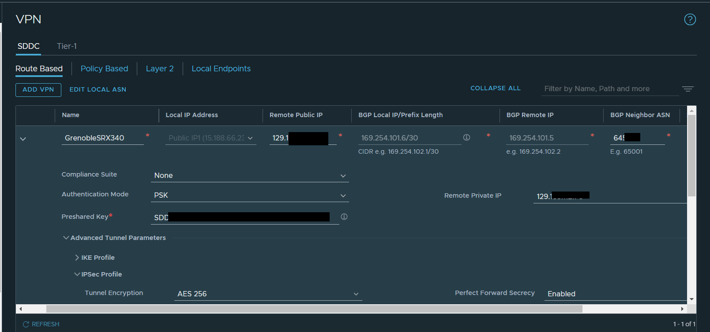

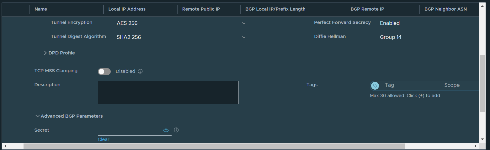

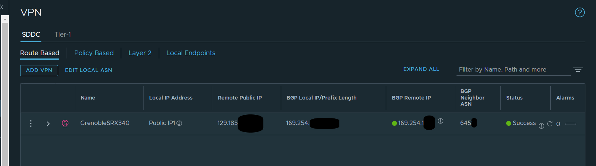

# Firewall rules for VMC Integration with On-Premises Products

Kindly refer the [VMC Firewall Rules Guide](https://github.com/GLB-CES-PrivateCloud/DHC-Documentation/blob/VCS-10646-Documentation-for-VMC-on-AWS---Integration/workInstructions/wiVMCFirewallRulesGuide.md) for more details.

# VMC Integration with On-Premises Product

## vRealize Operations

| Steps                                                                                                                                                                                                                                                                          | Screenshots                                                                                                                                                                                                                 |
|--------------------------------------------------------------------------------------------------------------------------------------------------------------------------------------------------------------------------------------------------------------------------------|-----------------------------------------------------------------------------------------------------------------------------------------------------------------------------------------------------------------------------|
| 1. Login to vROPs and click on **Datasource** > Choose **Integrations** and click on **Add Account**                                                                                                                                                                           | 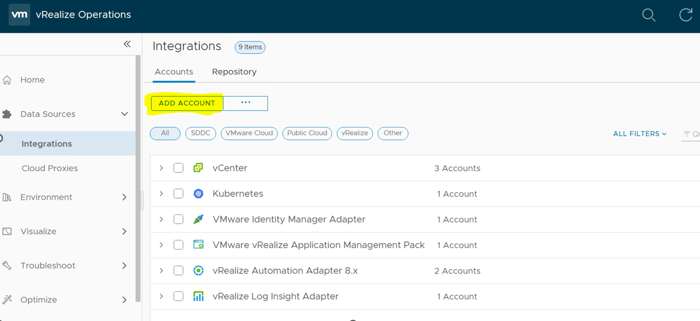                                                                                                                                                                 |
| 2. Choose **VMware Cloud on AWS** and fill in the form with Cloud Account Information in **Account Information** tab                                                                                                                                                           | 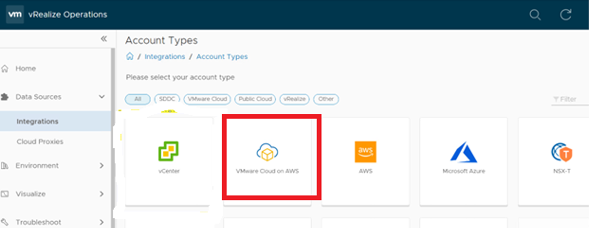 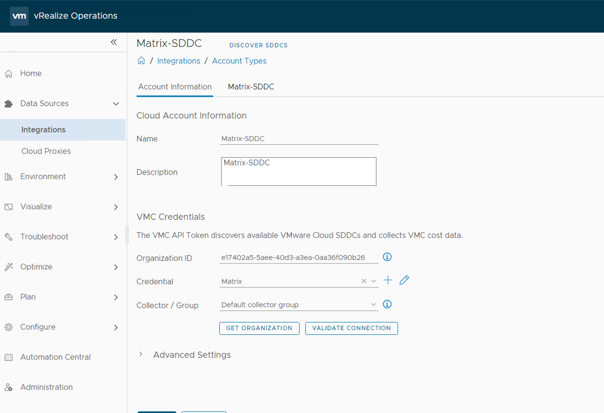                                                                                                                 |
| 3. Provide **Organization ID** (copy it from vRA SaaS portal)                                                                                                                                                                                                                  | 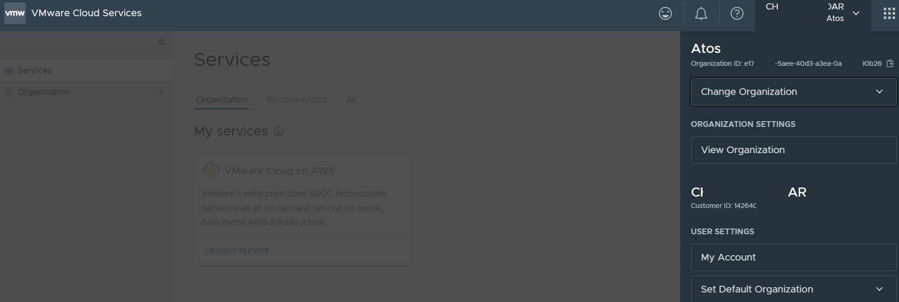                                                                                                                                                                           |
| 4. Select **Credential** from the dropdown or add it from the vRA SaaS portal (API Token stored in user **My Account**)<br /><br />**Note:** First user has to generate API token in vRA SaaS portal. Steps to generate the API Token mentioned in point number 5              | 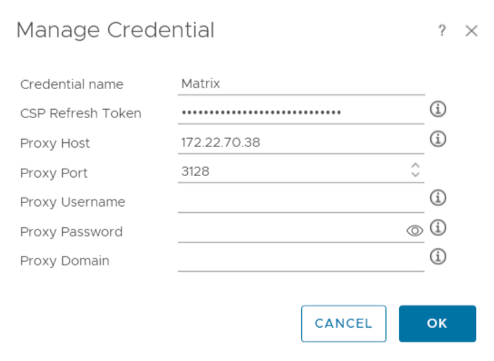                                                                                                                                                                       |
| 5. Login to the vRA SaaS portal > Select **Organization** > Click on **Username** (top right corner) > Under **USER SETTINGS** select **My Account** > Choose **API Token** tab and generate a token > Provide the details to generate the token shown in the screenshots      | 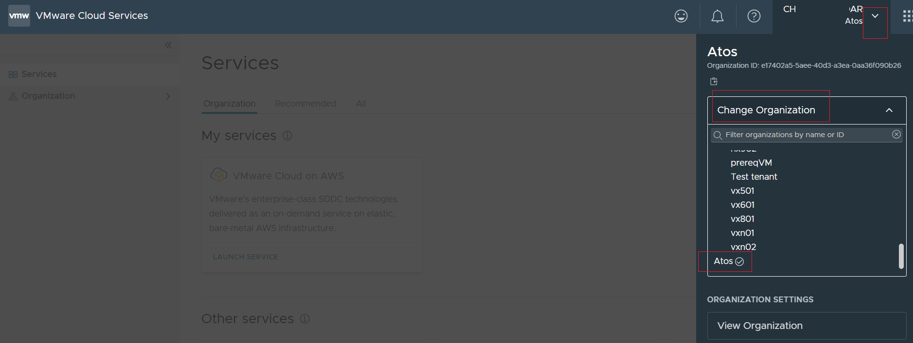 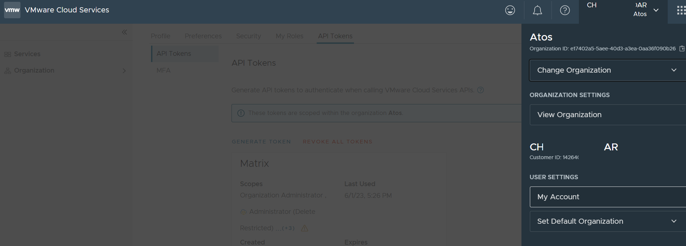 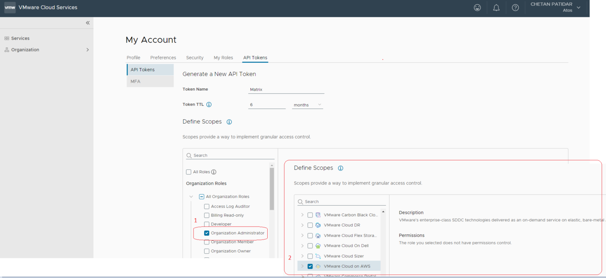 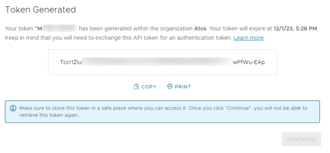 |
| 6. Select the tab next to **Account Information** tab (name of your SDDC) > Provided the **vCenter** connection details > Click **VALIDATE CONNECTION** > Once **Test connection successful** click **OK** and **SAVE THIS SDDC**                                              | 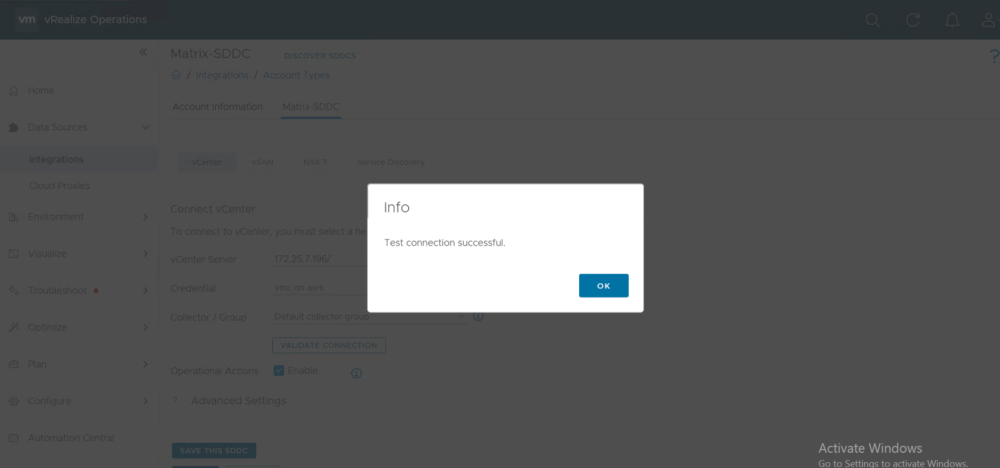                                                                                                                                                                  |
| 7. To validate if the integration of vROPs is successful, click on **Integration** tab and expand **VMware Cloud on AWS**<br /><br /> Or you can also go to **Environment** tab from the left panel > Click on **VMware Cloud on AWS** > Under VMC Storage select vCenter SDDC | 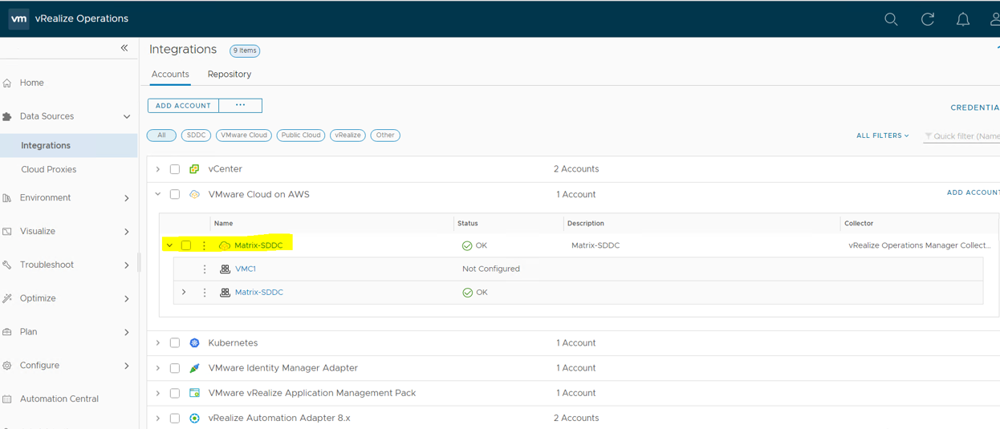 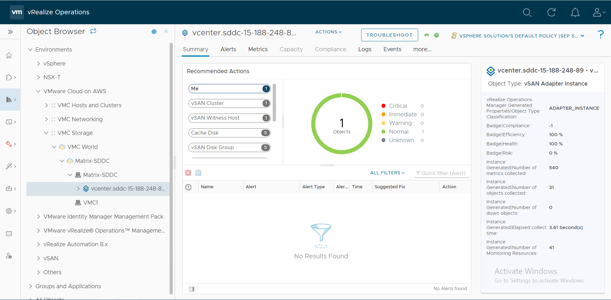                                                                                                   |

## VMware Aria Operations for Logs

| Steps                                                                                                                                                                                                                                             | Screenshots                                                                                                                   |
|---------------------------------------------------------------------------------------------------------------------------------------------------------------------------------------------------------------------------------------------------|-------------------------------------------------------------------------------------------------------------------------------|
| 1. Log in to VMware Aria Operations for Logs (SaaS) > Expand **Configuration**                                                                                                                                                                    | 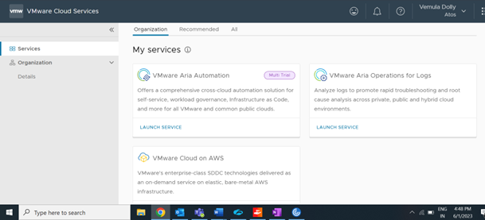                                                                            |
| 2. Click **Cloud Proxies** then expand **ADD PROXY** and click on **New**                                                                                                                                                                         | 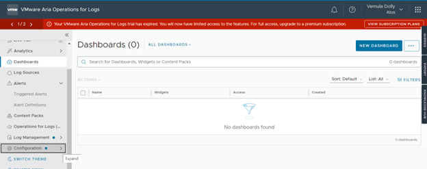                                                                    |
| 3. To deploy the Cloud Proxy, click on **DOWNLOAD OVA**                                                                                                                                                                                           |  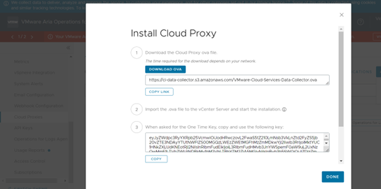                |
| 4. Navigate to your on-premises data center and Login to it                                                                                                                                                                                       | 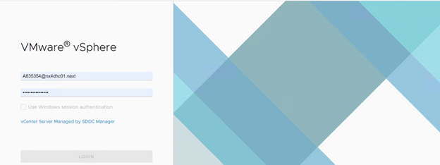                                                                     |
| 5. Click on the name of your **vCenter Cluster**                                                                                                                                                                                                  | 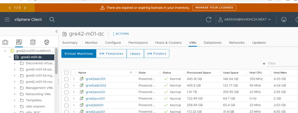                                                                        |
| 6. **Right-click** on selected cluster and select **Deploy OVF Template**                                                                                                                                                                         | 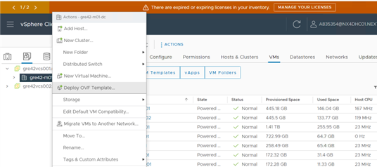                                                                |
| 7. In the **Deploy OVF Template** form, perform the following actions:                                                                                                                                                                            |                                                                                                                               |
| 7.1. Click **Select an OVF template** and select an OVF file by clicking **UPLOAD FILES** from the **Local file** option. Enter the path to the OVA Cloud Proxy file you downloaded > Click **Next**                                              | 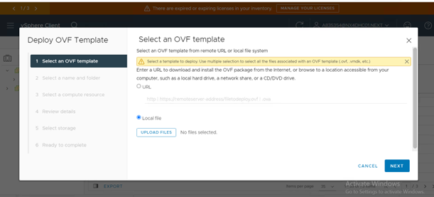                                                                |
| 7.2. Click **Select name and folder** and enter the name in **Virtual machine name** field for your OVA file > click **Next**                                                                                                                     | 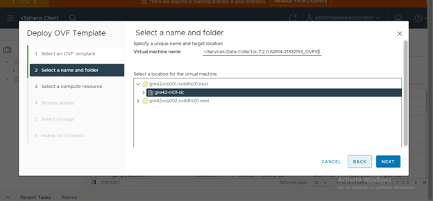                                                                |
| 7.3. Click **Select a compute resource** and the cluster where you want to run the Cloud Proxy > Click **Next**                                                                                                                                   | 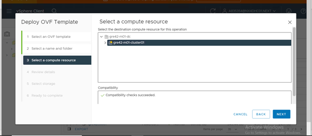                                                                |
| 7.4. Accept the **License Agreement** > Click **Next**                                                                                                                                                                                            | 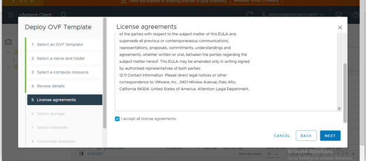                                                                |
| 7.5. Under **Select networks** select a vSAN network > Click **Next**                                                                                                                                                                             | 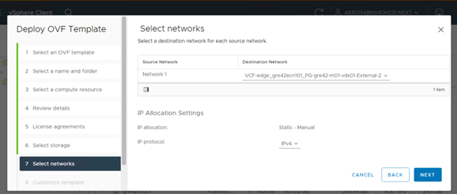                                                                |
| 7.6. Click **Customize template** and enter the required information > **Do not** click **Next**                                                                                                                                                  |                                                                                                                               |
| 7.6.1. Here, return to **VMware Aria Operations for Logs (SaaS)** and copy the **Token Key** provided > Paste the **One Time Key** in the custom template form                                                                                    | 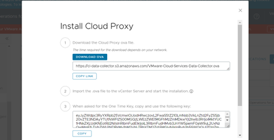 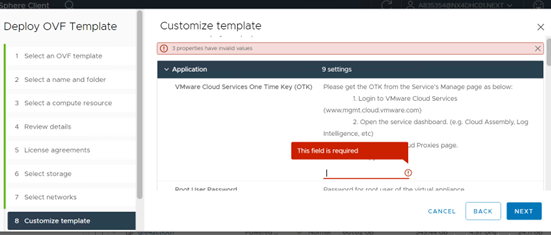 |
| 7.6.2. For **Root User Password**, choose a unique password. It does not need to match the vCenter password                                                                                                                                       | 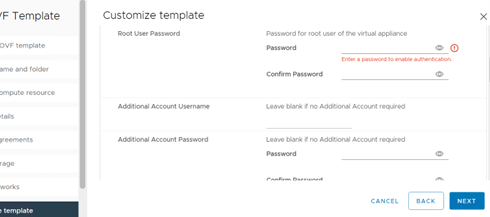                                                                |
| 7.6.3. Enter the **Cloud Proxy Display name**                                                                                                                                                                                                     |                                                                 |
| 7.6.4. Note that, you should have a Get a unique IP address, IP address should be first added to the DNS server and DNS PTR. Use this IP address in the customize template form                                                                   |                                                                                                                               |
| 7.6 Click on **Next** and **Cloud Proxy OVF Template** deployment will begin and can be seen in on-premise vCenter                                                                                                                                |                                                                                                                               |
| 7.7. To verify that your Cloud Proxy is running, at the **VMs** tab > check in the list of virtual machines, the VM deployed state should be **Powered On**                                                                                       |                                                                                                                               |
| 7.8. The Cloud Proxy is installed successfully and Cloud Proxy will try to contact the vRLI Service Cloud, if that is successful it will appear in the vRLI cloud UI                                                                              | 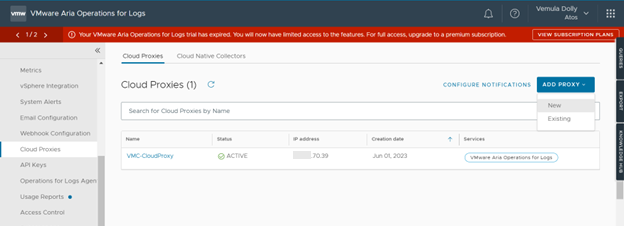                                                                         |
| 8. Return to the **VMware Aria Operations for Logs (SaaS)** > Expand **Log Management** > Click on **Log Forwarding** and select **New Configuration**                                                                                            | 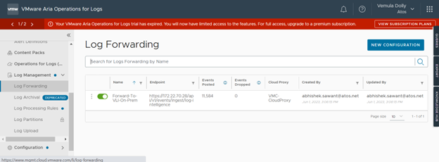                                                                         |
| 9. Create a new **Log Forwarding** rule. Complete all the details > Add the FQDN of the on-premises data center in the Endpoint URL<br />(URL pattern : <https://FQDN/api/v1/events/ingest/log-intell>)<br /> Click on **Verify** and **Save** it | 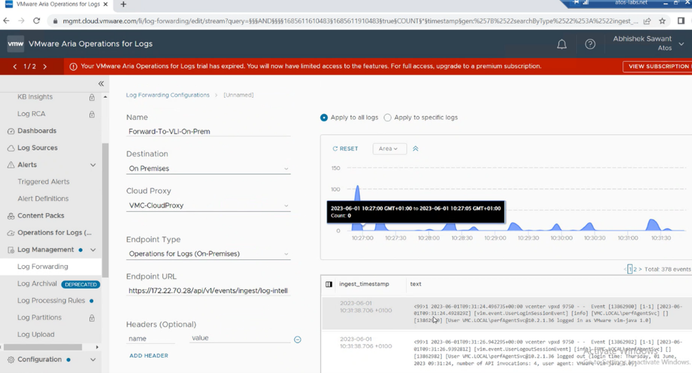                                                                      |
| 10. Navigate to Log Insight > Expand the dashboard > Expand General and click on overview > You can see the SDDC-Logs (cloud) to vRLI cluster on-premises                                                                                         | 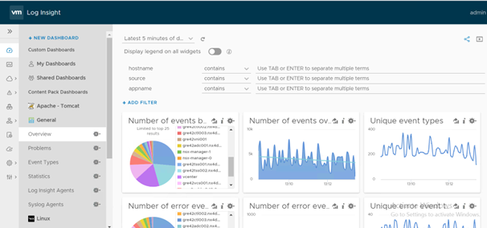                                                                    |

## VMware vRealize Automation

Note that, before proceeding VMC vCenter and NSX manage IPs are excluded from vRA proxy configuration

| Steps                                                                                                                                                                                                                                                                                                                                                                                                                                                                                   | Screenshots                                                                                                       |
|-----------------------------------------------------------------------------------------------------------------------------------------------------------------------------------------------------------------------------------------------------------------------------------------------------------------------------------------------------------------------------------------------------------------------------------------------------------------------------------------|-------------------------------------------------------------------------------------------------------------------|
| 1. In vRA On-Premises, select **Infrastructure** > **Connections** > **Cloud Accounts** and click **Add Cloud Account**                                                                                                                                                                                                                                                                                                                                                                 | 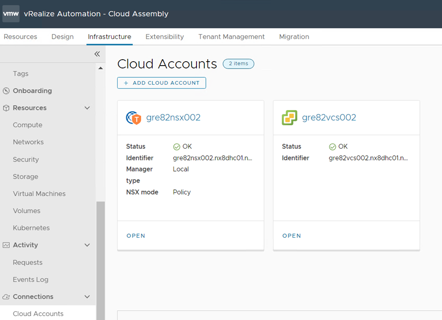                                                         |
| 2. Select type VMware cloud on AWS                                                                                                                                                                                                                                                                                                                                                                                                                                                      | 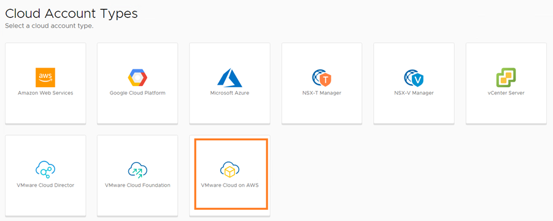                                                     |
| 3. Add the **VMC API token** along with **Name** (API token generated from VMC user profile is used here)<br /> Minimum required roles for the API token are:<br />&ensp;**- Organizational Roles**<br />&emsp;&ensp;Organization Member<br />&emsp;&ensp;Organization Owner<br />&ensp;**- Service Roles - VMware Cloud on AWS**<br />&emsp;&ensp; Administrator<br />&emsp;&ensp; NSX Cloud Administrator<br />&emsp;&ensp; NSX Cloud Auditor<br /><br />Click on **APPLY API TOKEN** | 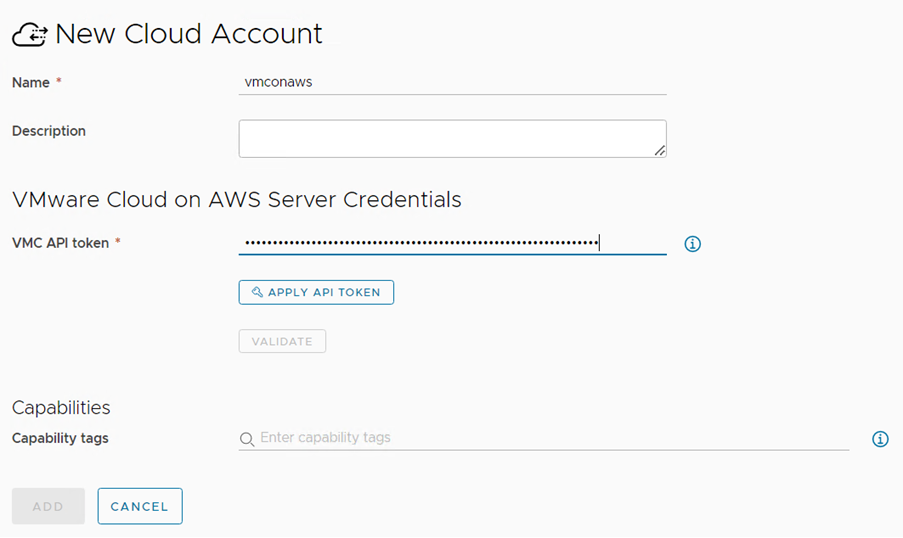                                                             |
| 4. Post applying token, the values are automatically populated based on the available SDDC list from VMC<br /> Select appropriate **SDDC name**                                                                                                                                                                                                                                                                                                                                         | 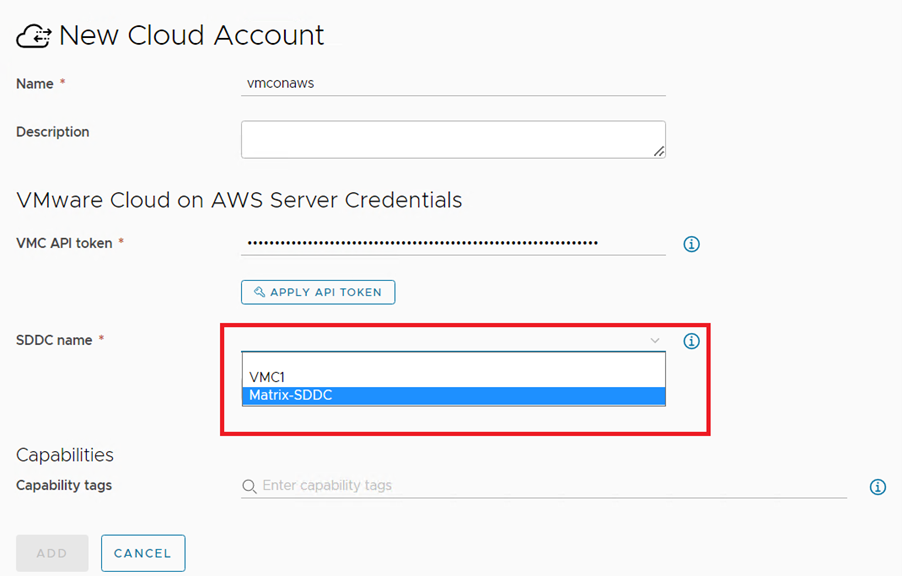                                                             |
| 5. Once SDDC is selected, **vCenter** and **NSX-T Manager** IP address/FQDN values are automatically populated<br /><br />**Note :** Replace NSX-T Manager URL with NSX-T Manager private IP and enter vCenter user name and password<br /><br />Click on **VALIDATE**                                                                                                                                                                                                                  | 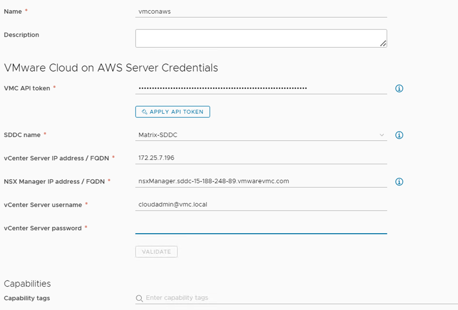 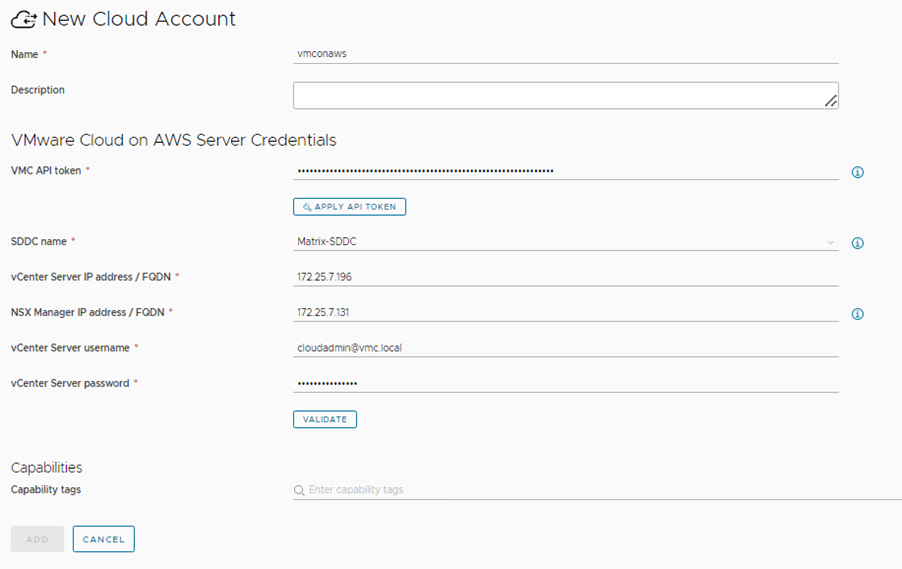 |
| 6. Post successful validation, it auto-populates data centers associated with the account > Select the checkbox against **SDDC-datacenter** > Click **ADD** and it will add a new cloud account                                                                                                                                                                                                                                                                                         | 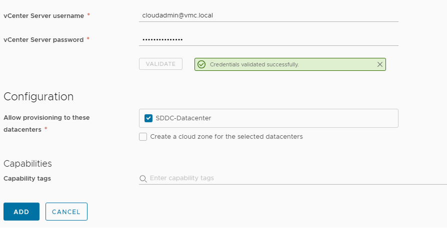                                                           |
| 7. Create new **Cloud Zone** > Goto **Infrastructure** > **Configure** > **Cloud Zone** (Create new zone by selecting VMC on AWS account/region)                                                                                                                                                                                                                                                                                                                                        |                                                             |
| 8. Click on **Compute** tab > **ADD** Cluster                                                                                                                                                                                                                                                                                                                                                                                                                                           |                                                            |
| 9. Create a new project and under **Provisioning** tab > Click on **ADD ZONE** and add a new cloud zone created in step number 7                                                                                                                                                                                                                                                                                                                                                        |                                                           |

## SNOW Discovery Intergration

1. To integrate vCenter deployed on VMC on AWS, make sure the SNOW Discovery is configured. If not use the [SNOW Discovery Deployment Guide](dhcSnowDiscoveryDeploymentGuide.md) to configure SNOW Discovery Instance and proceed further on the next step.

2. Once you verify the SNOW Discovery Instance is available, contact the [SNOW Discovery Support Team](dhcSnowDiscoveryDeploymentGuide.md#supportescalations) via email. Share vCenter IP and credential details to integrate the vCenter to SNOW Discovery

## Nessus Professional Integration

**Prerequisites for integration of Nessus Professional 10.1.x:**

1. Tenable Nessus Professional 10.1.x software installed on-premises.
2. Tenable Nessus Professional Active license.
3. VMware Cloud on AWS account and access credentials.
4. Network configurations allowing communication between Nessus and VMware Cloud on AWS.

### **Configure Nessus Scan**

| Steps                                                                                                                                                                                                                                                                                                           | Screenshots                                                     |
|-----------------------------------------------------------------------------------------------------------------------------------------------------------------------------------------------------------------------------------------------------------------------------------------------------------------|-----------------------------------------------------------------|
| 1. Login to **On-premises Nessus Professional portal**                                                                                                                                                                                                                                                          |      |
| 2. Create a **new scan**.<br />3. Post login **Under My scans** -> Click on **New scan** on the top right.<br />&ensp;                                                                                                                                                                                          |      |
| 4. Select the appropriate scan type you need to perform. <br />**Note:** In this case we have cloned **Scan_MGMT** to use the same configuration as for on-prem VM Scan.<br />&ensp;<br />5. To clone scan, click on the scan name (**Scan_MGMT**) -> Click on More -> Copy to > Select **MyScans**<br />&ensp; |        |
| 6. Provide a new name to the Scan, (e.g., in this case **POC-VMC-Scan_MGMT**)<br />7. Edit the **scan settings** & provide the **Target IP**, or **Network Range**.<br />&ensp;                                                                                                                                 |  |
| 8. Click on **Save**                                                                                                                                                                                                                                                                                            |                                                                 |

### **Nessus Scan Running**

Once the Scan has been configured successfully with the necessary configuration.

| Steps                                                                                                                                                                                                                                                                                | Screenshots                                                  |
|--------------------------------------------------------------------------------------------------------------------------------------------------------------------------------------------------------------------------------------------------------------------------------------|--------------------------------------------------------------|
| 1. Go to **My Scans**, Select the **respective scan** to scan the target instances in VMware Cloud on AWS. & Click on the **Run button** as highlighted in the screenshot.                                                                                                           |    |
| **Note:** Upon execution, the scan will be in **Running state**. It will take time depending on the number of hosts & the number of vulnerabilities found.<br />2. To view the **status**, click on **scan name** & click on **History tab**. Refer screenshot attached.<br />&ensp; |    |
| 3. Once scan is complete, the status of the **scan** will be updated as follows :                                                                                                                                                                                                    |  |

### **Analyzing Scan Results**

Once scan is completed successfully you can view the scan results as follows :-

| Steps                                                                                                                                                                                        | Screenshots                                                      |
|----------------------------------------------------------------------------------------------------------------------------------------------------------------------------------------------|------------------------------------------------------------------|
| 1. Go to **My Scans**. Then, Click on the **Scan Name**.<br />**Note:** In case you have scanned an entire network you can find the list of VM’s identified under **Hosts** Tab.<br />&ensp; |           |
| 2. To view the list of **vulnerabilities** for that respective VM click on **Vulnerabilities tab**.                                                                                          |  |
| 3. Click on the **respective vulnerability** to get more details about the vulnerability affected host.                                                                                      |        |

# vRealize Network Insight Integration

**Steps before integration of vRealize Network Insight Integration:**

| Steps                                                                                                                                                            | Screenshots                                                |
|------------------------------------------------------------------------------------------------------------------------------------------------------------------|------------------------------------------------------------|
| 1. Log in to vRealize Network Insight.                                                                                                                           |       |
| 2. Go to >> **Settings** >> **INFRASTRUCTURE AND UPDATES** >> **Add Collector VM** >> Copy the **Shared Secret key** for the Collector VM deployment on VMC SDDC |    |
| 3. Download a collector OVA from the **VMware Customer Connect Portal** and in VMC vCenter deploy the **connector VM**.                                          |   |
| 4. Deploy a **collector VM** in VCM SDDC.<br />5. Select the **OVF Template**<br />&ensp;                                                                        |   |
| 6. On the **Select a name and folder** page, enter a unique name for the virtual machine or vApp, select a deployment location, and click **Next**.              |   |
| 7. On the **Configuration** page, select a deployment configuration and click **Next**.                                                                          |   |
| 8. On the **Select storage** page, define where and how to store the files for the deployed OVF template                                                         |   |
| 9. On the **Select networks** page, select a source network and map it to a destination network. Click **Next**                                                  |   |
| 10. On the **Customize template** page, customize the deployment properties of the OVF template and click **Next**.                                              |   |
| 11. On the **Ready to complete** page, review the page and click **Finish**.                                                                                     |   |
| 12. Once deployment is successful, go to vRNI portal >> **Settings** >> **INFRASTRUCTURE AND UPDATES** >> you will see the collector VM added                    |  |

**Integration Steps:**

| Steps                                                                                                                                                 | Screenshots                                                                                                                       |
|-------------------------------------------------------------------------------------------------------------------------------------------------------|-----------------------------------------------------------------------------------------------------------------------------------|
| 1. Got to >> **Settings** >> **Account and Data Sources**                                                                                             |                                                                   |
| 2. Click on **Add Source**                                                                                                                            |                                                                   |
| 3. Select **VMC – vCenter from VMware Cloud (VMC)** section                                                                                           |                                                                   |
| 4. Provide the details for VMC vCenter >> Validate and provide the Nick name >> **Submit**                                                            |                                                                   |
| 5. Select **VMC – NSX Manager** from VMware Cloud (VMC) section and provide the details for NSX-T >> Validate and provide the Nick name >> **Submit** |                                                                   |
| 6. Go to >>**INFRASTRUCTURE AND UPDATES** >> Click on the VMC Collector VM and analyze the data                                                       |                                                                   |
| 7. Go to >> **Environment** >> **VMware Cloud** >> Analyze the data                                                                                   |   |

# VCS Automation for deploying Managed AWS Cloud Formation Templates

**Process Overview:**

1. Create/configure user in AWS
2. Create Cloud Formation template
3. Configure S3 bucket
4. Configure VMware vRealize Automation Service Broker
5. Deploy Cloud Formation via Service Broker

#### **Step 1: Create/Configure user in AWS**

| Steps                                                                                                                                                                           | Screenshots                                    |
|---------------------------------------------------------------------------------------------------------------------------------------------------------------------------------|------------------------------------------------|
| 1. Login to AWS with an account that has permissions to create and configure a new user                                                                                         |                                                |
| 2.  Click on the “**Services**” link at the top left and select the **IAM Service******                                                                                         |  |
| 3.  Click the “**Add user**” button                                                                                                                                             |                                                |
| 4.  On the “Add User” window, type the desired “User name”. At minimum, this user will need to be enabled for “Programmatic access”. Click the“Next…” button to continue        |  |
| 5. On the next “**Add user**” window, select the “**Attach existing policies directly**”option. *Alternatively, you can create a group that has the required access permissions |  |
| 6. On the “**Review**” window, select the “**Create user**” button                                                                                                              |  |
| 7. Creation and configuration of the new user with **AdministratorAccess** Security Policy is now complete.                                                                     |                                                |

#### **Step 2: Create Cloud Formation Template**

| Steps                                                                                                                                                 | Screenshots                                     |
|-------------------------------------------------------------------------------------------------------------------------------------------------------|-------------------------------------------------|
| 1. Go to path on AWS Console for Cloud Formation                                                                                                      |  |
| 2. Create Stack with Basic EC2 Instance Windows Template. Eg  This template creates a single server installation of Microsoft Windows Server 2012r23. |  |
| 3. Upload the template yml or json file  And Submit                                                                                                   |  |
| 4.  Check Manual Deployment is working or not                                                                                                         |                                                 |
| 5.  EC2 instance is deployed now                                                                                                                      |  |

#### **Step 3: Configure S3 Bucket**

| Steps                                                                                                                                   | Screenshots                                     |
|-----------------------------------------------------------------------------------------------------------------------------------------|-------------------------------------------------|
| 1.  Log into AWS Console to create an S3 bucket for the Cloud Formation template(s)                                                     |                                                 |
| 2.  Click on the “**Services**” link at the top left and select the **S3 Service**                                                      |                                                 |
| 3.  On the “**S3 buckets**”window, click the **“+Create bucket**” button                                                                |                                                 |
| 4.  On the “**Create bucket**”window, enter a “**Bucketname**” and select a “**Region**”to place the bucket in. Click the “Next” button |  |
| 5.  Leave the default selections on the next window and click the “Next” button                                                         |                                                 |
| 6.  On the “Set permissions” window, deselect the “Block all public access” checkbox.Click the “Next” button                            |  |
| 7.  On the “Review” window, click the “Create bucket” button                                                                            |                                                 |
| 8.  Once the S3 bucket is created, it will be visible in the “S3 buckets” window. Open the bucket by clicking on the bucket name        |  |
| 9.  In the bucket window, click the “**Upload**” button                                                                                 |  |
| 10. On the template’s permissions page, **Select** “**Everyone**”                                                                       |  |
| 11. The template now has the required permissions to be accessed for deployment via VMware vRealize Automation Cloud.                   |                                                 |

#### **Step 4: Configure VMware Cloud Services – Service Broke**

| Steps                                                                                                                                                                                                                                                                                                                                                                                                                                                                                               | Screenshots                                                                                     |
|-----------------------------------------------------------------------------------------------------------------------------------------------------------------------------------------------------------------------------------------------------------------------------------------------------------------------------------------------------------------------------------------------------------------------------------------------------------------------------------------------------|-------------------------------------------------------------------------------------------------|
| 1.  Login to VRA with an account that has permissions to create the required constructs for Service Broker                                                                                                                                                                                                                                                                                                                                                                                          |                                                                                                 |
| 2.  On the “My Services” page, click the “VMware     Service Broker” button                                                                                                                                                                                                                                                                                                                                                                                                                         |                                                  |
| 3.  On the “**ServiceBroker**” page, select “**Infrastructure**” from the top menu On the left menu, select “**Cloud Accounts**”, then click the “**+ ADD CLOUD ACCOUNT**” button On the “**AccountTypes**” page, select the “**Amazon Web Services**” button On the “**NewCloud Account**” page, enter the “**Access key ID**”and “**Secret access key**” that were recorded during the AWS user creation phase above. Give the account a **name** and click the “**ADD**” button                  |   |
| 4.  Select Regions and then Once added The new Cloud Account is now available and should show a Status of OK                                                                                                                                                                                                                                                                                                                                                                                        |                                                  |
| 5.  From the menu on the left, select “**Cloud Zones**”. On the **CloudZones** page, New Cloud Zone is added                                                                                                                                                                                                                                                                                                                                                                                        |   |
| 6.  On the left menu, click the “**Projects**” link. On the “**Projects**”page, click the “**+ NEW PROJECT**” button  On the “**NewProject – Users**” page add the users that will have access to this project. Either click the “**+ ADD USERS**” button or the “**+ADD USER GROUPS**” button to add the users. With the users added,click the “**Provisioning**” link                                                                                                                             |                                                  |
| 7.  On the “**NewProject – Provisioning**” page, click the “**+ADD CLOUD ZONE**” button.  On the “**AddCloud Zone**” page, search for the cloud zone. You can choose to accept the defaults for “**Provisioning Priority**” and “**Instanceslimit**”, or you can provide the desired settings for one or both. Click the “**ADD**” button.                                                                                                                                                          |   |
| 8.  From the top menu, select the “**Content & Policies**” link                                                                                                                                                                                                                                                                                                                                                                                                                                     |                                                  |
| 9. Type: AWS Cloud Formation Template <br />     Name: Provide a name for the Content Source  <br />     Description: *Optional  Bucket Name: <br />     Name of the **S3 Bucket** created in a previous step above  Bucket Access Policy:               Public Click the “**Validate**” button to ensure you can access the S3 Bucket Account:       Select the **Cloud Account** that was created in a previous step above  <br />Region: **Select the region** where deployments will be created |                                                  |
| 10. Click the “Save & IMPORT” button                                                                                                                                                                                                                                                                                                                                                                                                                                                                |                                                                                                 |
| 11.  On the left menu, select the “**Content Sharing**” link. On the “**ContentSharing**” page, **search** for the **project** that was created in an earlier step Locate the **ContentSource** that was created in an earlier step and place **checkmark** next to the content that should be shared. Click the “**Save**” button                                                                                                                                                                  |                                                  |
| 12.  You are now ready to deploy CloudFormation templates from within Service Broker.                                                                                                                                                                                                                                                                                                                                                                                                               |                                                  |

#### **Step 5: Deploy Cloud Formation via Service Broker**

With all of the settings and configurations in place, there are now AWS Cloud Formation templates available
in the Service Broker Catalog. To deploy these Cloud Formation templates, do the
following:

| Steps                                                                                                                                                                                                         | Screenshots                                                                                                                                   |
|---------------------------------------------------------------------------------------------------------------------------------------------------------------------------------------------------------------|-----------------------------------------------------------------------------------------------------------------------------------------------|
| 1. From the top menu in Service Broker, select  “Catalog” On the “**Catalog Items**” page, locate the Cloud Formation template you wish to deploy, and choose the “**REQUEST**” link within that catalog item |                                                                                                |
| 2. On the “**NewRequest**” page, fill out all of the required items that are marked with a red asterisk. Click the “**SUBMIT**”button                                                                         |                                                                                                |
| 3. Once submitted,the Cloud Formation template will begin deployment                                                                                                                                          |                                                                                                |
| 4. When the deployment is finished, you will be able to access the newly deployed environment                                                                                                                 |  |
| 5. Alarm on AWS: You can configure as per your requirements                                                                                                                                                   |                                                                                                |

# Deploy Tanzu Kubernetes Cluster from On-Prem vRealize Automation

**Process Overview:**

1. Activate Tanzu Kubernetes Grid in an SDDC cluster
2. Configuration settings for Tanzu Kubernetes Cluster deployment from vRealize Automation
3. Create a cloud template
4. Request Tanzu Kubernetes Cluster deployment in vRealize Automation
5. Access the newly created Tanzu Kubernetes Cluster

#### **Step 1: Activate Tanzu Kubernetes Grid in an SDDC cluster**

**Prerequisites:**

- SDDC at version 1.16 or later (at least 112 GB of available memory, and sufficient free resources to support 16 vCPUs)
- SDDC cluster requires a minimum of three hosts to qualify for activation
- 4 CIDRs blocks are required to configure the **Workload Management Network**. CIDR blocks of size 16, 20, 23, or 26. These CIDR blocks should be free and not overlap with other networks:
  
  - **Service CIDR**: This block of addresses is allocated to Tanzu supervisor services for the cluster
  - **Namespace Network CIDR**: This block of addresses is allocated to namespace segments i.e network IPs are used for the VMs provisioning
  - **Ingress CIDR**: This block of addresses is allocated to receive inbound traffic through load-balancers to containers
  - **Egress CIDR**: This block of addresses is allocated to outbound traffic from containers and guest clusters

| Steps                                                                                                                                                           | Screenshots                                                                                                                                        |
|-----------------------------------------------------------------------------------------------------------------------------------------------------------------|----------------------------------------------------------------------------------------------------------------------------------------------------|
| 1. On SDDC cluster >> **ACTIONS** and click to **Activate the Tanzu Kubernetes Grid** service                                                                   |                                                                                                    |
| 2. Checking cluster resource                                                                                                                                    |                                                                                                    |
| 3. Configure the **Workload Management Network** by providing the CIDR blocks and click **VALIDATE AND PROCEED** to validate the CIDR blocks you have specified |                                                                                                    |
| 4. Review and click on **ACTIVATE TANZU KUBERNETES GRID**                                                                                                       |                                                                                                    |
| 5. The activation process will take around 25 minutes. The SDDC Summary page shows that Tanzu Kubernetes Grid is Activating                                     |    |
| 6. After the successful activation you can find the **Workload Tanzu Cluster** in vCenter                                                                       |                                                                                              |

#### **Step 2: Configuration settings for Tanzu Kubernetes Cluster deployment from vRealize Automation**

| Steps                                                                                                                                                                                                                                                                                                                                                                                                                                  | Screenshots                                                                                                                                                                                                                                                             |
|----------------------------------------------------------------------------------------------------------------------------------------------------------------------------------------------------------------------------------------------------------------------------------------------------------------------------------------------------------------------------------------------------------------------------------------|-------------------------------------------------------------------------------------------------------------------------------------------------------------------------------------------------------------------------------------------------------------------------|
| 1. In vRA check, whether the connected Cloud Account (in this case the vCenter) can be used for Kubernetes deployments<br /><br />This means that this vCenter has **Workload Management** enabled and at least one Supervisor Cluster is configured                                                                                                                                                                                   |                                                                                                                                                                                                                     |
| **Note:** If Cloud Account is not added then add VMC on AWS SDDC vCenter to a cloud account in vRA<br /><br />To add **Cloud Account** goto **Cloud Assembly**, click on **Infrastructure**, and from the left menu in **Connections**, click **Cloud Accounts**<br /><br />Provide a name and vCenter server details and click **VALIDATE** >> tick in the checkbox for **Allow provisioning to these datacenter** >>click on **ADD** |                                                                                                                                                                                                                        |
| 2. In **Kubernetes** section, add the **Supervisor Cluster** and the **Supervisor Namespace** in the vRA **Infrastructure**                                                                                                                                                                                                                                                                                                            |                                                                                                                                                                                                                                                                         |
| To add the **Supervisor Cluster** provide the **Account** and select **Supervisor cluster** name                                                                                                                                                                                                                                                                                                                                       |                                                                                                                                                               |
| Create a new the **Supervisor Namespace** in vRA and configured it in **vCenter**<br /><br />                                                                                                                                                                                                                                                                                                                                          |                                                          |
| 3. Add a new **Kubernetes Zone**<br /><br />Select **Cloud Account** and provide additional information like **name** and **capability tag** (optional)<br />In **Provisioning** tab, click on **ADD COMPUTE** and assign **Supervisor Cluster** and **Supervisor Namespace** that should be used in the Kubernetes Zone as provisioning resources                                                                                     |      |
| 4. In **Cluster Plans**, click on **NEW CLUSTER PLAN**<br /><br />Choose the **Cloud Account**, provide **Name** and in **Cluster Details** section choose **Kubernetes version**, Define the count of VMs **Control plane** and **Worker** nodes **VM class** and **Storage class** for control plane and worker nodes, also in **Addition Settings** section select **Default PVC storage class**                                    |                                                                                                                                                                                                                        |
| 5. In **Project** tab<br />Add newly created **Cloud Account** in **Provisioning** section<br />Add **Kubernetes Zone** in **Kubernetes Provisioning** section                                                                                                                                                                                                                                                                         |                                                                                                                                                                 |
| **Note:** If **Project** is not added then add a new Project<br />To add click on **Projects** under **Administration** section from the left menu, and click **New Project**, provide **Name** and click **CREATE**<br />Once the project is created follow the steps 5                                                                                                                                                               |                                                                                                                                                                                                                                                                         |

#### **Step 3: Create a cloud template**

| Steps                                                                                                                                                                                                                                                                                               | Screenshots                                            |
|-----------------------------------------------------------------------------------------------------------------------------------------------------------------------------------------------------------------------------------------------------------------------------------------------------|--------------------------------------------------------|
| 1. Under **Cloud Assembly** go to **Design** tab, select **Cloud Templates** section from the left menu, and click on **NEW FORM** >> **Blank canvas**<br />In the popup form provide **Name** and choose **Project**, select **Share only with this project** radio button and click on **CREATE** |  |
| 2. Add the below test code to the cloud template form.<br />The code can be modified/changed as per the requirement                                                                                                                                                                                 |  |

```yml
formatVersion: 1
inputs:
  clusterName:
    type: string
  clusterPlan:
    type: string
    enum:
      - tanzuClusterPlan
resources:
  Cloud_Tanzu_Cluster_1:
    type: Cloud.Tanzu.Cluster
    properties:
      name: '${input.clusterName}'
      plan: '${input.clusterPlan}'
      constraints:
        - tag: 'k8zzone:demo'
```

| Steps                                                                                                                                                                                                                                                                                                                                                                    | Screenshots                                                                                                    |
|--------------------------------------------------------------------------------------------------------------------------------------------------------------------------------------------------------------------------------------------------------------------------------------------------------------------------------------------------------------------------|----------------------------------------------------------------------------------------------------------------|
| 3. Click on **TEST** to test the cloud template                                                                                                                                                                                                                                                                                                                          |   |
| 4. Click on **VERSION** and in the popup form provide **Version** number and check **Release** check box to make the cloud template available to the Service Broker catalog                                                                                                                                                                                              |    |
| 5. Under **Service Broker** >> **Content & Policies** section in **Content Source** >> import cloud template                                                                                                                                                                                                                                                             |                                                     |
| From the list of the **Content Sources** select the content source >> click on **VALIDATE** in the **Content Source Details** page >> click on **SAVE & IMPORT**<br /><br />**Note:** If your environment does not have any content source configured yet, you need to create one and integrate the **Project** in which context you have created the **Cloud Template** |                                                     |
| 6. Validate if the cloud template is present in **Catalog** >> **Catalog Items**                                                                                                                                                                                                                                                                                         |                                                         |

#### **Step 4: Request Tanzu Kubernetes Cluster deployment in vRealize Automation**

| Steps                                                                                                    | Screenshots                                                                                                            |
|----------------------------------------------------------------------------------------------------------|------------------------------------------------------------------------------------------------------------------------|
| 1. Choose the **Catalog Item** >> Open the form by clicking on **REQUEST**                               |   |
| 2. Provide all necessary information for the deployment to be successful and **SUBMIT** cluster resource |          |

#### **Step 5: Access the newly created Tanzu Kubernetes Cluster**

| Steps                                                                                                                                                                                           | Screenshots                                                                                                               |
|-------------------------------------------------------------------------------------------------------------------------------------------------------------------------------------------------|---------------------------------------------------------------------------------------------------------------------------|
| 1. Goto **Cloud Assembly** >> **Infrastructure** >> **Resources** section from the left menu and click on **Kubernetes**<br /><br />You can see the list of all clusters that you have deployed |   |

## **DNS settings for OS template Sync**

| Steps                                                                                                                                                              | Screenshots                                        |
|--------------------------------------------------------------------------------------------------------------------------------------------------------------------|----------------------------------------------------|
| 1. Log in to VMC on AWS console at [https://vmc.vmware.com](https://vmc.vmware.com/).                                                                              |    |
| 2. Click **Inventory** > **SDDCs**, then pick an SDDC card and click **VIEW DETAILS**.                                                                             |    |
| 3. Click **OPEN NSX MANAGER** and (Click on **Access via the Internet**) , log in with the **NSX Manager Admin User Account** shown on the SDDC **Settings** page. |    |
| 4. click on **Networking** Tab. Scroll to bottom left. Click on **DNS** under **IP Management** .                                                                  |    |
| 5. Click **DNS Services** . Click on **ADD DNS SERVICE**.                                                                                                          |    |
| 6. Create an entry for **Compute Gateway DNS Forwarder**  with the respective details.                                                                             |    |
| 7. Create an entry for **Management Gateway DNS Forwarder**  with the respective details.                                                                          |    |
| 8. Click on tab **DNS Zones**  > Click on **ADD DNS ZONE**                                                                                                         |    |
| 9. Create a DNS Zone for **Compute Gateway**. Click on **Save**                                                                                                    |    |
| 10. Create a DNS Zone for **Management Gateway**. Click on **Save**                                                                                                |  |

# VMC on AWS Hybrid Cloud Operations With HCX

To activate and install the HCX in VMware Cloud on AWS, kindly follow the steps mentioned in [VMC on AWS HCX Deployment Guide](https://github.com/GLB-CES-PrivateCloud/DHC-Documentation/blob/VCS-10646-Documentation-for-VMC-on-AWS---Integration/workInstructions/wiHcxDeploymentGuide.md)


The below image is an illustration of the steps on higher-level to HXC activation and installation:


# Avamar Backup Solution for VMC

To backup VMC VMs the **Avamar backup solution** can be used. To configure and implement a backup solution contact the backup team at `rocloudiaasbackupceb@atos.net` for further assistance.

# Shared Responsibility with VMC on AWS

To understand the shared responsibilities with VMC on AWS, Please click on the [Link](https://github.com/GLB-CES-PrivateCloud/DHC-Documentation/blob/VCS-10646-Documentation-for-VMC-on-AWS---Integration/workInstructions/WiVMCSharedResponsibility.md) to have a detail understanding.
