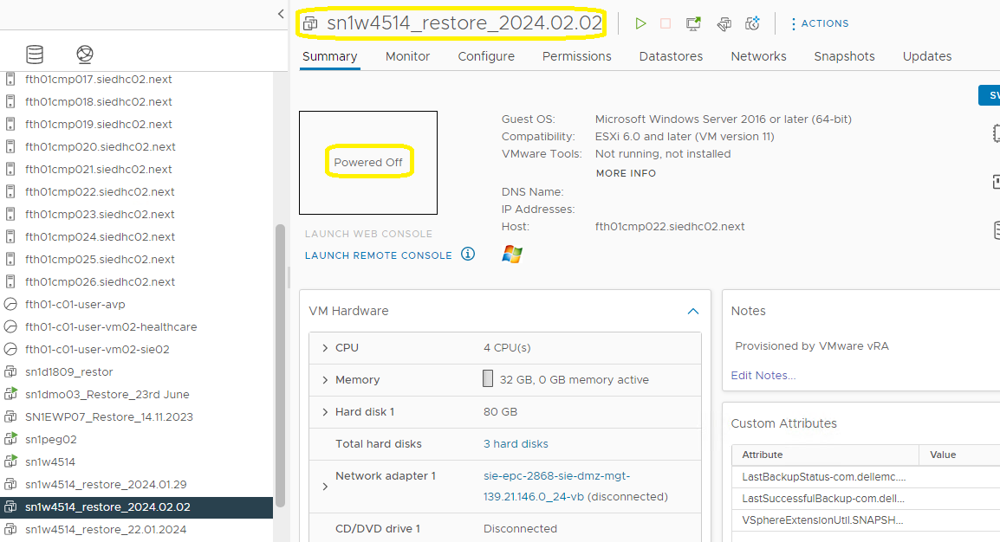
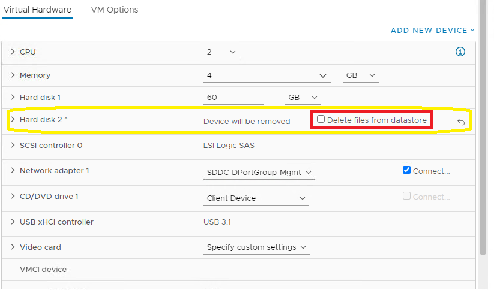
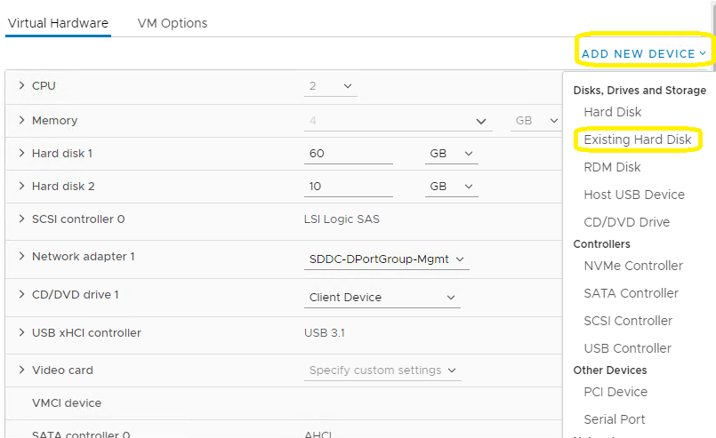
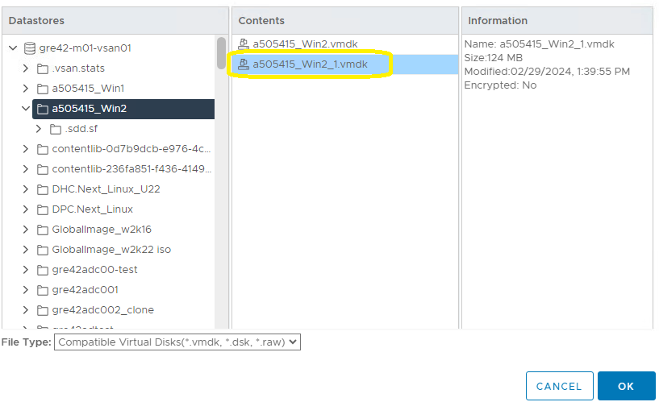
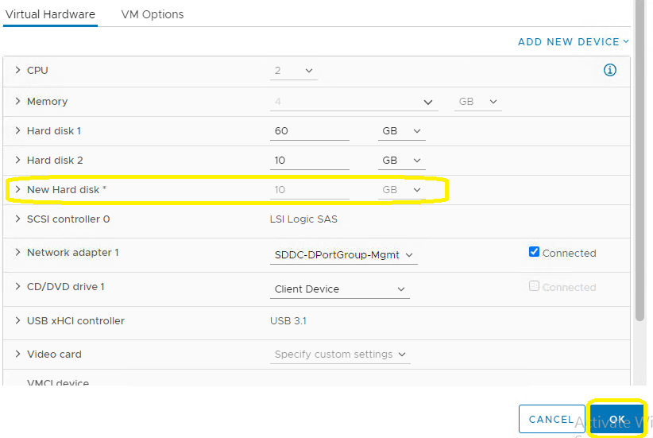
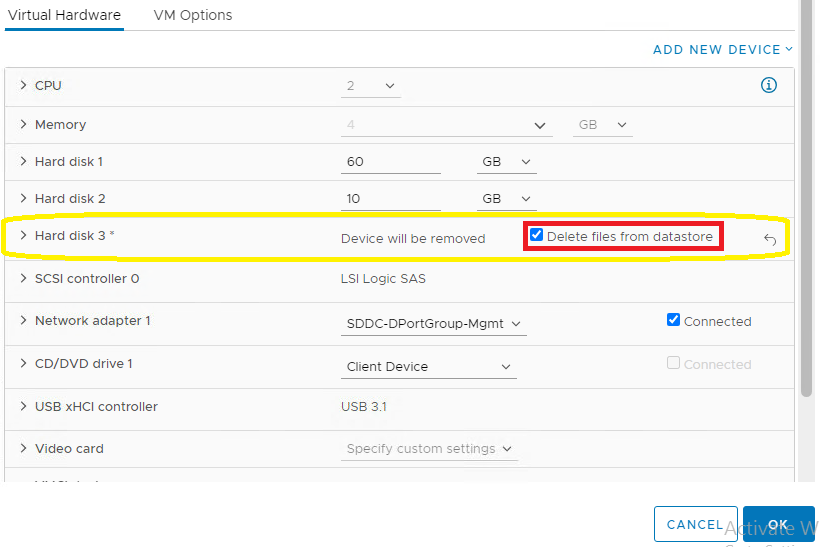
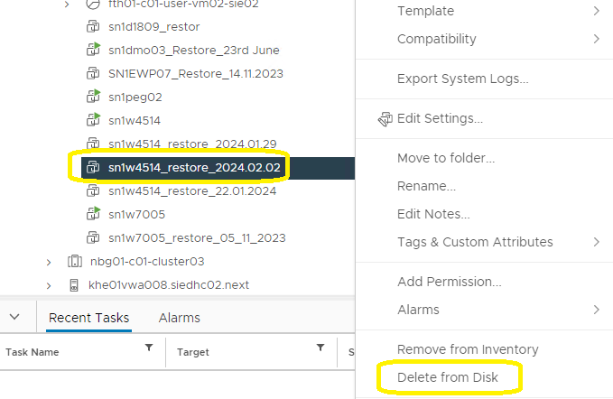

# VMDK migration for file restore

## Table of content

- [VMDK migration for file restore](#vmdk-migration-for-file-restore)
  - [Table of content](#table-of-content)
  - [Changelog](#changelog)
  - [Introduction](#introduction)
    - [Purpose](#purpose)
    - [Audience](#audience)
    - [Scope](#scope)
- [Procedure](#procedure)
  - [Step 1 Restore VM from Backup](#step-1-restore-vm-from-backup)
  - [Step 2 Move VMDK from Restore to VM](#step-2-move-vmdk-from-restore-to-vm)
  - [Step 3 Copy needed files](#step-3-copy-needed-files)
  - [Step 4 Remove VMDK from target VM](#step-4-remove-vmdk-from-target-vm)
  - [Step 5 Remove restored VM](#step-5-remove-restored-vm)

## Changelog

| Version | Date       | Issue     | Description     | Author(s)        |
| ------- | ---------- | --------- | --------------- | ---------------- |
| 0.1     | 29.02.2024 | VCS-12328 | Initial version | Piotr Gesikowski |

## Introduction

### Purpose

Retrieve files from Bakckup after File-Level Recovery

### Audience

- VCS Operations

### Scope

Moving virtual hard disk from one VM (restored) to another VM (target).

# Procedure

## Step 1 Restore VM from Backup

This task is performed by CEB team, VM has to be visible in vCenter and powered off to avoid any potential locks:

## Step 2 Move VMDK from Restore to VM

Remove required disk from restored VM. **Do not delete disk from datastore**:

Go to target VM and attach exisiting disk from restored VM:

Find exisitng disk on datastore:

Confirm required disk from restored VM is attached to target VM:

Remove required disk from restored VM. **Do not delete disk from datastore**:

Go to target VM and attach exisiting disk from restored VM:

Find exisitng disk on datastore:

Confirm required disk from restored VM is attached to target VM:

## Step 3 Copy needed files

Inform OS team the VMDK move from previous step (step 2) was successfull and required files can be copied.
Wait for OS team feedback before continue to next step.

## Step 4 Remove VMDK from target VM

Remove disk from target VM and **delete it from datastore**:

## Step 5 Remove restored VM

Remove restored VM from datastore:

