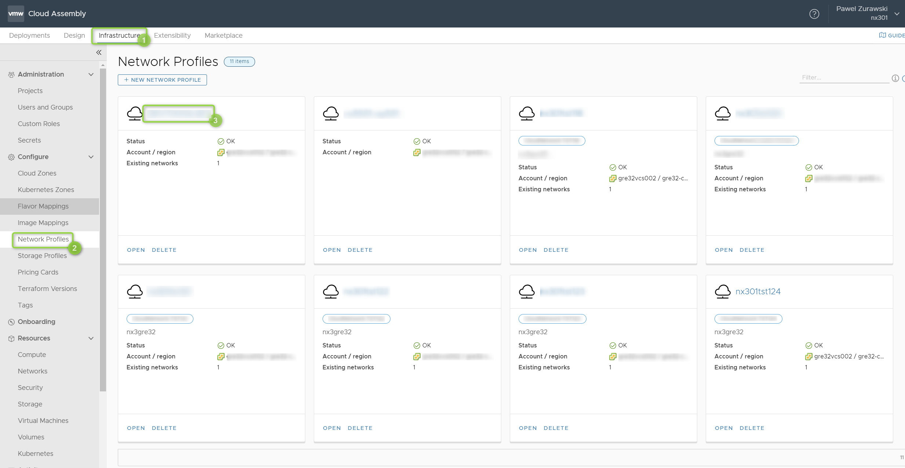
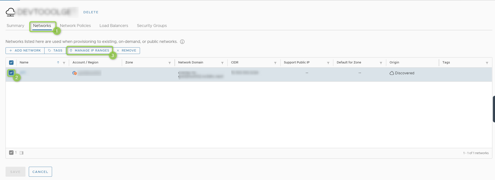
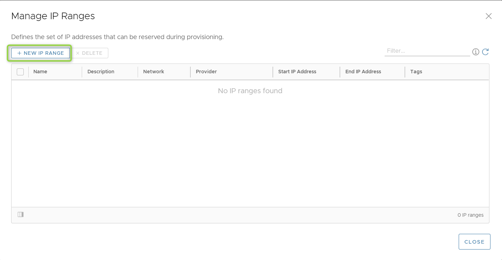
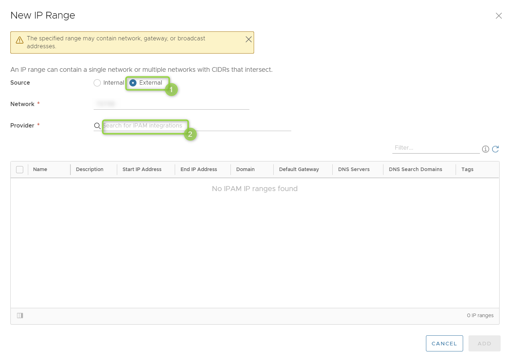
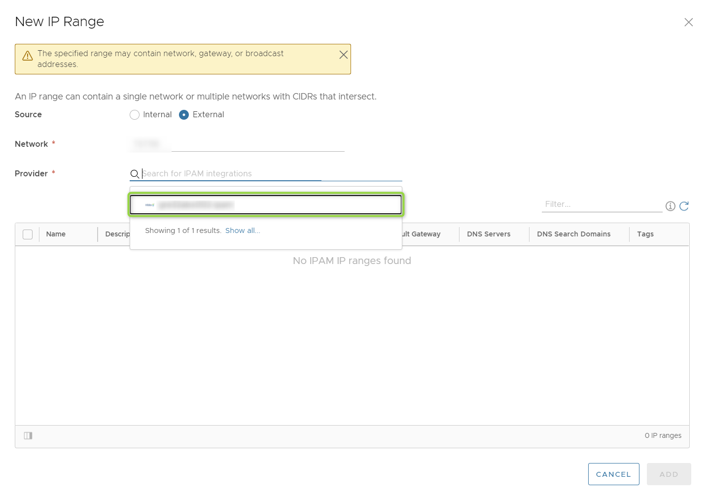
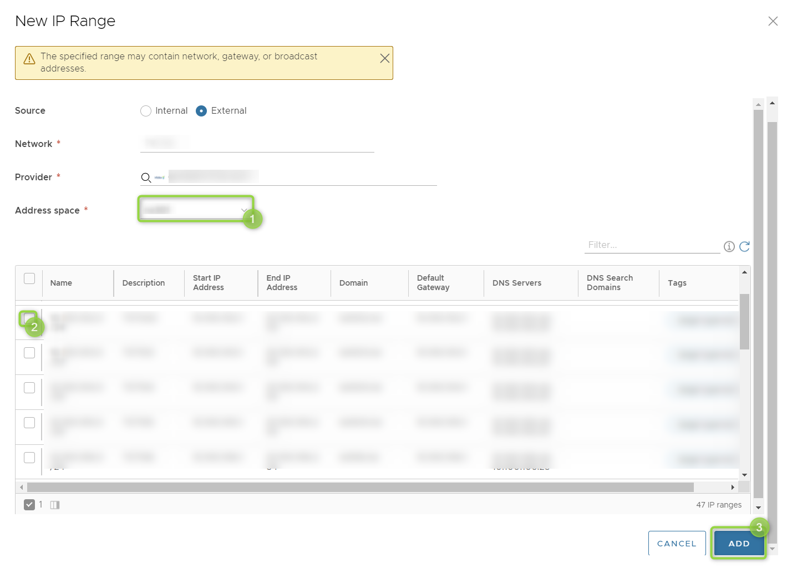
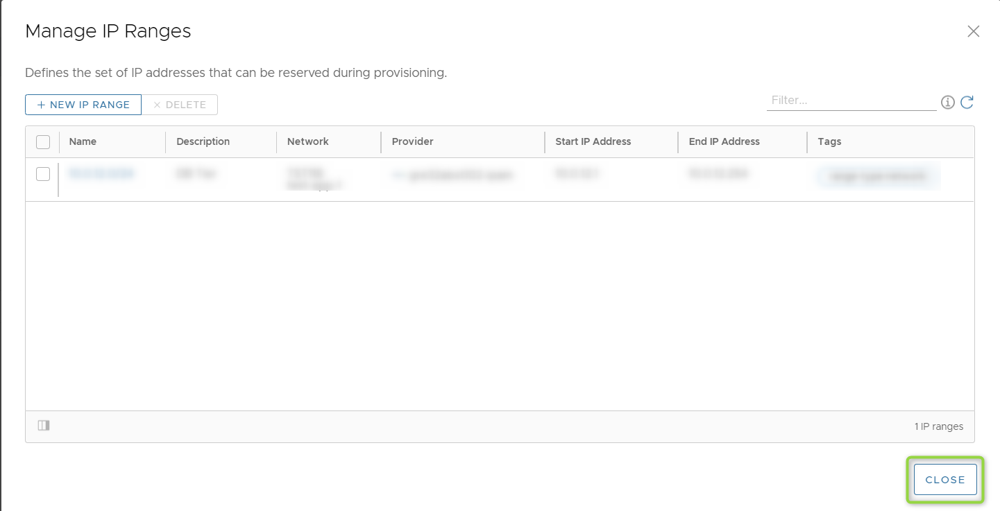
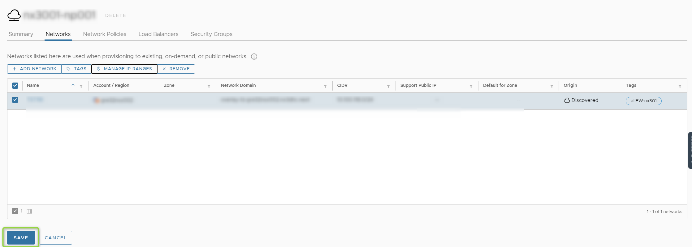

# VRA Infoblox Integration

## Changelog
  
| Version | Date       | Description              | Author       |
| ------- | ---------- | ------------------------ | --------------- |
| 0.1     | 27.08.2021 | First version | Pawel Zurawski|
| 0.2     | 03.11.2021 | Update | Michal Pindych|

# Table of Contents

- [VRA Infoblox Integration](#vra-infoblox-integration)
  - [Changelog](#changelog)
- [Table of Contents](#table-of-contents)
  - [Introduction](#introduction)
    - [Purpose](#purpose)
    - [Audience](#audience)
    - [Scope](#scope)
  - [Prerequisite](#prerequisite)
- [Configure external IPAM integration](#configure-external-ipam-integration)

## Introduction

### Purpose

Integrate vRA Network profile with external IPAM Infoblox.

### Audience

- VCS Operations
- VCS Engineers

### Scope

- Configure external IPAM integration

## Prerequisite

- Administrator access to vRA Cloud tenant.
- Basic understand of how vRA Cloud works.

# Configure external IPAM integration

Please log on into vRA Cloud correct tenant.

When you are logged into vRA Cloud tenant go to Infrastructure / Network Profiles / Click on new Network Profile created

New window with Network Profile details will appear. Go to Networks tab, select Network and click on MANAGE IP RANGES

Another new window will appear. Click +NEW IP RANGE

Another new window will appear. Change Source to External. Click on Provider and choose ABX IPAM integration.

New field will appear, please choose correct View (Customer Name), after it available network pools will be listed. Please select correct network pool and click ADD.

After that, please close all windows and save.

