# vRA on prem customer trusted ssl certificate

- [vRA on prem customer trusted ssl certificate](#vra-on-prem-customer-trusted-ssl-certificate)
  - [Changelog](#changelog)
  - [Introduction](#introduction)
    - [Purpose](#purpose)
    - [Audience](#audience)
    - [Scope](#scope)
- [4. Introduction](#4-introduction)
- [5. Prerequisites](#5-prerequisites)
- [6. Generate a CSR for vRA environment](#6-generate-a-csr-for-vra-environment)
- [7. Request customer to create a P7b and machine certificate from provided CSR](#7-request-customer-to-create-a-p7b-and-machine-certificate-from-provided-csr)
- [8. Import ROOT, SUBORDINATE and MACHINE certificate from customer singed CA Server to create a custom vRA PEM certificate](#8-import-root-subordinate-and-machine-certificate-from-customer-singed-ca-server-to-create-a-custom-vra-pem-certificate)
- [9. Import vRA certificate in vRealize LifeCycle Manager and apply to vRA environment](#9-import-vra-certificate-in-vrealize-lifecycle-manager-and-apply-to-vra-environment)
- [10. Replace vRealize Automation certificate from vRealize LifeCycle Manager](#10-replace-vrealize-automation-certificate-from-vrealize-lifecycle-manager)

## Changelog

| Version | Date | User | Changes |
|---------|------|------|---------|
| 0.1 | 27.09.2022 | Arun Sompura | CESVXR-697 - Customer trusted vra ssl certificate |

## Introduction

### Purpose

Replace local vRA on prem ssl certificate with customer CA signed ssl certificate.

### Audience

- VCS Operations

### Scope

- Pre-requisites
- Generate CSR for vra environment
- Request customer to create a P7b and machine certificate from provided csr
- Import ROOT, SUBORDINATE and MACHINE certificate from customer singed CA Server to create a custom vRA PEM certificate
- Import vRA certificate in vRealize LifeCycle Manager and apply to vRA environment
- Replace vRealize Automation certificate from vRealize LifeCycle Manager

**DISCLAIMER: This process will only be applicable if customer has the explicit requirment of customer-hosted CA signed certificate for vRA**

# 4. Introduction

VCS contains and implements it's own CA and root certificate installation for components however, if customer has a requirement wherein while accessing vRA portal it should not show any certificate warnings due to audit or other requirement they can opt for this solution. From VCS environment vRA CSR generated certificate request will be shared with customer so that it can be singed using customer CA server and which can be imported in vRA. Once implemented customer while accessing vRA portal will not show certificate warnings.

# 5. Prerequisites

- DNS A record of vRA tenant, vRA servers, vRA Load balancer VIP and vRA FQDN, Identity manager VIP, Identity manager Load balancer and vIDM servers record should be created in customer DNS by adding as a zone.
- DNS should resolve the VCS components with host records.
- Customer should have CA and root certificate server in there domain and VMware template available in CA server.
- This change needs vRA, vIDM downtime for offline snapshot and certificate replacement
- Offline snapshot of VMware Identity manager and vRealize Automation and latest inventory sync for vRA and vIDM environment from vRSLCM.

# 6. Generate a CSR for vRA environment

- login to vRealize LifeCycle Manager (vRSLCM) portal using domain account which assumes VCF role permission in vRSLCM
  
- Click on Locker > Certificates > Generate CSR
  
- Provide all the details pertaining to CN, OU, Country, Locality, State
  
- Important to provide Key length, Server Domain, Host name of all vIDM servers, vIDM Load balancer, vRA Load balancer FQDN, and vRA appliances and IP addresses for Subject Alternate name (as described in pre-requisites)
  
- Click generate to generate certificate.

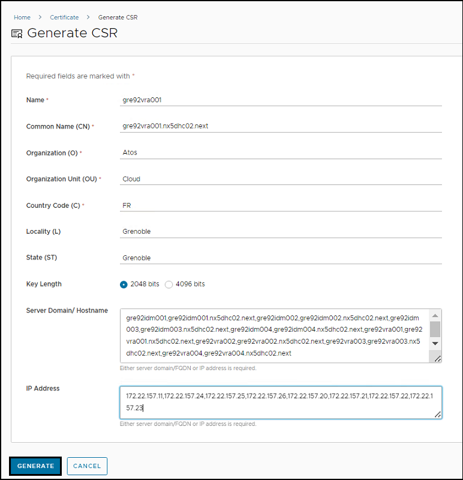
  
- VRA CSR certificate will be downloaded in PEM format consist of private key and certificate as shown below.

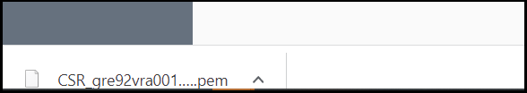

- Open downloaded CSR with text editor like notepad and provide ONLY certificate part to customer securely (marked with red outline) and save it for future use.
  
> Please note that the private key from this CSR will be used during final PEM certificate generation where we need to build complete certificate chain.

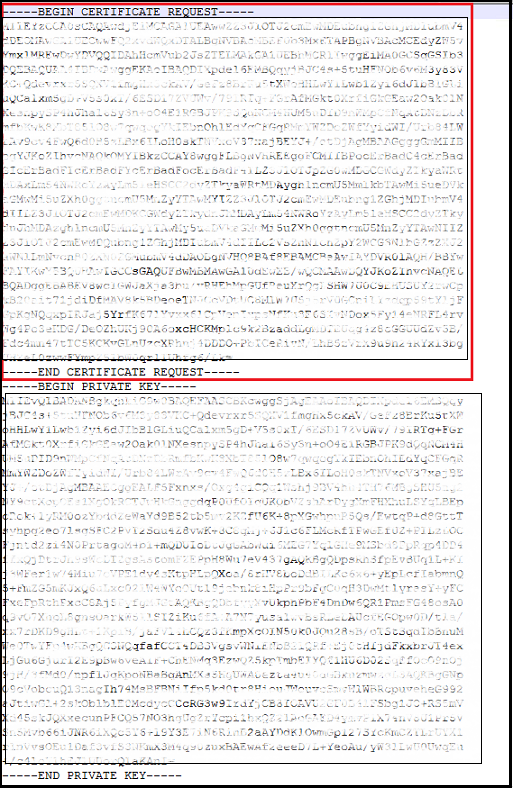

# 7. Request customer to create a P7b and machine certificate from provided CSR

VCS Engineering team will provide certificate part from CSR to customer in order to get p7b and machine certificate generated using customer Certificate Authority server:

- Customer engineer will connect to their CA server using browser. (example `https://customerCAserver/certsrv`)
  
- Click on Request a certificate

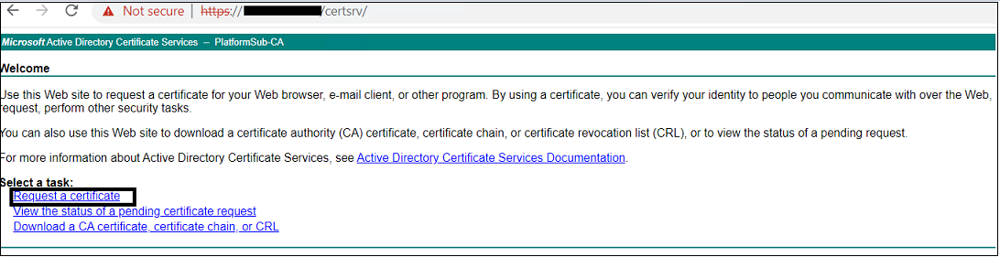  

- Click on advanced certificate request
  
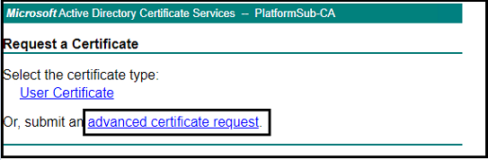  

- Paste certificate provided by VCS team in textbox *Base-64-encoded certificate request (CMC or PKCS #10 or PKCS #7)*

- Choose certificate template and submit

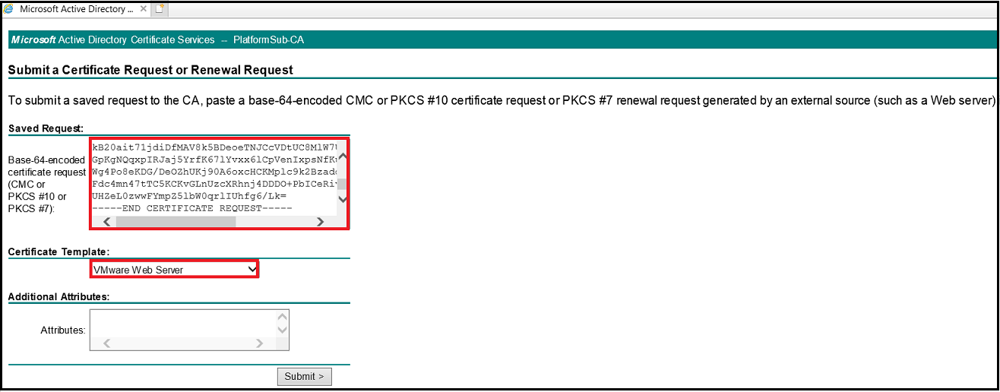

- Website will prompt message of certification click on yes

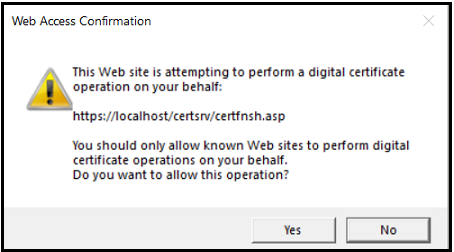

- Download certificate as shown and rename it as machineCertificate with .cer extension.

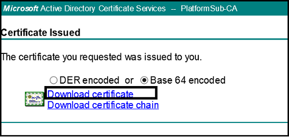

- Download certificate chain as shown it will save certificate as a p7b format.

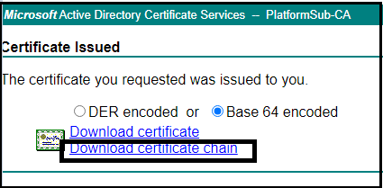

- Click p7b certificate and open.

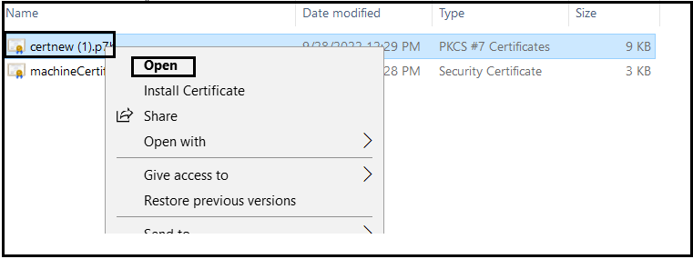

- Right click on root certificate to open and export from All Tasks option.
  
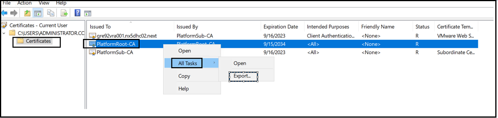

- Export certificate using Base-64 encoded X.509 ( .CER ) as root.cer and wait for export to complete.
  
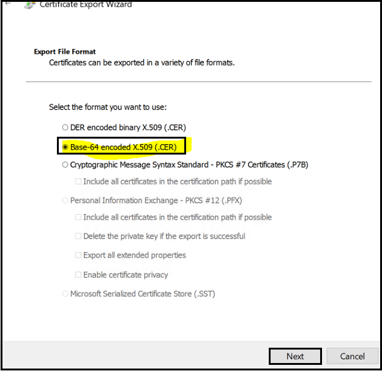

- Right click on sub certificate to open and export from All Tasks option and save it as subordinate.cer.

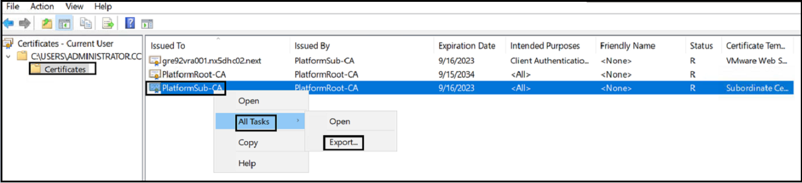

- This way customer will have *machine certificate* , *root certificate* and *subordinate certificate*
  
- VCS team have to request all 3 certificate from customer for importing it in vRealize LifeCycle Manager for vRA environment.

# 8. Import ROOT, SUBORDINATE and MACHINE certificate from customer singed CA Server to create a custom vRA PEM certificate

- Collect root, subordinate and machine certificate from customer.
  
- Copy collected certificate on VCS terminal server.
  
- Open all certificate using text editor and create a vRealize automation PEM certificate as per given screenshot.

> Please make sure there are no blank spaces during merging this certificate into single PEM certificate.

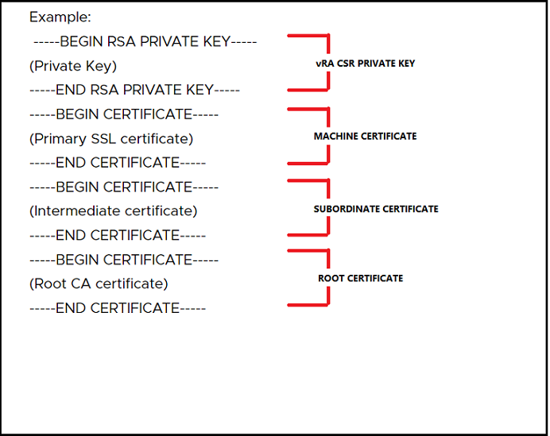

# 9. Import vRA certificate in vRealize LifeCycle Manager and apply to vRA environment

As we have created PEM certificate from vRealize LifeCycle Manager (vRSLCM) we need to import PEM certificate into vRSLCM locker under certificate so that it is available for replacement from vRA certificate replacement environment action page.

- Log in to vRealize LifeCycle Manager (vRSLCM) go to Locker > Certificate > IMPORT
  
  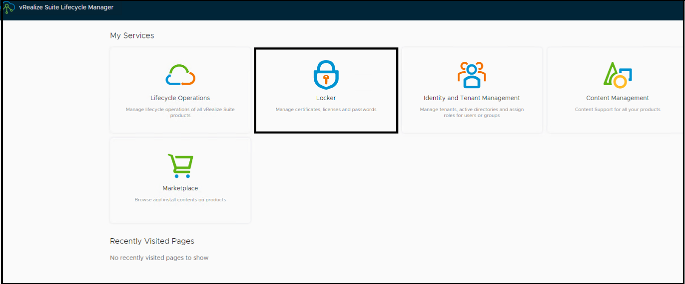

  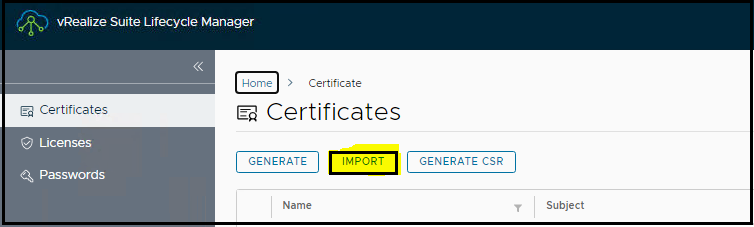

- Provide certificate name and passphrase and click *BROWSE FILE* to provide the path of .PEM certificate which was created on step 8.
  
- Stor passphrase in vault under vra

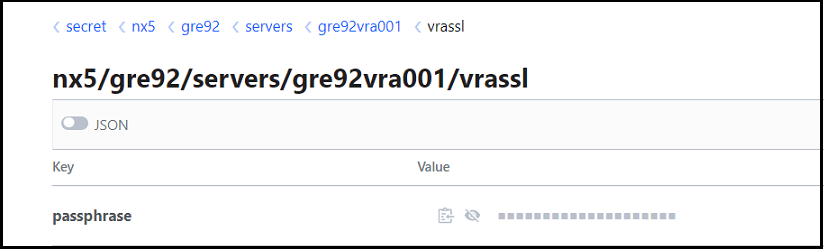

- Verify that private key and certificate chain correctly populated.

- Click import to add certificate in vRSLCM certificate store.
  
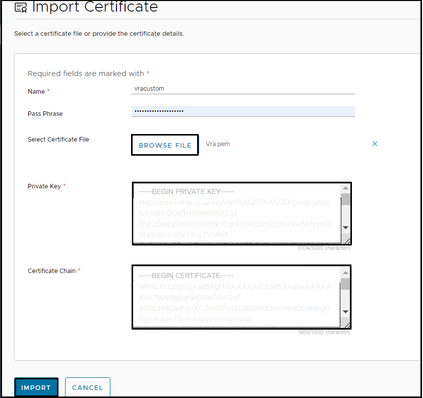

- Verify certificate is successfully added
  
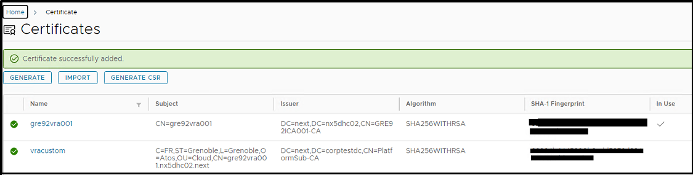

# 10. Replace vRealize Automation certificate from vRealize LifeCycle Manager

- Login to vRealize life cycle manager > click Lifecycle Operations

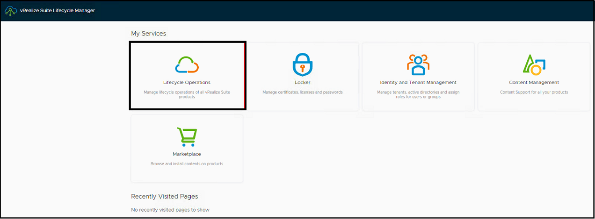

- Click on Manage Environments > click on VIEW DETAILS for vRA environment

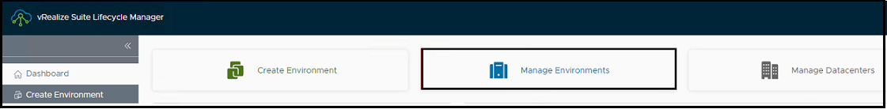

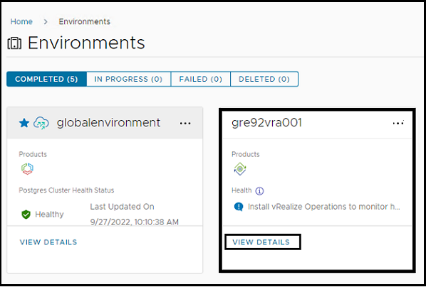

- Click on 3 dots for vRA environment to populate actions available.
  
- Click on Replace Certificate

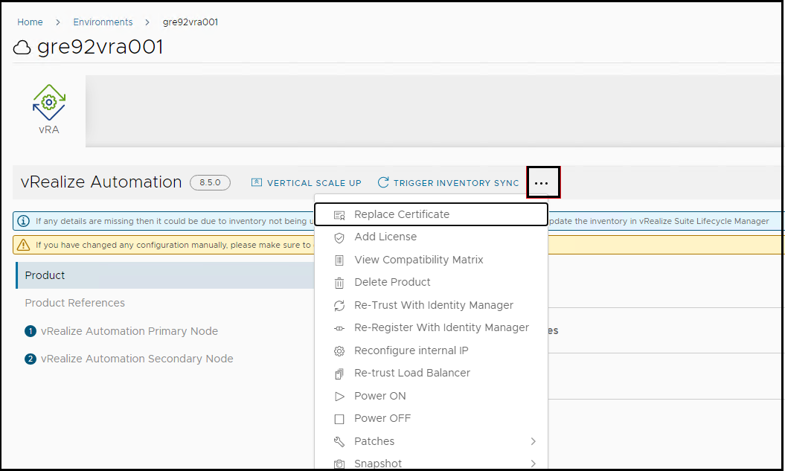

- This will open a window showing current certificate click next
  
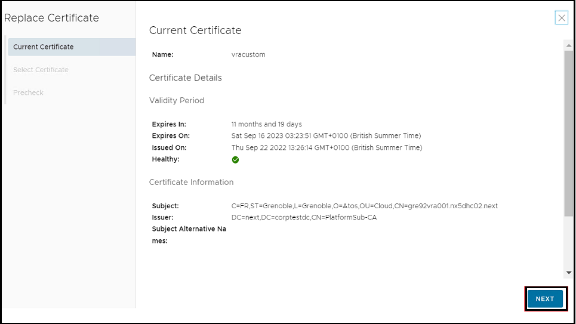

- Select Certificate from the dropdown and select the newly imported vRealize automation PEM certificate and click next

> Please make sure to validate and choose correct certificate.
  
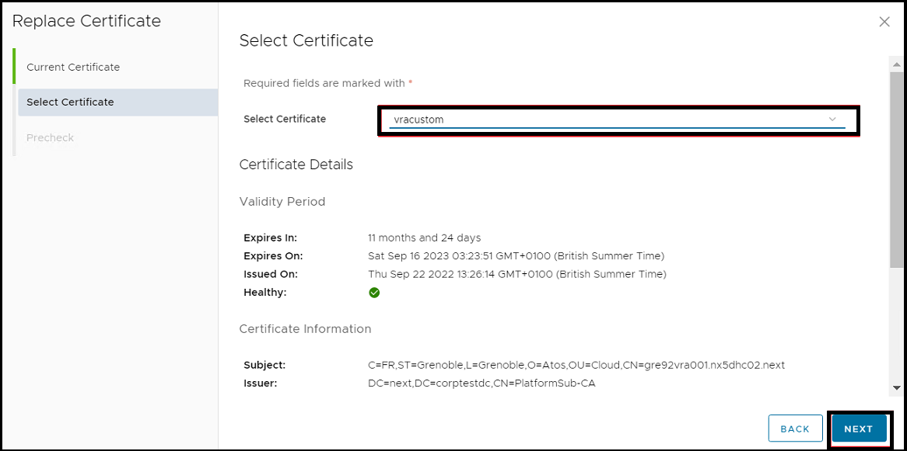

- Run precheck to verify for any warnings and error. Kindly fix applicable warnings and errors before proceeding to next step.

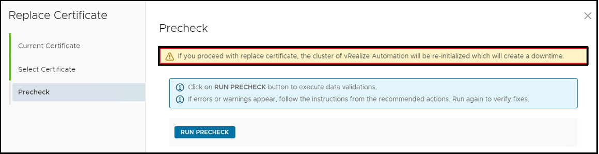

> Please note once you submit the request vRA will be down and reinitialized hence, make sure to get change and downtime arranged.

- Once validated click Finish to start certificate replacement and wait for request to complete.

- Request takes around 30 mins to complete.

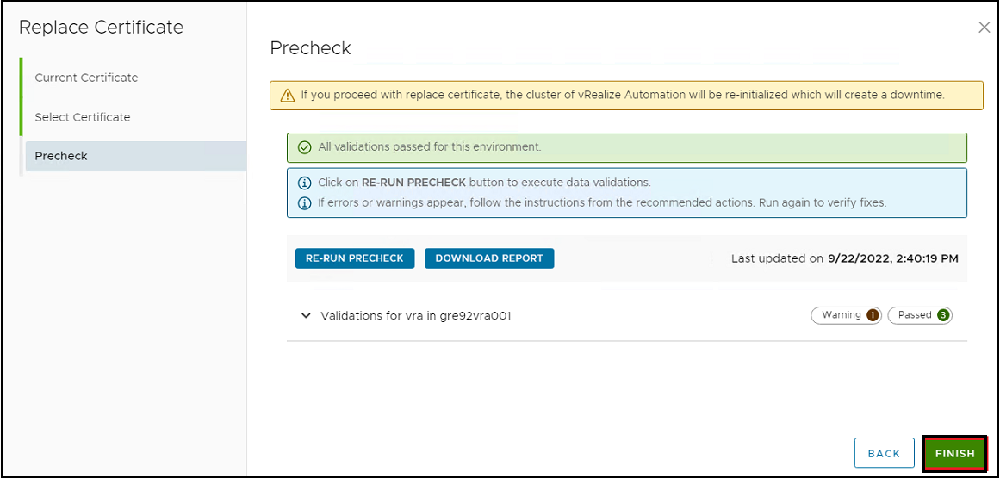

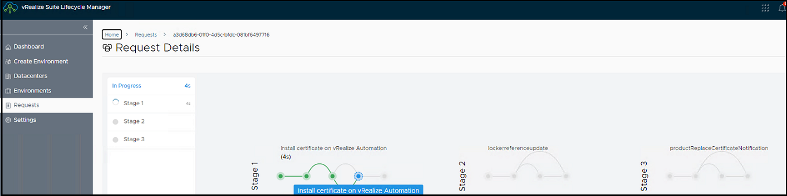

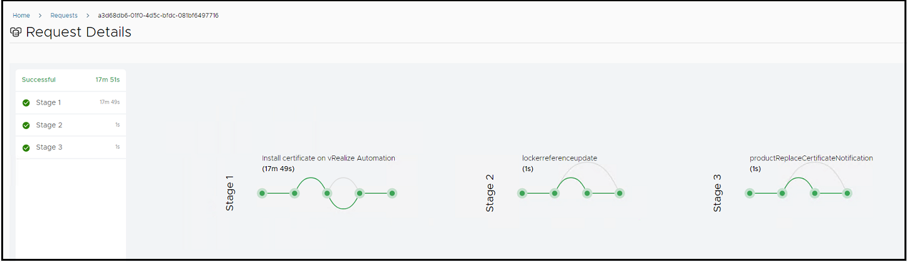

> Kindly verify certificate is updated successfully and its showing as secured when accessing vRA also, verify all host and IP address are showing correctly in Subject alternate name, Certificate chain is valid.

- Post confirmation at VCS site request customer to access vRealize automation to confirm no certificate warnings is shown..
  
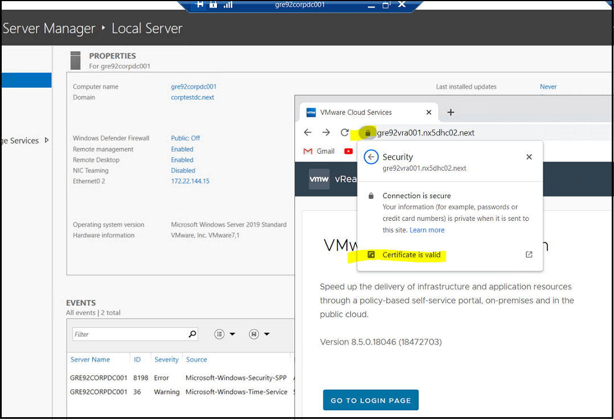
