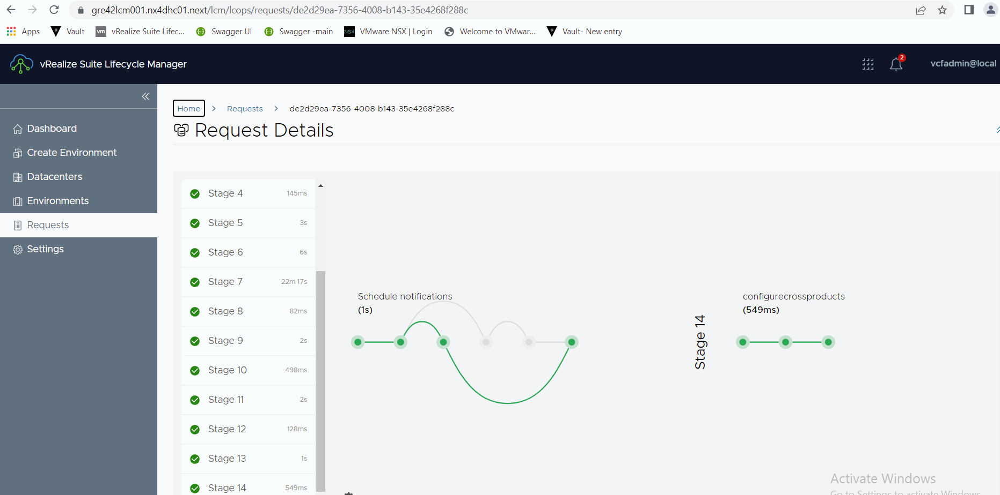
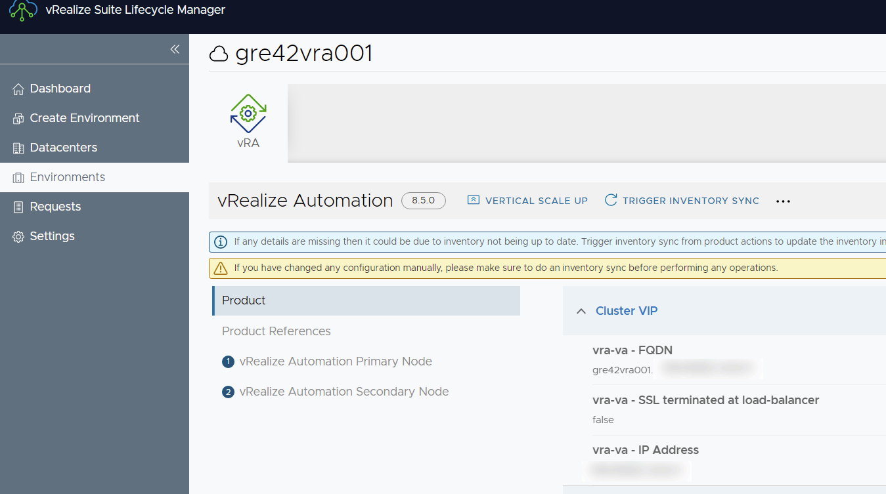
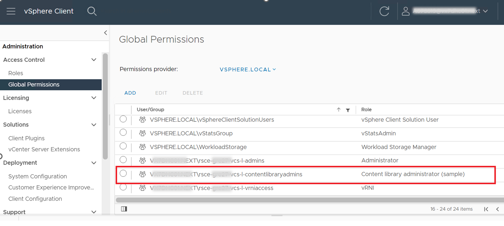
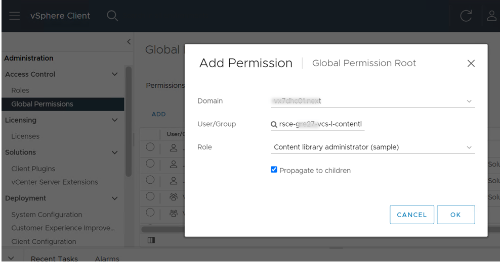
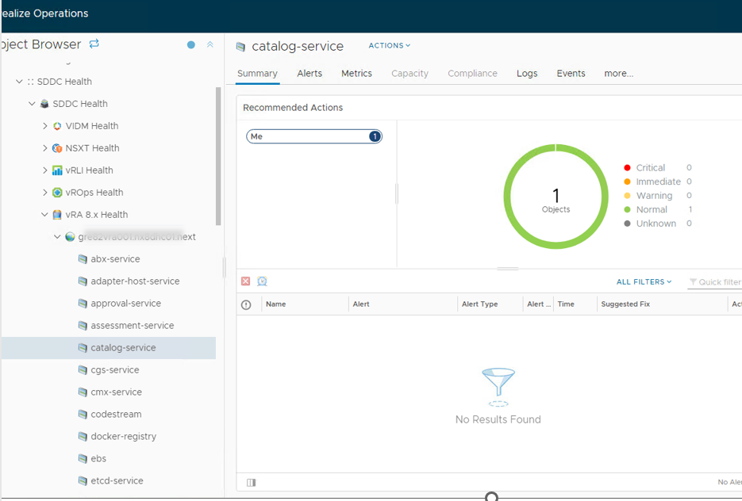
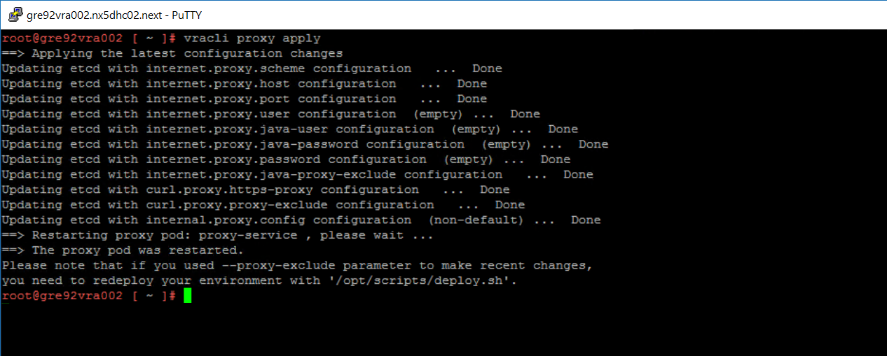
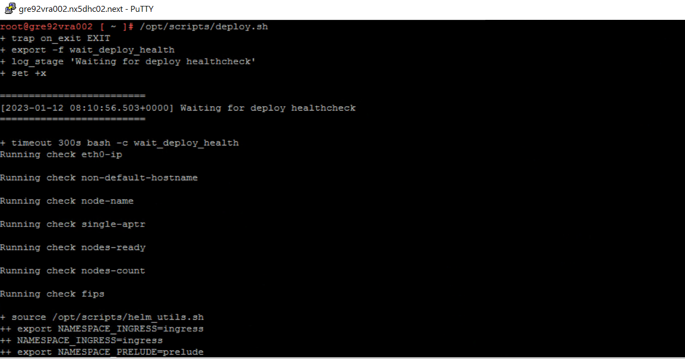
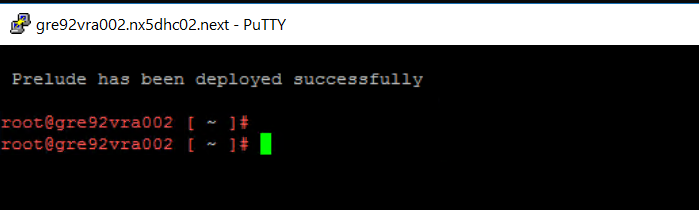

# vRA On-Premises Deployment

Table of Contents

- [vRA On-Premises Deployment](#vra-on-premises-deployment)
- [Changelog](#changelog)
  - [Introduction](#introduction)
    - [Purpose](#purpose)
    - [Audience](#audience)
    - [Scope](#scope)
- [Prerequisites](#prerequisites)
- [Image Binary Mapping](#image-binary-mapping)
- [Deployment](#deployment)
  - [vIDM Scale up -ETA 60 minutes (optional)](#vidm-scale-up--eta-60-minutes-optional)
  - [Add vIDM Administrator account to Vault -ETA 5 minutes](#add-vidm-administrator-account-to-vault--eta-5-minutes)
  - [vRA OnPrem Deployment -ETA 150 Minutes](#vra-onprem-deployment--eta-150-minutes)
    - [Aria Automation Patching](#aria-automation-patching)
    - [Validate Content Library Administrator access](#validate-content-library-administrator-access)
  - [vRA Multi-tenancy](#vra-multi-tenancy)
  - [vRA Tenant Configuration in multi-tenancy](#vra-tenant-configuration-in-multi-tenancy)
  - [Configure Monitoring -ETA 10 Minutes](#configure-monitoring--eta-10-minutes)
  - [Import vRO package -ETA 10 Minutes](#import-vro-package--eta-10-minutes)
  - [Rollback in case of deployment fail -ETA 15 Minutes](#rollback-in-case-of-deployment-fail--eta-15-minutes)
  - [vRA On-prem Atos Branding](#vra-on-prem-atos-branding)
  - [Atos Global Images import to CL](#atos-global-images-import-to-cl)
  - [vRA Tenant Configuration in multi-tenancy](#vra-tenant-configuration-in-multi-tenancy-1)
- [Optional](#optional)
  - [Customer Active Directory addition to VCS vIDM -ETA 15 Minutes](#customer-active-directory-addition-to-vcs-vidm--eta-15-minutes)
  - [Configure vRA appliances on stretched cluster -ETA 10 Minutes](#configure-vra-appliances-on-stretched-cluster--eta-10-minutes)
  - [Atos Global Images import to CL](#atos-global-images-import-to-cl-1)
  - [configuration Changes if vRA deployment model is Regional](#configuration-changes-if-vra-deployment-model-is-regional)

# Changelog

| Date       | TOS     | Issue   |    Author         |    Description    |
| ---------- | ------- | ------- | ----------------- | ----------------- |
| 01-08-2022 | VCS 1.6 |    CESDHC-554   | Chetan Patidar    |    Initial Draft |
| 18-08-2022 | VCS 1.6 |    CESDHC-645   | Vasanth Vignesh M R | vRA Initial Configuration |
| 12-10-2022 | VCS 1.6 |    CESDHC-3564   | Alpesh Kumbhare   | Document update with current development |
| 02-12-2022 | VCS 1.7 |    CESDHC-4477   | Madhavi Rane      | Added details related to service account creation for vsphere cloud account |
| 15-12-2022 | VCS 1.7 |   CESDHC-4486    | Alpesh Kumbhare   | Update document with Atos branding section |
| 12-01-2023 | VCS 1.7 | | Arun Sompura | Document update for regional deployment model |
| 27-01-2023 | VCS 1.7 | | Bhalchandra Gavhane | Document update for regional Firewall rules |
| 13-04-2023 | VCS 1.7 |                  |  Madhavi Rane | Added step to validate contentLibraryAdmin role assignment to corresponding AD group |
| 27-04-2023 | VCS 1.7 |  VCS-9419 | Chetan Patidar | Updated the document with the tag information and their use case |
| 30-06-2023 | VCS 1.8 |  VCS-9940 | Madhavi Rane | Added details related to vRA service monitoring |
| 23-08-2023 | N/A | VCS-10307 | | Removed firewall xlsx mention and version matrix clone from Pre-requisites |
| 16-05-2024 | VCS 2.0 | VCS-12849 | Lukasz Bienkowski | Removed manual task to set VRA service monitoring on NSX-T (automation on place) |
| 21-05-2024 | VCS 2.0 | VCS-12848 | Adam Wieczorek | Adjustments for VCS 2.0 |
| 15-08-2024 | VCS 2.0 | VCS-13167 | Marcin Kujawski | Adjustments of vRA configuration chapter |

## Introduction

### Purpose

Deploy the VMware vRealize Automation for the on-premises versions of the product. vRA on-premises is deployed in cluster architecture with three vRA appliances. Also, a virtual server and server pool will be created inside the existing NSX-T load balancer.

### Audience

- VCS Engineers
- VCS Operations

### Scope

- Configuration of deployed vRA will be done using [wiTenantBuilderVraOnPrem.md](wiTenantBuilderVraOnPrem.md).
- Optional : Changes to vRA on prem if deployment model is regional

The scope of this document is to cover the deployment of vRA on-premises in VCS. An optional setting in vRA if deployment model is regional.

# Prerequisites

- vRA On-Prem deployment can be done on VCF 5.1
- Aria Automation image has to be available in Aria Lifecycle Manager in Binary Mappings
- The vRLCM, vIDM, and ICA servers must be available, operational and healthy for Aria Automation deployment playbook execution.
- On the Aria Lifecycle Manager server run `Trigger Inventory Sync` for `globalenvironment` (vIDM). Remediate any issues before proceeding with Aria Automation deployment.
- Vra OnPrem License should be available before running vRA deployment playbook

# Image Binary Mapping

Since Aria Lifecycle Manager no longer supports online image download, all products images have to be downloaded manually.

1. Go to [Broadcom Download page](https://support.broadcom.com/group/ecx/productfiles?subFamily=VMware%20Aria%20Automation&displayGroup=VMware%20Aria%20Automation&release=8.17.0&os=&servicePk=520347&language=EN) and download *VMware Aria Automation x.yy.z virtual appliance*. For version refer to Version Matrix, ie: `Prelude_VA-8.16.0.33697-23103949_OVF10.ova`
2. Transfer the file to `<locationCode>lcm001` server to `/data/productlinks/` catalog using WinSCP or other tool.
3. In Aria Lifecycle Manager web GUI navigate to `Lifecycle Operation` > `Settings` > `Binary Mapping`.
4. Click `ADD BINARIES` button. In the `Location Type` select `Local` and provide path to uploaded file in the text field called `Base Location`, ie: `/data/productlinks/`. Click `Discover`
5. Select discovered file (file should be of type `Install`) and click `Add` button.
6. Wait for image to be imported

# Deployment

## vIDM Scale up -ETA 60 minutes (optional)

- If vIDM is deployed as very small appliance in VCS, it need to be scale up before deploying vRA on-prem. Vertical scale-up of the vIDM server is performed by executing the updateVidmNodeSize.yml playbook which will upscale vIDM from very small to medium size.

- Execute the playbook with the below command and provide the domain username and password to the prompt:

```shell
ansible-playbook updateVidmNodeSize.yml
```

## Add vIDM Administrator account to Vault -ETA 5 minutes

- We need to use vIDM Administrator account for the initial configuration of vRA On-Prem. This Administrator account is not getting added to Vault in deploy phase, hence we need to add it to vault.

- Execute the playbook with the below command and provide the domain username and password to the prompt:

```shell
ansible-playbook manageVidmAdministratorAccount.yml
```

**Note:** You can validate and compare the administrator account is added to Vault with the same password as in vLCM locker.
The password will be available in vRSLCM locker under the name globalenvironment-vidm-defaultConfigurationPassword.

## vRA OnPrem Deployment -ETA 150 Minutes

For the vRA on-premises deployment createVraOnPrem.yml playbook need to be executed.

```shell
ansible-playbook createVraOnPrem.yml
```

- After executing the above ansible-playbook command, it prompts for the domain username and password.

- Below steps will be performed while running the vRA on-premises deployment playbook:

  - vRA root password will be generated and added to the vRLCM locker and to the vault
  - Virtual Server and server pool will be created and configured in existing NSX-T load balancer
  - VCS internal CA signed certificate will be generated and added to the vRLCM locker
  - DNS entries will be Created and updated to the group_vars/all file for the vRA appliance and load balancer
  - Service Account (svc-LocationCode-vcs02) will be created which will be used to add vsphere cloud account to vRA
  - Host file entry will be created for vRA appliances
  - Image binary mapping will be done based on Version Matrix
  - 3 vRA appliances will be deployed in cluster mode
  - vRA appliances will be tagged with the "daily1800_3w" tag for the backup plan
  - Anti-affinity rules for vRA appliances will be created

To have more control on deployment and check any issues if occurred during execution, run playbook for each tags one by one. Tags added to playbooks are mentioned below with the descriptions of tasks included in it:

- importVariables - to import all required variables to run the vRA deployment
- preRequisitesTasks - used for invoking all prerequisites tasks
- dnsCreation - used to create DNS entries for vRA nodes
- certGeneration - it will run certificate generation tasks and tasks to add the certificate to vRLCM locker
- vRADeployment - vRA deployment tasks will be run
- antiAffinity - used to run tasks to add the anti-affinity rules for the vRA nodes
- updateVaultPolicy - used to run tasks to update vault policy to restrict other users from accessing user-specific vRA token

If any issues occur during playbook execution, run the playbook for each tag one by one as shown below:

- To import all required variables to run the vRA deployment

   ```shell
   ansible-playbook createVraOnPrem.yml --tags importVariables
   ```

>Note: Tasks under importVariables tag will be run always to transfer the host credentials for other plays in the deployment steps  

- To run all the prerequisites tasks required for vRA deployment

   ```shell
   ansible-playbook createVraOnPrem.yml --tags preRequisitesTasks
   ```

- Create DNS entries for vRA nodes

   ```shell
   ansible-playbook createVraOnPrem.yml --tags dnsCreation
   ```

- Run the certificate generation tasks and tasks to add the certificate to vRLCM locker

   ```shell
   ansible-playbook createVraOnPrem.yml --tags certGeneration
   ```

- Run vRA deployment tasks

   ```shell
   ansible-playbook createVraOnPrem.yml --tags vRADeployment
   ```

- Add anti-affinity rules for the vRA nodes

   ```shell
  ansible-playbook createVraOnPrem.yml --tags antiAffinity
   ```

- Post successful execution of playbook user can verify the vRA deployment in vRLCM UI





**Note:** Once the deployment is successful you can refer to the above screenshot and can use the vRA FQDN. If the deployment process gets stuck due to an error, then retry the deployment by addressing the error in the UI. This is a manual task and this can be caused due to environmental issues. In ideal conditions, the deployment will run smoothly.

### Aria Automation Patching

ETA ~120 mins

After succesful Aria Automation installation it may be required to install additional patch. Patch process installation is fully automated and will install patch if patch info is defined in Version Matrix (OS-patch).  
To launch patching process run following playbook from *manage* repo:

```shell
ansible-playbook patchAriaAutomation.yml
```

Task requires to provide user domain credentials. Whole process will do following:

- decide if patch is available and required
- perform Inventory sync
- upload patch and perform binary mapping in Aria Lifecycle Manager
- run patching pre-validation
- shutdown, take snapshot of all nodes and start up Aria Automation
- install patch

### Validate Content Library Administrator access

The service account **svc-LocationCode-vcs02** is created by vRA On-prem deployment playbook which is executed in above mentined step. This account will be used to add vsphere cloud account in on-prem vRA. It is added to AD groups **rsce-locationCode-vcs-l-admins** and **rsce-locationCode-vcs-l-contentlibraryadmins**. Please validate AD group **rsce-locationCode-vcs-l-contentlibraryadmins** has **Content library administrator** role assigned as part of global permission on vcenter.
Please follow below mentioned steps,

  1. Login to VCS management vcenter with administrator login credentials.
  2. Go to Administration-> Access Control -> Global Permissions
  3. Check in existing list of permissions if AD group **rsce-locationCode-vcs-l-contentlibraryadmins** has role **Content library administrator** assigned to it.

     

  4. If AD group **rsce-locationCode-vcs-l-contentlibraryadmins** is not in the existing list then click on **Add** option available under Global Permissions to assign the role.
  5. Select VCS management domain from domain drop down list. Select group **rsce-locationCode-vcs-l-contentlibraryadmins** from group drop down list. Select role **Content library administrator** from role drop down list and click ok.



## vRA Multi-tenancy

To configure multi-tenancy for vRA on-prem in the VCS environment, please refer to the [wiVraOnPremMultitenancy.md](wiVraOnPremMultitenancy.md). The purpose of this document is to provide step-by-step instructions to configure vRA on-prem for multi-tenant.

## vRA Tenant Configuration in multi-tenancy

Please continue with [wiTenantBuilderVraOnPremMultiTenancy.md](wiTenantBuilderVraOnPremMultiTenancy.md) for configuring vRA tenant.

## Configure Monitoring -ETA 10 Minutes

For configuring and enabling vRA on-premises monitoring with vRLI and vROPS below playbook need to be executed for it. Playbook configures as well NSX-T to enable port forwarding to monitor vRealize Automation 8.x services with SDDC Health Monitoring Solution Management Pack.

```shell
ansible-playbook configureVraOnPremMonitoring.yml
```

Wait for 10 minutes and then verify that vRA service objects are available in vROPs.



## Import vRO package -ETA 10 Minutes

As we are using embedded vRO from vRA appliances, we does not need to integrate it, as it will be by default. We need to configure vRO to integrate it with github to pull the latest package. Below playbook need to be executed for it. In order to execute the below playbook user may need the git account details (username and personal access token), VCS branch which will be cloned and also user should have an access to pull code from [VRO-Workflow](https://github.com/GLB-CES-PrivateCloud/VRO-Workflows.git) git repository.

```shell
ansible-playbook configureOnPremVroPackageImport.yml
```

**Note:** The user has to login to vRO and validate the workflow availability under the VCS folder. In case of task failure/skipped, the user should not proceed further with the configureVraOnPremTenant.yml playbook. Firstly, the user has to execute the Import vRO package playbook as mentioned above.

## Rollback in case of deployment fail -ETA 15 Minutes

If deployment get failed due to some issue and we need to do cleanup, below playbook need to be executed for it. This playbook will clean up failed environment creation from LCM and also remove certificate and root password which was created.

```shell
ansible-playbook rollbackVraOnPrem.yml
```

## vRA On-prem Atos Branding

After successful deployment of vRA on-prem, Atos branding has to be applied to vRA and IDM. Follow steps and procedure mentioned in  [wiVraOnPremAtosBranding.md](wiVraOnPremAtosBranding.md).

## Atos Global Images import to CL

Validate the images under content library in vCenter Server, if images are not present/missing then the below task is mandatory to execute which will be importing Atos Global Images to Compute vCenter Content Library by executing the playbook:
  
```yml
ansible-playbook importGlobalImagesToContentLibrary.yml
```

**Note:** In case of no images under content library, the vRA configuration will failed during Image Mapping task.

## vRA Tenant Configuration in multi-tenancy

Please continue with [wiTenantBuilderVraOnPremMultiTenancy.md](wiTenantBuilderVraOnPremMultiTenancy.md) for configuring vRA tenant.

# Optional

## Customer Active Directory addition to VCS vIDM -ETA 15 Minutes

- If there is requirement to provide access on vRA OnPrem to customer active directory users, we need to add Customer active directory to VCS vIDM.

- We have below playbook available

```shell
ansible-playbook configureVidmVraOnPrem.yml
```

- This playbook execution requires below input from user-
  - domain username from VCS domain for running playbook
  - password for domain user
  - Customer domain name which need to be added to vIDM in format custdomin.next
  - Enter Customer Base DN - Distinguished Name where users available in customer AD in the format CN=Users,DC=dhctestad,DC=next
  - Customer Bind DN - Distinguished Name for the user which will be used to authenticate customer AD in the format CN=Administrator,CN=Users,DC=dhctestad,DC=next
  - password for custBindDN
  - domain controller IP
  - group DN - Distinguished Name for the group which need to be sync in vIDM to pull users from customer AD in the format CN=Users,DC=dhctestad,DC=next

- This execution will add the customer AD to the vIDM which can be used to provide access to users from customer active directory to vRA OnPrem.

## Configure vRA appliances on stretched cluster -ETA 10 Minutes

For the vRA on-premises deployment in Stretched cluster, we need to add them to rule in vCenter so that they should be running on primary site, below playbook need to be executed for it.

```yml
ansible-playbook configureVraOnPremForStretchedCluster.yml
```

## Atos Global Images import to CL

For primary VCS site import Atos Global Images to Compute vCenter Content Library by executing the playbook:
  
```yml
ansible-playbook importGlobalImagesToContentLibrary.yml
```

**IMPORTANT:** Importing Atos Global Images for the second and subsequent VCS sites is no longer necessary as images are now configured with the Subscribed Content Library. Subscribed Content Library is replicating Atos Global Images from primary VCS Published Content Library.
Instead of running `importGlobalImagesToContentLibrary.yml` run the playbook:

```yml
ansible-playbook createSubscribedContentLibrary.yml
```

for creating vSphere Subscribed Content Library. Then run the playbook:

```yml
ansible-playbook addSubscribedClImageMapping.yml
```

to configure Image Mappings for Atos Global Images in vRA Cloud Assembly. Follow guidance of above playbook's Readme file, to provide vRA-specific user's input parameters.

Please continue with [wiTenantBuilderVraOnPrem.md](wiTenantBuilderVraOnPrem.md) for configuring vRA tenant.

## configuration Changes if vRA deployment model is Regional

- Below steps needs to be followed if deployment model is regional:

  - As per [wiVraOnPremRegionalFirewallRules.md](wiVraOnPremRegionalFirewallRules.md) network ports needs to be open between the sites.
  - DNS secondary zone needs to be created of primary site into secondary site dns and vice-versa for name resolution.
  - Configuration needed in vRA docker container proxy to allow direct connection into primary site to secondary site.
  
- vRA update proxy If deployment model is regional [manual]

Next, start to update configuration of docker container proxy under vRA appliance on primary site.

Perform below steps to allow direct connection into secondary site.

- Open putty client from bastion host and log in to VRA appliance. Use VRA appliance root credentials stored in site vault location: secret/data/`<customerCode>`/`<locationCode>`/servers/`<locationCode>`vra001/root

- Execute shell command to retrieve output of the current proxy configuration

```shell
root@gre92vra002 [ ~ ]# vracli proxy show
```

- Extract the content of the following values from previous shell output: `proxy-exclude`, `upstream_proxy_host`, `upstream_proxy_port`

- Adjust proxy-exclude output adding at the end active directory domain name from upcoming secondary sites at the end, like in below example:

```text
proxy-exclude": ".local,.localdomain,localhost,10.,192.168.,172.16.,127.,kubernetes,gre92vra001.nx5dhc02.nex t,172.22.157.21,.nx5dhc02.next,gre92vra002.nx5dhc02.next,172.22.157.22,gre92vra003.nx5dhc02.next,172.22.157.23,gre92vra004.nx5dhc02.next,.nx8dhc01.next,.nx5dhc01.next"
```

- Run shell command using new proxy-exclude configuration and current proxy host, port values like in below example:

```shell
root@gre92vra002 [ ~ ]# vracli proxy set --host http://gre92pxy001.nx5dhc02.next:3128 --proxy-exclude ".local,.localdomain,localhost,10.,192.168.,172.16.,127.,kubernetes,gre92vra001.nx5dhc02.next,172.22.157.21,.nx5dhc02.next,gre92vra002.nx5dhc02.next,172.22.157.22,gre92vra003.nx5dhc02.next,172.22.157.23,gre92vra004.nx5dhc02.next,.nx8dhc01.next,.nx5dhc01.next"
```

- Run shell command to apply new configuration (this will result in restart of vRA proxy service)

```shell
root@gre92vra002 [ ~ ]# vracli proxy apply
```
  

  
- Run final shell command to redeploy environment to use new proxy settings.

```shell
root@gre92vra002 [ ~ ]# /opt/scripts/deploy.sh
```
  

  
- Validate the environment redeployment finished with success.


  
> To validate:
>
> - Validate the secondary site domain appears under proxy config
>
> ```shell
>  root@gre92vra002 [ ~ ]# vracli proxy show
>
>  ```
>
> - logout from *vra002* server
>
> ```shell
>  root@gre92vra002 [ ~ ]# exit
>  ```
>
