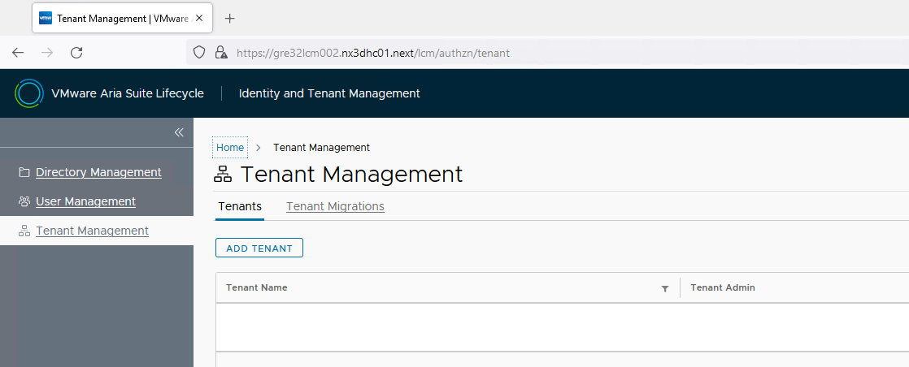
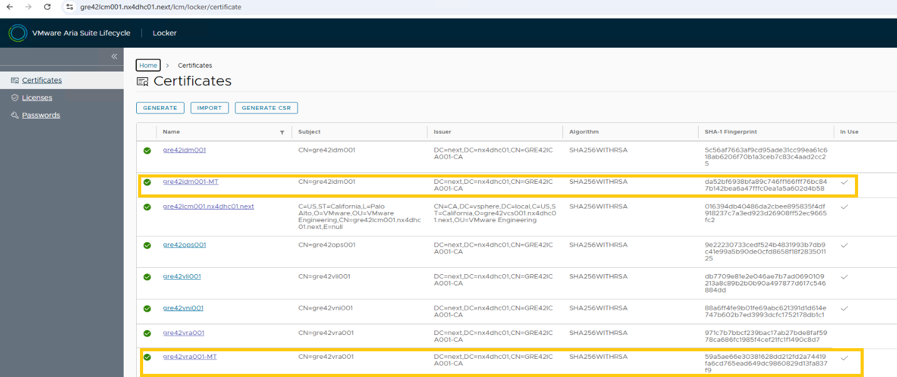
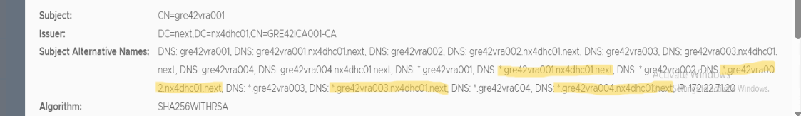
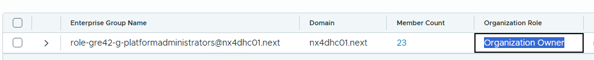
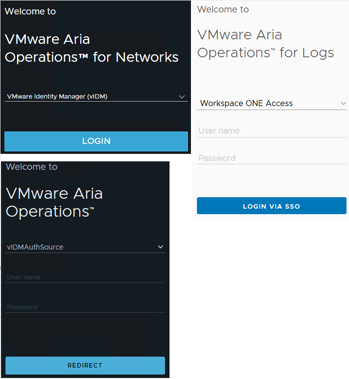

# vRA On-Premises Multi-tenancy Configuration

Table of Contents

- [vRA On-Premises Multi-tenancy Configuration](#vra-on-premises-multi-tenancy-configuration)
- [Changelog](#changelog)
  - [Introduction](#introduction)
    - [Purpose](#purpose)
    - [Audience](#audience)
    - [Scope](#scope)
- [Pre-requisite](#pre-requisite)
- [Procedure](#procedure)
  - [vRA  Scale up -ETA 60 minutes](#vra--scale-up--eta-60-minutes)
  - [Enabling vRA OnPrem Multi-Tenancy -ETA 150 Minutes](#enabling-vra-onprem-multi-tenancy--eta-150-minutes)
  - [Validation and check](#validation-and-check)

# Changelog

| version | Date       | Description   | Author(s)           |
| ------- | ---------- | ------------- | ------------------- |
| 0.1     | 21-12-2022 | Initial Draft | Alpesh Kumbhare      |
| 0.2     | 19-01-2023 | Updates for CESDHC-4496 | Alpesh Kumbhare |
| 0.3     | 15.08.2024 | VCS-13167 Move vRA tenant configuration part to wiVraOnPremDeploymentGuide.md | Marcin Kujawski |
| 0.4     | 03.06.2025 | VCS-16207 Add validation chapter | Krzysztof Olszewski |
| 0.5     | 18.11.2025 | VCS-17473 Improve validation section | Aparna Kadam |

## Introduction

### Purpose

Enable multi-tenancy in VMware vRealize Automation on-premises.

### Audience

- VCS Operations

### Scope

- Cover the enablement of Multi-tenancy for vRA on-premises in VCS.

# Pre-requisite

- vRA On-Prem deployment should be done using [wiVRAOnPremDeploymentGuide.md](wiVRAOnPremDeploymentGuide.md)
- vRA, vIDM, LCM and SDDC manager are working fine and in healthy state.
- Take snapshots of SDM, LCM, vIDM and vRA before beginning this activity. vIDM and vRA snapshots should be taken from LCM.

# Procedure

## vRA  Scale up -ETA 60 minutes

- vRA is deployed as medium size in VCS, it need to be scale up before enabling multi-tenancy. Vertical scale-up of the vRA is performed by executing the updateVraOnPremNodeSize.yml playbook which will upscale vRA from medium to extra-large size.
- vRA environment should be up to date with respect to LCM binary store else upscale will not work.
- Execute the playbook with the below command and provide the domain username and password to the prompt:

```shell
ansible-playbook updateVraOnPremNodeSize.yml
```

## Enabling vRA OnPrem Multi-Tenancy -ETA 150 Minutes

For enabling vRA on-premises multi-tenancy, configureMultiTenancyVraOnPrem.yml playbook need to be executed.

```shell
ansible-playbook configureMultiTenancyVraOnPrem.yml
```

- After executing the above ansible-playbook command, it prompts for the domain username and password

- Playbook performs below mentioned tasks:

  - All DNs entries will be created to enable multi-tenancy with default-tenant and 50 tenants (tenant1 to tenant50)
  - vIDM and vRA new certificates will be created in LCM locker.
  - vIDM certificate will be replaced on all IDM appliances and Load balancer (virtual server) of vIDM in NSX-T.
  - vIDM will re-trust load balancer
  - All products associated with vIDM will be re-trusted
  - Multi-tenancy will be enabled in LCM

## Validation and check

The activation of multi-tenancy is designed to be seamless, with no impact on user experience. The portal’s web URL remains unchanged after multi-tenancy enablement.

Login to VMware Aria Suite Lifecycle like `https://<locationName>lcm001.<domainFQDNname>`  
**Check Tenant Creation**:
Select `Identity and Tenant Management->Tenant Management` and check whether the page is displayed.  
Normally, there should be no additional tenants.



**Check Certificate**
Select `Locker->Certificates`  
New certificates with the -MT suffix should be visible and have the `In Use` status enabled.



Open the Certificate of vRA and check the subject as below.
Wildcard SSL certificate for Ex.
*.gre42vra001.nx4dhc01.next,
*.gre42vra002.nx4dhc01.next,
*.gre42vra003.nx4dhc01.next,
*.gre42vra004.nx4dhc01.next



**vRA Login and RBAC role:**
Log in to vRA at `https://<locationName>vra001.<domainFQDNname>` using the **vIDM Administrator** account if domain-based authentication is not working. After login go to  **Identity and Access Management**, verify that the Enterprise role-RBAC role group has the organization role "Organization Owner". If not assigned, then assign it.



**Domain-Based Authentication:**

Additionally, verify the feasibility of domain-based authentication for vOPS, vLI, vNI, vRA, and NSX. All should work with IDM SSO.  


