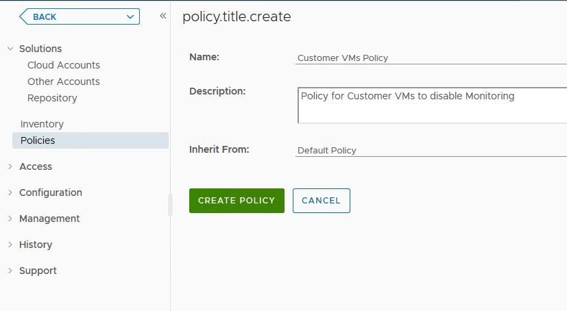
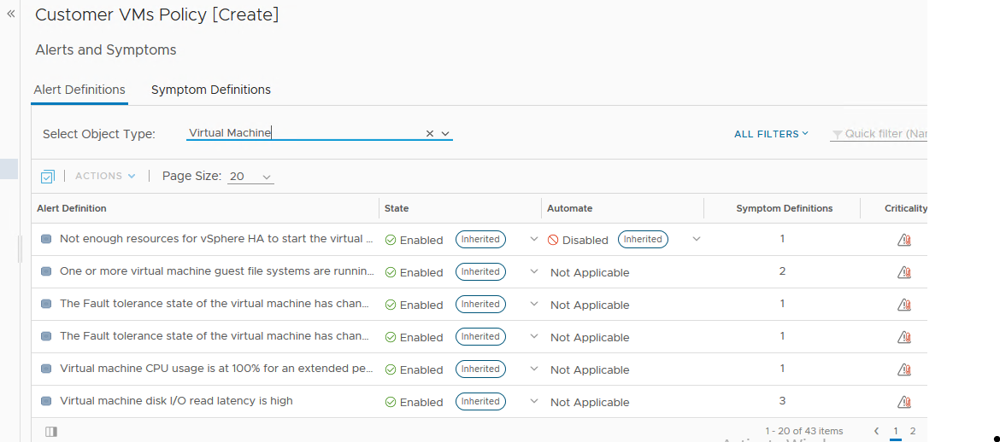
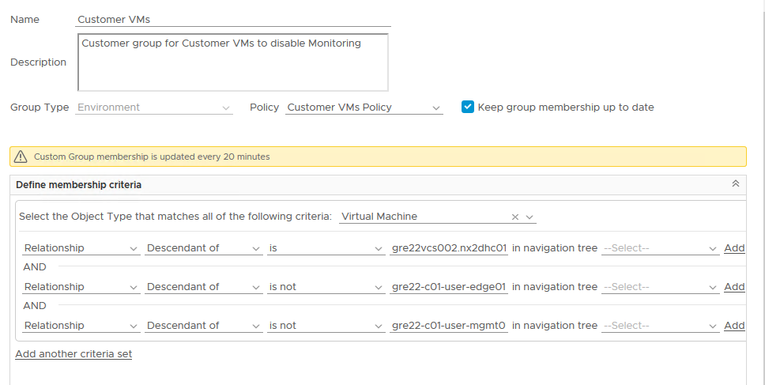

# Table of Contents

<!-- TOC -->
- [Table of Contents](#table-of-contents)
- [List of Changes](#list-of-changes)
  - [Introduction](#introduction)
    - [Purpose](#purpose)
    - [Audience](#audience)
    - [Scope](#scope)
- [Related Documents](#related-documents)
- [Steps to update Monitoring for Customer VMs in vROPS](#steps-to-update-monitoring-for-customer-vms-in-vrops)
  - [Prerequisites](#prerequisites)
  - [Create Custom Policy](#create-custom-policy)
  - [Create custom Group](#create-custom-group)
<!-- TOC -->

# List of Changes
  
| Version | Date       | Description      | Author       |
| ------- | ---------- | ---------------- | -------------|
| 0.1     | 21.09.2021 | First version    | Alpesh Kumbhare |
| 0.2     | 16.10.2025 | Updated list of disabled alerts | Mirela-Maria Bogdan |

## Introduction

### Purpose

Update monitoring in vROPS for customer workload VMs.

### Audience

- VCS Operations

### Scope

The scope of this document covers the following:

- Create Custom Policy
- Create custom Group

# Related Documents

N/A

# Steps to update Monitoring for Customer VMs in vROPS

## Prerequisites

Follow below steps:

- take snapshots of vROPS VMs. This snapshot should be removed after completion of activity.

## Create Custom Policy

- Click on Administration – Policies – Add
- Provide below input and Click on Create Policy
  - Name – Customer VMs Policy
  - Description – Policy for Customer VMs to disable Monitoring
  - Inherit from – Default Policy
 
- Click on Alert and Symptoms to edit policy
- Select object type as virtual machine

- Disable below alerts in this policy and Save
  - One or more virtual machine guest file systems are running out of disk space
  - Virtual machine CPU usage is at 100% for an extended period of time
  - Virtual machine disk I/O read latency is high
  - Virtual machine disk I/O write latency is high
  - Virtual machine has CPU contention due to long wait for I/O events
  - Virtual machine has memory contention caused by swap wait and high disk read latency
  - Virtual machine has unsupported VMware Tools
  - Virtual machine in a cluster is demanding more CPU than its entitlement
  - Virtual machine in a DRS cluster is demanding more CPU than its entitlement
  - Virtual machine is demanding more CPU than its entitlement
  - Virtual machine is demanding more CPU than the configured limit
  - Virtual machine is experiencing memory compression, ballooning, or swapping due to memory limit
  - Virtual Machine on a host with BIOS power management not set to OS controlled is facing CPU contention
  - Virtual Machine on a host with BIOS power management set to OS controlled is facing CPU contention
  - The Fault tolerance state of the virtual machine has changed to "Needs Secondary" state
  - The Fault tolerance state of the virtual machine has changed to a "Disabled" state
  - Guest OS experiencing CPU queue
  - Guest OS experiencing disk queue
  - VM CPU utilization has reached a critical level
  - VM experiencing disk write latency
  - VM experiencing disk read latency

- Below Alerts will be enabled by default and we should not disable them as they are related to infrastructure/Virtualization.
  - Not enough resources for vSphere HA to start the virtual machine
  - Virtual machine has CPU contention due to memory page swapping in the host
  - Virtual machine has CPU contention due to multi-vCPU scheduling issues (co-stop) caused by snapshots
  - Virtual machine has CPU contention due to multi-vCPU scheduling issues (co-stop) caused by too many vCPUs
  - Virtual machine has disk I/O latency problem caused by snapshots
  - Virtual machine has memory contention due to memory compression, ballooning, or swapping
  - Virtual machine is in an invalid or orphaned state
  - vRNI-An infrastructure VM is experiencing a high memory condition. This condition may lead to an NSX service disruption.
  - vRNI-An NSX infrastructure VM is experiencing high CPU. This condition may lead to a service disruption.
  - vRNI-Most of the allocated disk space for an infrastructure VM has been consumed. The infrastructure VM may become inaccessible or lead to a service d
  - vRNI-Network and security container information used with the NSX distributed firewall or with Service Composer failed to be updated on an NSX host
  - vRNI-NSX Controller Not Found
  - vRNI-The NSX infrastructure VM found to be in powered off state. Services provided by it may get impacted.
  - vRNI-The SpoofGuard configuration was not applied to the specified vNIC on the host.
  - vSphere HA cannot perform a failover operation for the virtual machine
  - vSphere HA failed to restart a network isolated virtual machine
  - Virtual machine is running on snapshots for more than 2 days
  - vRNI-A distributed firewall rule was not applied to a host's vNIC.

## Create custom Group

- Login to vROPS with admin account
- Navigate to Environment-custom groups-Environment
- Click on Add to create new custom Group
- Provide below inputs
  - Customer VMs
  - Description - Customer group for Customer VMs to disable Monitoring
  - Group Type – Environment
  - Policy – Customer VMs Policy
  - Keep group membership up to date - Checked
  - Object Type – Virtual machine
  - Relationship – Descendant of – is – vcenter name
  - Relationship – Descendant of – is not – edge resource pool name
  - Relationship – Descendant of – is not– mgmt resource pool name
 
- Click on preview to validate all customers vms are included in this group. Also validate if no MGMT VMs are there. In case of MGMT VMs still in this list, exclude them manually. Click OK.
- Monitor Alerts to validate no Alerts ae getting generated for Customer VMs now.
