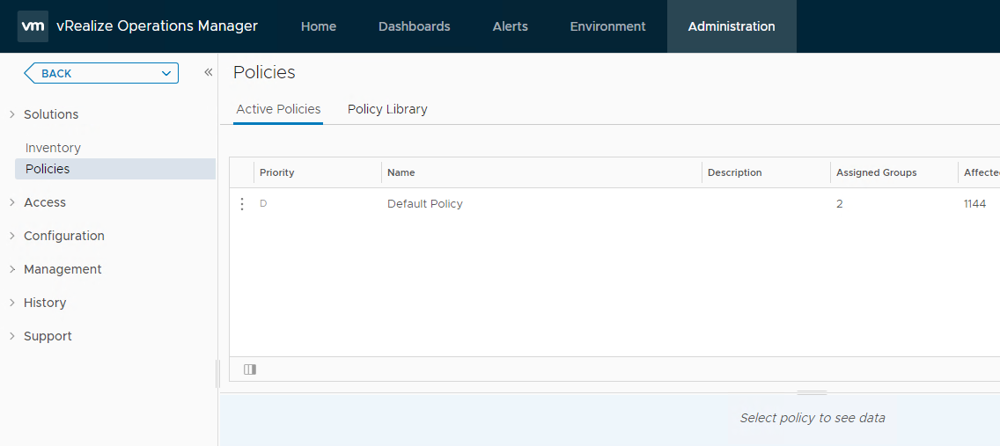
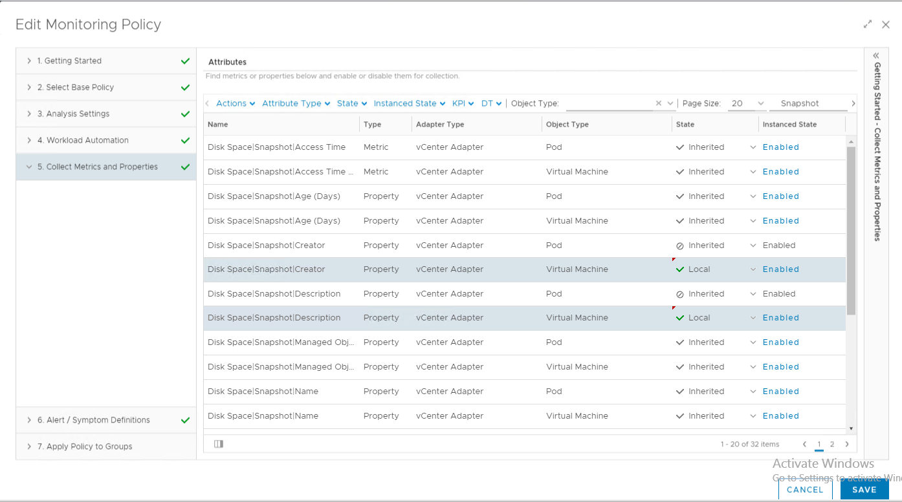
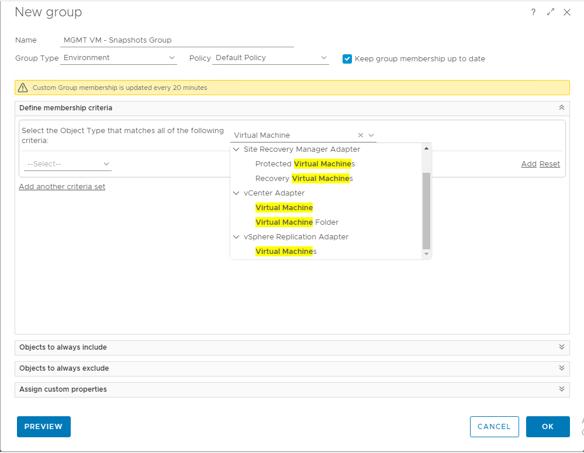
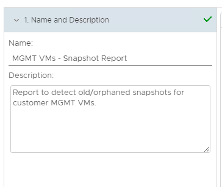
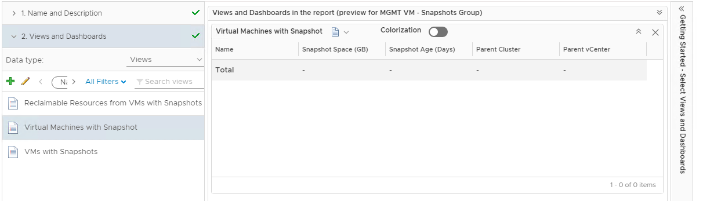
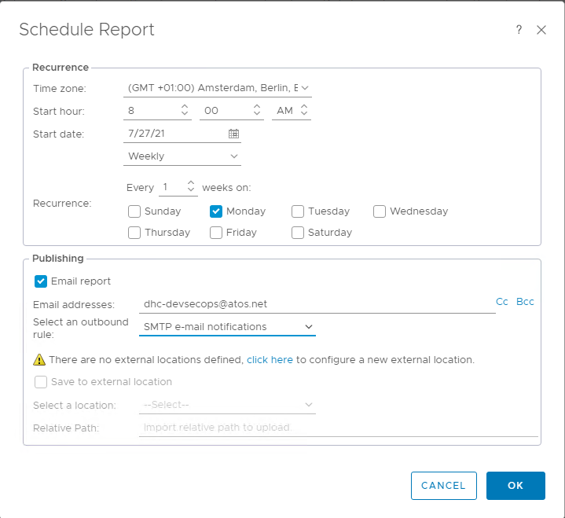

# vROPS Snapshot Report Scheduling

# Changelog
  
| Date       | TOS | Issue  | Author        | Description                |
|------------|-----|--------|---------------|----------------------------|
| 29/07/2021 |     | DDP-75 | Margo Piliukh | Initial document creation. |

## Introduction

### Purpose

Create a report with a list of old/orphaned snapshots of customer VMs.

### Audience

- VCS Operations

### Scope

This work instruction will cover the necessary steps for creating and scheduling Snapshot reports, which include the following:

1. Modifying monitoring policy in vRealize Operations Manager by enabling the necessary metrics collection.
2. Creating a custom group for all customer VMs to be applied as the subject for the necessary View – *Virtual Machines with Snapshot*.
3. Creating a report template based on the View.
4. Scheduling the report to run regularly.

## ETA

The whole process takes around 7 min in total.

# Process Description

## Step 1. Modify the policy

You will have to log in as admin into vRealize Operations Manager to modify the monitoring policy and enable the necessary metrics for report creation.
Select **Administration** tab at the top of the UI and select **Policies** from the menu on the left.

> **NOTE**: there might be more than just one group policy in **Active Policies** section. Make sure you are modifying the right policy, which applies to all the VMs. You can check that from the vROps level by entering the VM name in the search bar and checking what policy is being currently applied to it.

Edit the applicable policy by clicking on three dots next to the name and selectd **Edit**. Go to **Collect Metrics and Properties** section. In the **Filter** bar type in *Snapshot* to filter out the unnecessary metrics.

Find two metrics and set them to **Local** and **Enabled** state:

- Disk Space | Snapshot | Creator
- Disk Space | Snapshot | Description

The **Object Type** must be **Virtual Machine**. Option **Local** must be with a green tick. Click **Save**.

## Step 2. Create a custom group

Select **Environment** tab at the top of vRealize Operations Manager and choose **Custom Groups** under **Groups and Applications** section on the left.

Select **New** and enter name of the group. Under **Define membership criteria** select the **Object type** and type in *“virtual machine”*.  Select **“Virtual Machine”** from the list (under **vCenter Adapter**). In this given example the Policy is the **Default Policy** as it applies to all the VMs and we configured it previously for this purpose. The **Group Type** can be set to **Environment**, but this is not obligatory.

Click **PREVIEW** button to check the group listing the VMs. Press **Close** and **OK**.

## Step 3. Create a report template

Locate the custom group you’ve just created. In the overview of the group go to **Details** tab and in the **Filter bar** enter *Snapshot* to locate the necessary View. **Virtual Machines with Snapshot** should be present by default.

Go to **Reports** tab and select **ADD**. Provide the name and description for the report template.

Select **View** - **Virtual Machines with Snapshot**. Double-click on the correct view to select it. **Formats** and **Layout options** can remain as they are. Click **Save**.

## Step 4. Schedule the report

Locate the newly created report under **Report Templates**. Select **Schedules** to schedule this report. Set the frequency and other parameters as required. Enter the email address(es) for **Publishing**. Click **OK** to confirm and save.  

