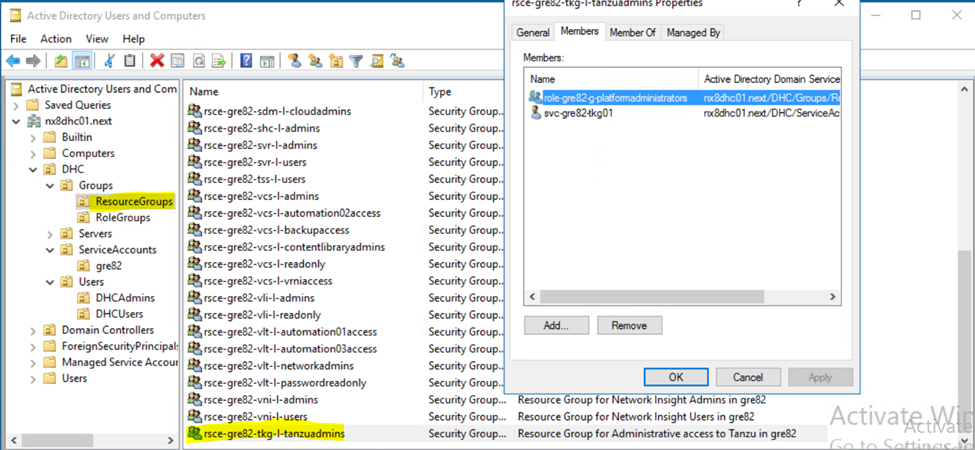
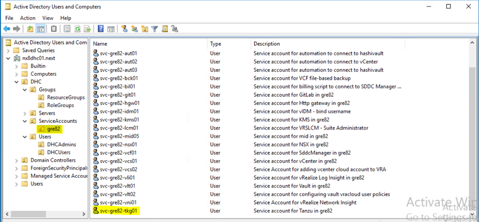

# Tanzu on VCS Buildguide

## Table of Contents

- [Tanzu on VCS Buildguide](#tanzu-on-vcs-buildguide)
  - [Table of Contents](#table-of-contents)
  - [Changelog](#changelog)
  - [Introduction](#introduction)
    - [Purpose](#purpose)
    - [Audience](#audience)
    - [Scope](#scope)
    - [Related Documents](#related-documents)
  - [Networking for vSphere with Tanzu](#networking-for-vsphere-with-tanzu)
  - [Prerequisites](#prerequisites)
    - [Licenses](#licenses)
  - [Input Data File](#input-data-file)
  - [Tanzu on VCS build steps overview](#tanzu-on-vcs-build-steps-overview)
  - [Deployment Steps](#deployment-steps)
    - [Enable Proxy on Vcenter](#enable-proxy-on-vcenter)
    - [Distributed Firewall rules implementation for Tanzu](#distributed-firewall-rules-implementation-for-tanzu)
      - [Management NSX-T Rules for Tanzu](#management-nsx-t-rules-for-tanzu)
      - [Workload NSX-T Rules for Tanzu](#workload-nsx-t-rules-for-tanzu)
    - [Tanzu deployment procedure](#tanzu-deployment-procedure)
  - [Post Deployment Steps](#post-deployment-steps)
    - [Creating TKGS Cluster Namespace and configuring RBAC](#creating-tkgs-cluster-namespace-and-configuring-rbac)
    - [Configure Backup Using Valero](#configure-backup-using-valero)
    - [Contour Ingress on Tanzu](#contour-ingress-on-tanzu)

## Changelog

 |    Date    |  TOS   | Issue   | Author | Description |
 |------------|---------|-----------|--------|--------|
 | 27.09.2022 |  VCS 1.7   |   CESDHC-4411     | Rohit Singh | Initial draft creation |

## Introduction

### Purpose

Install and configure vSphere with Tanzu on VCS customer vSphere cluster.

### Audience

- VCS Engineers
- VCS Operations

### Scope

- Configure Tanzu

### Related Documents

This document is a subset of Atos Technology Lifecycle Management (ATLM) artefacts. All documents are stored in the VCS Documentation repository.

| Document                       | Document Name                                                     |
|--------------------------------|-------------------------------------------------------------------|
| lldvspherewithTanzu            | [lldvspherewithTanzu.md](../design/lldvspherewithTanzu.md)        |
| createNamespace.md             | [createNamespace.md](createNamespace.md)                           |

## Networking for vSphere with Tanzu

A Supervisor Cluster can either use the vSphere networking stack or VMware NSX-T™ Data Center to provide connectivity to Kubernetes control plane VMs, services, and workloads.

The networking used for Tanzu Kubernetes clusters provisioned by the Tanzu Kubernetes Grid Service is a combination of the fabric that underlies the vSphere with Tanzu infrastructure and open-source software that provides networking for cluster pods, services, and ingress.

Refer document [Tanzu Network Requirements](../design/lldvspherewithTanzu.md) to understand network inputs.

To understand about the network requirements and preparation please refer [lldvspherewithTanzu](../design/lldvspherewithTanzu.md)

## Prerequisites

It has been assumed that VCS environment is prepared for deploying vSphere with Tanzu.

Person who is going to use this document should be familiar with VCS and basics of Tanzu.

Main prerequisities to deploy VCS on Tanzu are:

1. One site (non-stretched), Workload domain VI type enabled on VCF.
2. NSX edge cluster prepared for Workload Management. If the NSXT edge cluster is not deployed via VCF, then we need to add tags on the edge cluster, For that login on to nsx002, navigate to `System -> Fabric -> Nodes -> Edge Clusters` and select the cluster and add the tag `WCPReady`.
3. IP addresses subsets for using by Tanzu; at least two /27 routable networks with help of Network team.
4. VCS DNS & NTP Server details.
5. Proxy must be enabled on both vcenters for content library creation. Refer [Enable Proxy on Vcenter](#enable-proxy-on-vcenter) section given below in the document to know how to enable proxy.
6. A resource group for VCS administrators should be created with the naming convention `rsce-< location code >-tkg-l-tanzuadmins` on the active directory as shown below.

   

7. For VCS administrators to operate Tanzu Workload Cluster, a new service account with the naming convention `svc-< location code >-tkg-01` must be created and also its password entry to be created in vault.

   

### Licenses

Once you configure a vSphere cluster for vSphere with Tanzu and it becomes a Supervisor Cluster, you must assign the cluster a VMware Tanzu Basic license before the 60 day evaluation period expires as per our document [VCS BOM](../design/hldDigitalHybridCloudBOM.md).

| Field description *Input  Parameter name*  | example  for  DEV  nx1  env  | Description |
| ------ | ------ | ------ |
| Tanzu License Key | *tanzuLicense* | Provide VMware Tanzu Basic license for Tanzu |

## Input Data File

The `tanzu-builder.yml` playbooks relies on input data file *$HOME/tanzuCustomInfraVars.yml* located in your home directory.

Next, the input file have to be **filled out manually**.

> Note: Please make sure that the `namespacesubnetprefix` and the subnet value in `podcidr` should be different.

|  Parameter name  | Example as in NX9 infra | Description |
| ------ | ------ | ------ |
|Mgmt Workload advance configuration | default/customized | When set to customized more options are available |
| *wcpsize* | MEDIUM | Tanzu deployment size which is TINY, SMALL, MEDIUM, LARGE |
| *startingip* | 172.22.151.10 | Starting management ip for supervisor vms |
| *mastersm* | 255.255.255.0 | Subnet mask for management ip |
| *gatewayip* | 172.22.151.1 | Management gateway |
| *dnsserver* | 172.22.128.24, 172.22.128.25 | DNS server along with customer DNS if present seperated by commas |
| *ntpserver* | 172.22.128.24, 172.22.128.25 | NTP server |
| *podcidr* | 10.244.0.0/19 | POD cidr |
| *namespacesubnetprefix* | 24 | Namespace Subnet |
| *servicecidr* | 10.96.0.0/22 | Service cidr |
| *egressaddress* | 172.17.149.0 | Egress CIDR for outgoing traffic |
| *ingressaddress* | 172.17.148.0 | Ingress CIDR for incoming traffic |
| *egressingressprefix* | 24 | Subnet for Ingress and Egress CIDR |
| *workloadDomainNumber* | 01 | Workload Domain number |
| *clusterNumber* | 01 | Cluster Number |
| *principalStorageTypeCmp* | vsan | storage type for customer workload domain vsan or vmfs |
| *workloadPodCidr* | 192.168.0.0/16 | workload pod cidr |
| *workloadServiceCidr* | 11.96.0.0/12 | workload service CIDR |
| *tzjmpCIDR* | 172.22.151 | CIDR for Tanzu Jumphost server |
| *tzjmpOctet* | 9 | Octet for Tanzu Jumphost server |
| *tzjmpSubnetMask* | 255.255.255.0 | subnetmask for Tanzu Jumphost server |
| *tzjmpGateway* | 172.22.151.1 | gateway for Tanzu Jumphost server |
| *storagePolicy* | vSAN Default Storage Policy | VSAN storage policy |
| *vlanIdSupervisor* | 2911 | supervisor vlan id |
| *networkSupserver* | 172.22.151 | first 3 octet for supervisor cidr |
| *networkEgress* | 172.17.149 | first 3 octet for Egress cidr |
| *networkIngress* | 172.17.148 | first 3 octet for Ingress cidr |
| *networkSupPodCidr* | 10.244.0 | first 3 octet for supervisor pod cidr |
| *networkWorkloadCidr* | 192.168.0 | first 3 octet for workload pod cidr |
| *networkSupServiceCidr* | 10.96.0 | first 3 octet for supervisor service cidr |

Below is the sample input file for *$HOME/tanzuCustomInfraVars.yml*:

```yaml
tanzuCustomVars:
  tkg001:
# Provide the Control plane size like TINY, SMALL, MEDIUM, LARGE.
    wcpsize: "MEDIUM"
# Provide the starting IP for Supervisor Cluster:
    startingip: "172.22.151.25"
# Provide the subnet mask for Supervisor Cluster:
    mastersm: "255.255.255.0"
# Provide the gateway for for Supervisor Cluster:
    gatewayip: "172.22.151.1"
# Provide the DNS server IP along with customer DNS if present seperated by commas:
    dnsserver: "172.22.144.24,172.22.144.25"
# Provide the NTP server IP:"
    ntpserver: "172.22.144.24,172.22.144.25"
# Provide the Namespace/POD CIDR VALUE:
    podcidr: "10.244.0.0/19"
# Provide the namespace subnet.
    namespacesubnetprefix: "24"
# Provide the Service CIDR value
    servicecidr: "10.96.0.0/22"
# Provide the Egress CIDR value:
    egressaddress: "172.17.149.0"
# Provide the Ingress CIDR value:
    ingressaddress: "172.17.148.0"
# Provide the subnet range for Ingress and Egress.
    egressingressprefix: "24"
# Provide the Workload Domain number.
    workloadDomainNumber: "01"
# Provide the cluster number.
    clusterNumber: "01"
# Provide storage type for customer workload domain vsan or vmfs.
    principalStorageTypeCmp: "vsan"
# Provide workload pod cidr
    workloadPodCidr: "192.168.0.0/16"
# Provide workload service CIDR
    workloadServiceCidr: "11.96.0.0/12 | "
#Provide CIDR for Tanzu Jumphost server
    tzjmpCIDR: "172.22.151"
#Provide Octet for Tanzu Jumphost server
    tzjmpOctet: "7"
#Provide the subnetmask for Tanzu Jumphost server
    tzjmpSubnetMask: "255.255.255.0"
#Provide gateway for Tanzu Jumphost server
    tzjmpGateway: "1"
#Provide VSAN default storage policy name
    storagePolicy: "vSAN Default Storage Policy"
#Provide edge cluster name
    edgeClusterName: "gre82ecn01"
#Provide supervisor vlan id for portgroup 
    vlanIdSupervisor: "2911"

tzjmpNodes:
  tkg001:
    name: "{{ locationCode }}tkg001"
    octet: "{{ tzjmpOctet }}"
    cidr: "{{ tzjmpCIDR }}"
    
# Variables for tanzu microsegmentation
 
#Provide first 3 octet for supervisor cluster cidr
networkSupserver:
  cidr: "172.22.151"
# Provide first 3 octet for Egress cidr 
networkEgress:
  cidr: "172.17.149"
# Provide first 3 octet for Ingress cidr 
networkIngress:
  cidr: "172.17.148"
# Provide first 3 octet for supervisor pod cidr
networkSupPodCidr:
  cidr: "10.244.0"
# Provide first 3 octet for workload pod cidr
networkWorkloadCidr:
  cidr: "192.168.0"
# Provide first 3 octet for supervisor service cidr  
networkSupServiceCidr:
  cidr: "10.96.0"
  ```

## Tanzu on VCS build steps overview

| Playbook name | Description |
| ------------- | ----------- |
|*createTanzuMgmtNsxtMicrosegmentation.yml*| Apply microsegmentation for tanzu on VCS components in management domain |
|*createTanzuWdNsxtMicrosegmentation.yml*| Apply microsegmentation for tanzu on VCS components in workload domain |
|*tanzu-builder.yml*| Deploy Tanzu and its related resources |
|*tanzuPrecreationTask.yml*| Create Tanzu Supervisor portgroup and subscribed content library and perform whitelist |
|*tanzuEnableWldMgmt.yml*| Enable Tanzu Workload Management |
|*tanzuCreateNamespace.yml*| Create Tanzu Namespace |
|*tanzuCopyLinuxNextTemplate.yml*| Copy Next Linux Template from VCS001 to VCS002 |
|*tanzuDeployJumphost.yml* | Deploy Tanzu Jumphost and perform additional config on jumpserver and copies the kubectl binaries to tanzu jumphost |
|*tanzuConfigureUbuntuCompliance.yml* | Perform Ubuntu Compliancy on tanzu deployed jumphost |
|*tanzuInstallConfigureDocker.yml*| Install and Configure docker on tanzu jumphost |
|*tanzuConfigureCNI.yml*| Configure Container Network Interface on tanzu server |
|*tanzuEnableHarborRegistry.yml*| Enable Harbor registry and push hello word image on harbor UI |
|*tanzuCreateTKGcluster.yml*| Create TKG cluster |
|*tanzuConfigurePodPolicy.yml*| Configure Tanzu Pod policy |
|*tanzuCreateRbacDhcAdmins.yml*| Create RBAC policy for VCS Admins |
|*configureTkgVrops.yml*| Configure monitoring on Tanzu |

## Deployment Steps

### Enable Proxy on Vcenter

Below steps need to be followed for enabling proxy:

- Login on to vcenter vami portal `https://{{ mgmtDns.vcs002.ip }}.{{ mgmtDns.vcs002.cidr }}:5480`.
- Navigate to `Networking -> Proxy Settings` and click on edit.
- Enter the proxy server details and save the settings.
- Next connect to the workload domain vCenter via SSH and open file `sudo vi /etc/sysconfig/proxy` and enter all the ips in no proxy section.
  Below table depicts all the mandatory inputs to be entered in /etc/sysconfig/proxy:

  |  Parameter name  | Example as in NX9 infra | Description |
  | ------ | ------ | ------ |
  | *supervisorcidr* | 172.22.151.0/24 | Supervisor CIDR |
  | *podcidr* | 10.244.0.0/19 | POD cidr |
  | *servicecidr* | 10.96.0.0/22 | Service cidr |
  | *egressaddress* | 172.17.149.0 | Egress CIDR for outgoing traffic |
  | *ingressaddress* | 172.17.148.0 | Ingress CIDR for incoming traffic |
  | *workloadPodCidr* | 192.168.0.0/16 | workload pod cidr |
  | *workloadServiceCidr* | 11.96.0.0/12 | workload service CIDR |
  | *managementNetworkCidr* | 172.22.144.0/24 | Management Network Cidr |
  | *networkAvnLocalRegionCidr* | 172.22.156.0/24 | AVN network Cidr |
  | *searchDomain* | nx5dhc02.next | search domain |
  | *customerDomain* | corpdc.local | customer Domain |

  Example is shown below for NX9:
  `NO_PROXY="localhost,127.0.0.1,nx5dhc02.next,172.22.151.0/24,172.22.148.0/24,172.22.149.0/24,172.22.144.0/24,172.22.156.0/24,10.96.0.0/22,192.168.0.0/16,11.96.0.0/12,cluster.local,corptestdc.next"`

- Now save the file and restart the vcenter.
- Perform the same steps for management vCenter.

### Distributed Firewall rules implementation for Tanzu

**Description:**  
In order to secure Tanzu on VCS components, we'll be applying tanzu microsegmentation for both management and workload domains.

- Establish ssh connection to ans001 `<networkAvnLocalRegion.Cidr>.37` (i.e NX8 it is 172.22.135.37) with user `next`, navigate to */opt/dhc/manage* directory:

#### Management NSX-T Rules for Tanzu

Default input file (mdTanzuNsxt.yml) is available in */opt/dhc/firewall/microsegmentationImports*. Run the below playbook to apply microsegmentation for Tanzu on VCS components in the management domain.

   ```shell
   ansible-playbook createTanzuMgmtNsxtMicrosegmentation.yml
   ```

**Validate:**  
To validate NSX DFW ruleset, please verify objects creation inside NSX-T (in Management Domain). To do that go through the following steps:

1. Login to NSX-T(nsx001) via HTTPS
2. Navigate to **Advanced Networking & Security**
3. Navigate to **Security**
4. Navigate to **Distributed Firewall**
5. Verify if section `Tanzu` is present, rules from mdTanzuNsxt (sources, destinations, services, apply to) are existing under the `Tanzu`.

#### Workload NSX-T Rules for Tanzu

**Description:**  
Default input file (wdTanzuNsxt.yml) is available in */opt/dhc/firewall/microsegmentationImports*. Run the below playbook to apply microsegmentation for Tanzu on VCS components in the workload domain.

   ```shell
   ansible-playbook createTanzuWdNsxtMicrosegmentation.yml
   ```

**Validate:**  
To validate NSX DFW ruleset, please verify objects creation inside NSX-T (in Workload Domain). To do that go through the following steps:

1. Login to NSX-T(nsx002) via HTTPS
2. Navigate to **Advanced Networking & Security**
3. Navigate to **Security**
4. Navigate to **Distributed Firewall**
5. Verify if section `Tanzu` is present, rules from wdTanzuNsxt (sources, destinations, services, apply to) are existing under the `Tanzu`.

### Tanzu deployment procedure

- Establish ssh connection to ans001 `<networkAvnLocalRegion.Cidr>.37` (i.e NX8 it is 172.22.135.37) with your domain credentials, navigate to */opt/dhc/manage* directory:
- Check that time is in sync with NTP server for ans001*

>**Note:** There is a limitation in design while deploying applications on `Vsphere Namespaces`. By design, the imageFetcher will always bypass the proxy server and direct the DNS traffic to coredns which in turn directs the traffic to the workload network DNS server. This is a design limitation with the current implementation of vSpherePods/NativePods/PodVMs. The only solution to get this to work is configure the DNS server to access the internet which is not an option. Hence, we recommend using TKGs workload clusters which don't use the imageFetcher and therefore, are not affected by this limitation.

- Run **Tanzu Master Build** playbook:

   ```shell
   ansible-playbook tanzu-builder.yml
   ```

To have more control on deployment and check any issues if occured during execution, run playbook for each tags one by one.

- Create Tanzu Supervisor portgroup and subscribed content library and perform whitelist.

   ```shell
   ansible-playbook tanzu-builder.yml --tags 1-1 OR ansible-playbook tanzu-builder.yml --tags tanzuPrecreationTask
   ```

>Note: After we complete above step, we have to wait for 30 mins to sync the content library

- Enable Tanzu Workload Management

   ```shell
  ansible-playbook tanzu-builder.yml --tags 1-2
   ```

- Create Tanzu Namespace

   ```shell
   ansible-playbook tanzu-builder.yml --tags 1-3
   ```

>Note: Binaries for tanzu will be avialble in /opt/binaries on ans001. For existing customer request for Tanzu, follow documentation [Download TKG CLI Tools](downloadTkgCliTools.md)

- Copy DPC Next Linux Template from VCS001 to VCS002

   ```shell
   ansible-playbook tanzu-builder.yml --tags 1-4
   ```

- Deploy Tanzu Jumphost and perform additional config on jumpserver and copies the kubectl binaries to tanzu jumphost

   ```shell
   ansible-playbook tanzu-builder.yml --tags 1-5
   ```

- Perform Ubuntu Compliancy on tanzu deployed jumphost

   ```shell
   ansible-playbook tanzu-builder.yml --tags 1-6
   ```

- Install and Configure docker on tanzu jumhost

   ```shell
   ansible-playbook tanzu-builder.yml --tags 1-7
   ```

- Configure Container Network Interface on tanzu server

   ```shell
   ansible-playbook tanzu-builder.yml --tags 1-8
   ```

- Enable Harbor registry and push hello word image on harbor UI

   ```shell
   ansible-playbook tanzu-builder.yml --tags 1-9
   ```

- Create TKG cluster

   ```shell
   ansible-playbook tanzu-builder.yml --tags 1-10
   ```

- Configure Tanzu Pod policy

   ```shell
   ansible-playbook tanzu-builder.yml --tags 1-11
   ```

- Create RBAC policy for VCS Admins

   ```shell
   ansible-playbook tanzu-builder.yml --tags 1-12
  ```

- Install and configure TKG on Vrops for monitoring

   ```shell
   ansible-playbook tanzu-builder.yml --tags configureTkgVrops
   ```

> Note: Please follow [validateConnectionForTkgAdapter.md](../workInstructions/validateConnectionForTkgAdapter.md) after executing this playbook to complete the configuration of Tkg adapter in Vrops.
Please hit --Enter-- to continue

## Post Deployment Steps

### Creating TKGS Cluster Namespace and configuring RBAC

Customers will have a role group created under their domain, which the Kubernetes cluster will then connect to their namespaces.

To create TKG workload cluster namespace, please perform the steps mentioned in section `Create TKG workload cluster namespace` available in the document [createNamespace.md](createNamespace.md).

>Note: To read more about the RBAC policy read [Creating RBAC Policy for TKG Workload Cluster](https://docs.vmware.com/en/VMware-vSphere/7.0/vmware-vsphere-with-tanzu/GUID-6DE4016E-D51C-4E9B-9F8B-F6577A18F296.html).

Below is the procedure for configuring the RBAC policy which will create Cluster Role and role binding for the namespace that we created above:

- First login on to the tkg cluster using command:

   ```shell
   kubectl vsphere login --server=<supervisor_cluster_IP_address> --vsphere-username <VsphereUsername> tanzu_Kubernetes_cluster_name <TanzuKubernetesClusterName> tanzu_kubernetes_cluster_namespace <TanzuKubernetesClusterNamespace>
   ```

Example  is shown below.

   ```shell
   kubectl vsphere login --server=172.17.148.1 --vsphere-username Administrator@vsphere.local --insecure-skip-tls-verify --tanzu-kubernetes-cluster-name tkgs-cluster-01 --tanzu-kubernetes-cluster-namespace tkg-wld-ns
   ```

- Create a cluster role and rolebinding file and copy the below contents in the yaml file `sudo vi rolebinding.yml` and add the policy required as per customer requirement. Below is the example:

   ```shell
   apiVersion: rbac.authorization.k8s.io/v1
   kind: ClusterRole
   metadata:
     name: cust-testuser
   rules:
   - apiGroups:
       - '*'             # Gives access to all api groups
     resources:
     - '*'               # Gives access to all resources in the API group
     verbs:
     - '*'               # Gives all access to the resources like create,update,delete,edit
   ---
   apiVersion: rbac.authorization.k8s.io/v1beta1
   kind: RoleBinding
   metadata:
     name: cust-testrolebindings             # Name of the rolebinding
     namespace: test-namespace                      # Name of the tkg workload cluster namespace
   roleRef:
     apiGroup: rbac.authorization.k8s.io
     kind: ClusterRole
     name: cust-testuser                     # Cluster role created above
   subjects:
   - kind: Group
     name: sso:role-gre82-g-tkgcust@nx8dhc01.next    # User group to which access needs to be given
     apiGroup: rbac.authorization.k8s.io
   ```

- Then apply the configuration on the cluster using command `kubectl apply -f rolebinding.yml`
- Delete the kubeconfig file using command `rm -rf .kube`
- Now login on the workload cluster using the customer domain credentials and deploy the required resources on the namespace where access is given.

### Configure Backup Using Valero

We have used the Velero Plugin for vSphere to backup and restore workloads running on vSphere Pods by installing the Velero Plugin for vSphere on the Supervisor Cluster.The Velero Plugin for vSphere provides a solution for backing up and restoring vSphere with Tanzu workloads.

The solution requires the installation and configuration of several components. Once you have the Velero Plugin for vSphere installed and configured we can backup and restore both vSphere Pods and workloads running on a Tanzu Kubernetes. Follow documentation [wiVeleroBackupAndRestoreforTanzu.md](wiVeleroBackupAndRestoreforTanzu.md) and do the backup configuration.

### Contour Ingress on Tanzu

Contour is an open source Kubernetes Ingress controller that acts as a control plane for the Envoy edge and service proxy. To know more about contour follow documentation [Contour Architecture](https://projectcontour.io/docs/v1.23.2/architecture/). Kindly follow document [wiContourForTanzu.md](wiContourForTanzu.md) for deploying Contour.
