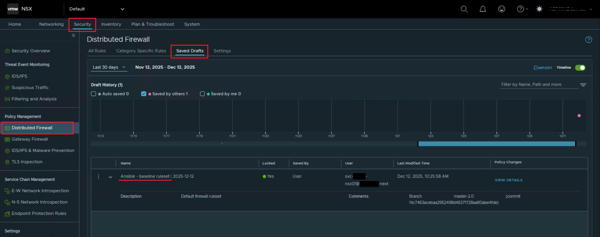
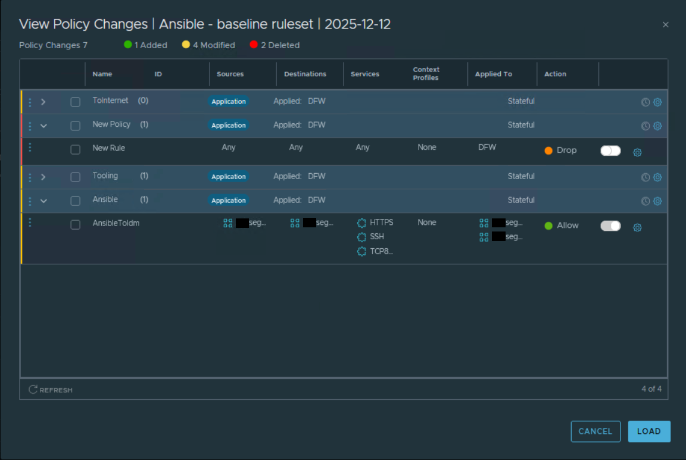
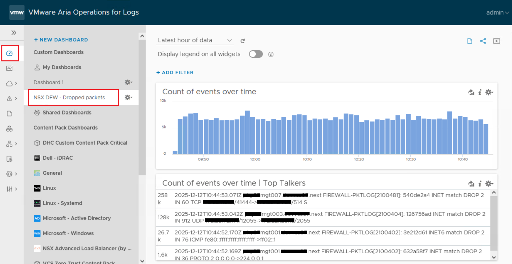
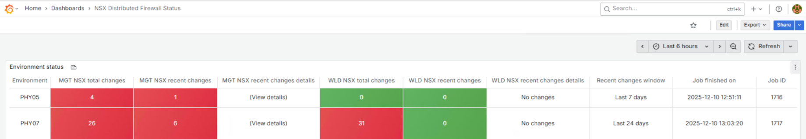

# Zero Trust Firewalls

## Changelog

| Date       | Issue     | Author               | Description               |
|------------|-----------|----------------------|---------------------------|
| 11.12.2025 | VCS-17779 | Stanisław Kilanowski | Initial document creation |
| 22.01.2026 | VCS-18048 | Stanisław Kilanowski | Documentation update      |

## Introduction

### Purpose

Understanding the process of NSX-T Distributed Firewall management and the way of working with the created automation.

### Audience

- VCS Engineers

## Process overview

In order to ensure that the environments are using proper firewall configuration, a process was established and automation was created. All changes on the NSX-T DFW must be reflected in the configuration files and the documentation stored on the repository. If this is not done, the engineer's work may be reverted on the environment, however it is exported to files that are ready to be implemented again.

It is recommended that for operations on the NSX-T DFW, the automation described further in this document is used - unless it doesn't cover the required functionality. It has been designed to create and operate on configuration files following the YAML format standardized in VCS. Once the engineer considers their work ready, they can use any of the exported files to verify the changes and apply them on the repository.

### Repository update

The VCS repository must be updated following the **VCS Release Management Process**.

Firewall configuration files must be updated or created - according to the work instruction for [Adding new Security Objects to NSX-T](dhcAddingSecurityObjectsNSX.md). It is important to understand the following principles:

- The default configuration is stored in the **mdNsxt.yml** and **wdNsxt.yml** files - respectively for Management NSX-T and Workload NSX-T.
- All optional features should be defined in separate files.
- Each file should use the format described in the document. Specifically:
  - The top-level objects should have a prefix for identifying the NSX-T instance (e.g. "md" or "wd") and suffix depending on the defined item (e.g. "Services", "SecurityGroupsIp", "SecurityGroupsDynamic", "DfwRules").
  - These should not be duplicated anywhere across all configuration files, therefore a unique descriptor must be inserted in between (e.g. "Tz" for Tanzu, effectively for items like "mdTzServices" or "wdTzDfwRules").

The changes must be reflected in the [Software Defined Networks Firewall LLD](../design/lldSoftwareDefinedNetworksFirewall.md). Instead of defining YAML objects, this document follows specific format as described at the beginning of its sections. In general, the elements from the firewall configuration files can be translated to entries in the documentation.

## Tooling

### Distributed Firewall Drafts

The state of the NSX-T Manager's Distributed Firewall can be saved using Drafts. These can be used to view configuration changes as well as to restore the firewall to the saved state. A draft named "Ansible - baseline ruleset" is automatically created when running the automation for [baseline ruleset restoration](#baseline-ruleset-restoration). Details can be viewed to check the reference to the used branch and commit.





### Aria Operations for Logs dashboard

A dashboard named "NSX DFW - Dropped packets" can be created in Aria Operations for Logs, which filters events for packets dropped on the firewall. The Top Talkers view shows the most active connection tuples. Data displayed by this dashboard can be used e.g. for troubleshooting issues or identifying unwanted traffic.

A dedicated playbook is used for the setup - please refer to the [Configuring Aria Operations for Logs](#configuring-aria-operations-for-logs) section.



### Aria Operations alerts

Alerts can be defined in Aria Operations for Logs and forwarded to Aria Operations with the purpose of reporting Distributed Firewall changes. These would have various severity to help identify potentially unwanted activities. The alerts include:

- NSX Distributed Firewall Changes - Warning
- NSX Distributed Firewall Changes - Immediate

A dedicated playbook is used for the setup - please refer to the [Configuring Aria Operations for Logs](#configuring-aria-operations-for-logs) section.

### AWX

The environment hosting the Tooling cluster is running an AWX instance. Ansible jobs are defined there to automate recurring operations on the lab environments. By default the following jobs are scheduled:

- Firewall state reporting - collecting **every day** the total differences and the amount of changes from past 7 days.
- Firewall restoration - applying the baseline ruleset **every other Sunday**.

### Grafana

The environment hosting the Tooling cluster is running a Grafana instance. It fetches data from the latest AWX jobs to generate a dashboard with a centralized view of the firewall state in lab environments.



## Automation usage

> [!NOTE]
> The playbooks responsible for firewall operations create reports or configuration exports (ready to be applied in the repository). By default, these use the following structure - separated into directories by the responsible automation and further into files by the related user, target NSX-T and action. The report could be found only for the "Ruleset difference reporting" automation. The "unknownUser" files are not created for the "Modifying firewall rules" automation. At the end of the execution, the playbooks report where the data has been saved.
>
> ```text
> /tmp/dfwOverlayExport/
> └── <automation directory> # e.g. userChanges/, baselineRestoration/, onDemandReport/
>     ├── onDemandReport-<timestamp>.html
>     ├── DAS1-mdNsxt-created-<timestamp>.yml
>     ├── DAS2-mdNsxt-modified-<timestamp>.yml
>     └── unknownUser-mdNsxt-removed-<timestamp>.yml
> ```

Please refer to the [Examples](#examples) section for reference how to customize the playbooks.

### Configuring Aria Operations for Logs

The dashboard and alerts described in the [Tooling](#tooling) section are part of the "**VCS Zero Trust Content Pack**" and can be configured automatically. This can be done by executing the playbook:

```shell
ansible-playbook installVrliZeroTrustContentPack.yml
```

### Modifying firewall rules

To implement changes on NSX-T DFW execute the following playbook:

```shell
ansible-playbook updateNsxtDfw.yml
```

The playbook requires an input file `dfwImport.yml` in the user's home directory. This can be any file in the YAML format standardized in VCS - including an export from the Zero Trust Firewalls automation. On top of that the entries can have the `state` parameter set to one of: add, delete or update (add by default, if not specified).

By default the file is validated for errors and implemented if there are no problems. Tag `validate` can be used to only run validation.

#### Limitations

Resources can be added only in the format used on the repository, i.e.:

1. **Services** - one service is a single pair of a protocol and its ports. Ports are provided as comma-separated single values or ranges.
2. **Security Groups (Dynamic Membership)** - membership defined by criteria "VM name contains value" and combined by OR operators. Each criterion is provided as an entry on the members list.

#### Input file structure

##### Services

|    Parameter    |  Data type  | Required for "add" | Required for "delete" | Method for "update" |
| --------------- | ----------- | ------------------ | --------------------- | ------------------- |
| displayName     | String      | Yes                | Yes                   | n/a                 |
| protocol        | String      | Yes                | No                    | set                 |
| destinationPort | String      | Yes                | No                    | set                 |

##### Security Groups

|    Parameter    |  Data type  | Required for "add" | Required for "delete" | Method for "update" |
| --------------- | ----------- | ------------------ | --------------------- | ------------------- |
| name            | String      | Yes                | Yes                   | n/a                 |
| members         | List        | Yes                | No                    | add / delete        |
| description     | String      | Yes                | No                    | set                 |

##### DFW Rules

|    Parameter    |  Data type  | Required for "add" | Required for "delete" | Method for "update" |
| --------------- | ----------- | ------------------ | --------------------- | ------------------- |
| name            | String      | Yes                | Yes                   | n/a                 |
| section         | String      | Yes                | Yes                   | n/a                 |
| source          | List        | Yes                | No                    | add / delete        |
| destination     | List        | Yes                | No                    | add / delete        |
| service         | List        | Yes                | No                    | add / delete        |
| applyto         | List        | Yes                | No                    | add / delete        |
| action          | String      | Yes                | No                    | set                 |

### Baseline ruleset restoration

To restore baseline NSX-T DFW configuration from the repository for the given VCS release execute the following playbook:

```shell
ansible-playbook recreateNsxtDfw.yml
```

In the end the playbook presents a summary of its work, the configuration delta is exported and a DFW Draft is created.

#### Customization

Optional configuration files can be provided in the `featureConfigFiles.yml` file in the user's home directory.

If any custom variables are needed (e.g. for the optional features) these should be added in the runtime.

If any extra target configuration has to be included, it should be provided using the variable `extraConfig`.

Additionally, the following extra vars can be used:

- `ignoreFeaturesCheck` to skip prompt during input file validation.
- `skipWorkload` to skip restoring the workload NSX-T configuration.

### Ruleset difference reporting

To report NSX-T DFW overlay configuration execute the following playbook:

```shell
ansible-playbook getNsxtDfwOverlay.yml
```

In the end the playbook presents a summary of its work, specifically the total amount of firewall changes and amount of changes per user over the specified time delta (7 days by default), the configuration delta is exported and a detailed report is created.

#### Customization

Optional configuration files can be provided in the `featureConfigFiles.yml` file in the user's home directory.

If any custom variables are needed (e.g. for the optional features) these should be added in the runtime.

If any extra target configuration has to be included, it should be provided using the variable `extraConfig`.

Additionally, the following extra vars can be used:

- `ignoreFeaturesCheck` to skip prompt during input file validation,
- `createReport` to skip report creation,
- `daysDelta` to specify the time delta for logs collection.

### Examples

1. If the `featureConfigFiles.yml` file is used, it must list existing files from the DHC-Firewall repository and use the following structure, e.g. for Tanzu:

   ```yaml
   featureConfigFiles:
     - "mdTanzuNsxt.yml"
     - "wdTanzuNsxt.yml"
   ```

2. Custom variables can be added in the runtime as follows, e.g. for Tanzu:

   ```shell
   ansible-playbook recreateNsxtDfw.yml -e "@$HOME/tanzuCustomInfraVars.yml"
   ```

3. If the `extraConfig` variable is used, it must be either a path to the YAML file or the YAML configuration itself, e.g. as a file path:

   ```shell
   ansible-playbook getNsxtDfwOverlay.yml -e extraConfig="/path/to/configFile.yml"
   ```

   **Tooling ruleset for lab environments** can be supplied this way. At the time of writing this document, the user can get it from the [DHC-Engineering repository](https://github.com/GLB-CES-PrivateCloud/DHC-Engineering/blob/develop/ansible/roles/dhc-manageNsxtFirewall/templates/awxNsxtDfw.yml) or copy from below:

    ```yaml
    ###### List of services
    # SSH is built in so commenting out
    # TCP5986 is created while hardening
    # Expecting these services to be already present so Commenting out
    # mdToolingServices:
    #   - displayName: "TCP5986"
    #     protocol: "TCP"
    #     destinationPort: "5986"
    #   - displayName: "SSH"
    #     protocol: "TCP"
    #     destinationPort: "22"

    ##### List of security groups with IP
    mdToolingSecurityGroupsIp:
      - description: "Tooling Group"
        name: "Tooling"
        members: [
          "10.99.94.0/24",
          "10.196.213.0/24"
        ]

    ##### Distributed Firewall rules
    mdToolingDfwRules:
      - name: "ToolingToAnsible"
        section: "Tooling"
        source: [Tooling]
        destination: ["{{ customerCode }}seg007"]
        service: ["SSH", "TCP5986", "HTTP", "HTTPS"]
        action: "ALLOW"
        applyto: ["{{ customerCode }}seg007_APPLYTO"]
        justification: "AWX communication to Ansible"
        requestedBy: "A915338"
        jiraStoryNr: "VCS-16599"
      - name: "AnsibleToTooling"
        section: "Tooling"
        source: ["{{ customerCode }}seg007"]
        destination: [Tooling]
        service: ["SSH", "TCP5986", "HTTP", "HTTPS"]
        action: "ALLOW"
        applyto: ["{{ customerCode }}seg007_APPLYTO"]
        justification: "Ansible communication with AWX"
        requestedBy: "A915338"
        jiraStoryNr: "VCS-16599"
      - name: "HashiToTooling"
        section: "Tooling"
        source: ["{{ customerCode }}seg009"]
        destination: [Tooling]
        service: ["TCP8200"]
        action: "ALLOW"
        applyto: ["{{ customerCode }}seg009_APPLYTO"]
        justification: "Hashi communication with AWX"
        requestedBy: "A915338"
        jiraStoryNr: "VCS-16599"
      - name: "ToolingToHashi"
        section: "Tooling"
        source: [Tooling]
        destination: ["{{ customerCode }}seg009"]
        service: ["TCP8200"]
        action: "ALLOW"
        applyto: ["{{ customerCode }}seg009_APPLYTO"]
        justification: "Tooling communication with Hashi"
        requestedBy: "A915338"
        jiraStoryNr: "VCS-16599"
    ```

4. The following template can be used as a reference for the `dfwImport.yml` input file:

    ```yaml
    mdServices: # or wdServices
      - displayName: "Service 1"
        protocol: "Protocol 1"
        destinationPort: "Port 1"
        # state: "add"
      - displayName: "Service 2"
        state: "delete"
      - displayName: "Service 3"
        state: "update"
        set:
          protocol: "Protocol 3"
          destinationPort: "Port 3"

    mdSecurityGroupsIp: # or mdSecurityGroupsDynamic, wdSecurityGroupsIp, wdSecurityGroupsDynamic
      - name: "Security Group 1"
        description: "Security Group 1 description"
        members: ["Security Group 1 member"]
        # state: "add"
      - name: "Security Group 2"
        state: "delete"
      - name: "Security Group 3"
        state: "update"
        set:
          description: "Security Group 3 description"
        add:
          members: ["Security Group 3 member"]
        delete:
          members: ["Security Group 3 member"]

    mdDfwRules: # or wdDfwRules
      - name: "Rule 1"
        section: "Policy 1"
        source: ["Rule 1 source"]
        destination: ["Rule 1 destination"]
        service: "Rule 1 service"
        action: "Rule 1 action"
        applyto: ["Rule 1 apply to"]
        # state: "add"
      - name: "Rule 2"
        section: "Policy 2"
        state: "delete"
      - name: "Rule 3"
        section: "Policy 3"
        state: "update"
        set:
          action: "Rule 3 action"
        add:
          source: ["Rule 3 source"]
          destination: ["Rule 3 destination"]
        delete:
          service: "Rule 3 service"
          applyto: ["Rule 3 apply to"]
    ```
