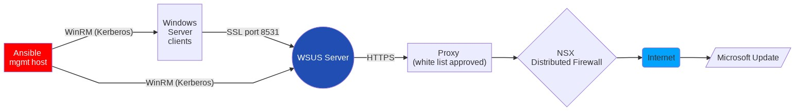
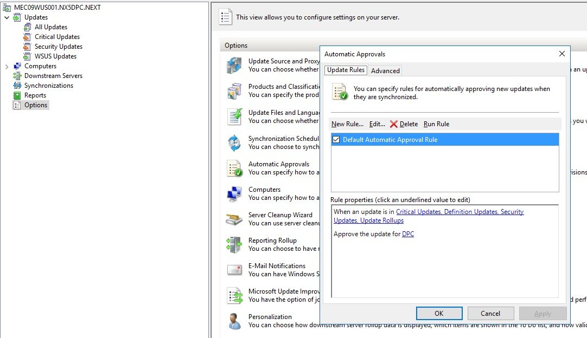
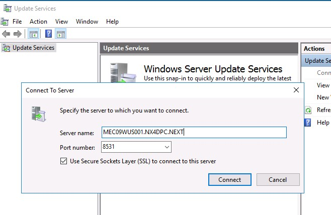
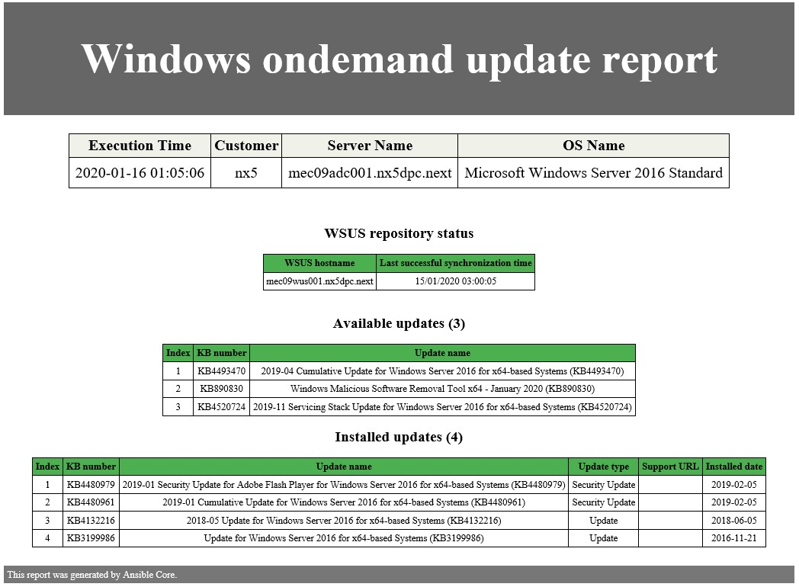
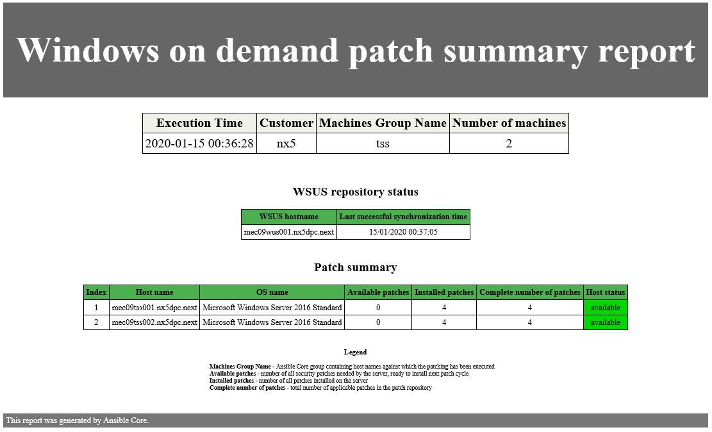
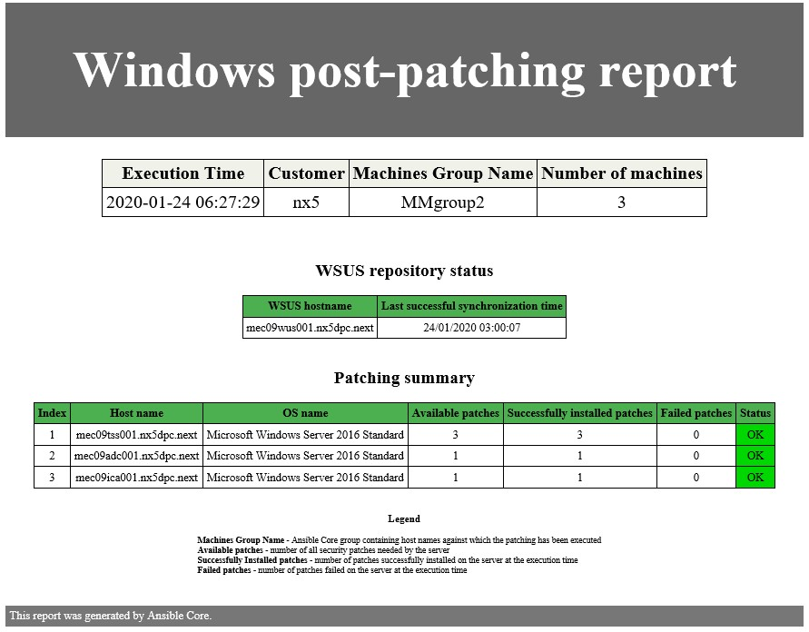

# Windows Patching

## Changelog

| Version | Date | User | Changes |
|---------|------|------|---------|
| 0.1 | 01.2020 | Jakub Wosko | draft version |
| 0.2 | 07.02.2020 | Robert Kaminski| review and updates |
| 0.3 | 24.09.2020 | Jakub Wosko| correct name of windows patching playbook, added table of contents |
| 0.4 | 05.09.2022 | Margo Piliukh | CESDHC-3989 - added the evidence collection in the CES Evidence repository |
| 0.5 | 09/08/2023 | Radoslaw Dabrowski | VCS-10487 - Updated link to SP to collect evidences. |
| 0.6 | 16/04/2024 | Adam Szymczak | VCS-12436 - Added section on automated patching |
| 0.7 | 07/06/2024 | Stanislaw Kilanowski | VCS-12744 - Added information about automated report delivery |
| 0.8 | 24/10/2024 | Stanislaw Kilanowski | VCS-14175 - Updated for consolidated patching reports |
| 0.9 | 14/10/2025 | Przemyslaw Pakula | VCS-17332 - Correct all entries containing .yaml to .yml |
| 1.0 | 09/02/2026 | Toader Gurin | VCS-18200 - CAT as Test Environment for Patching Activities |

## Introduction

### Purpose

Execute Windows management servers patching and gather/generate reports for VCS.

### Audience

- VCS Operations

### Scope

This document covers the following tasks and activities:

- **Generate on-demand Windows patching reports**
- **Execute Windows patching playbook**
- **Upload reports to the CES Evidence repository**

The following tasks are out of scope of this document:

- **Windows Patching process**

**DISCLAIMER: Windows Patching process contain setting maintenance windows, agreement with security officers in the area of approved patches etc. The actual change process is out of scope

## Introduction

VCS contains it's own windows patch repository based on Windows Update Services (wus001). WSUS synchronizes patches from vendor, directly from Microsoft Update. All Windows servers joined to domain are automatically configured to use internal WSUS server as a Windows Update source. This configuration is applied by Group Policy (GPO).



Windows Clients synchronize patches directly from VCS WSUS server.
Patching is triggered from Ansible Mgmt Server.

## Prerequisites

- Ansible Mgmt server (ans001) is member of the management active directory (automated in VCS build).
- Ansible Mgmt server (ans001) is configured to use kerberos as an authentication method (automated in VCS hardening).
- Operator uses their personal management domain account (account creation is part of VCS hardening).
- Windows Update server (wus001) has patch catalog sync with Microsoft Update and the patches are approved (AutoApprove enabled by default in VCS buid).
- In case Integration Architect decided to disable patch auto approval on WUS, the patch approval has to be done manually.

## Windows Update Server - patch approval

Default configuration of WSUS is to automatically approve all Microsoft security and critical updates for dedicated product (by default windows 2016 server).
Refer to patching LLD to understand the concept.



The automatic approval configuration on the WSUS server can be changed by Cloud Operational team at any time if this is required by Account to follow patching process.

> IMPORTANT: WSUS is configured to use Secure Sockets Layer (SSL) protocol to help protect Windows Server Update Services.



## Patching groups

VCS Engineering has predefined three Windows maintenance groups:

| Group Name | Hosts |
| --- | --- |
| MMgroup1 | *tss002* (second Bastion Host) <br> *adc002* (second Domain Controller) |
| MMgroup2 | *tss001* (first Bastion Host) <br> *adc001* (first Domain Controller) <br> *ica001* (Certificate Issuer server) |
| MMgroup3 | *wus001* (WSUS server) |

Configuration of those groups is defined in Ansible inventory text file **/opt/dhc/manage/hosts** on Ansible Mgmt server (ans001) server.

Edit the inventory file to adjust maintenance group when needed.

## Functionality

Patching solution in VCS has two functionalities:

- Main functionality is automated patching of Windows servers. Post patching reports are generated automatically and stored in the WSUS dedicated folder.
- Second is on-demand reporting.

## On-demand reports

As mentioned above one of the functionality of Windows patching solution is on-demand reporting.

We have two types of reports implemented:

- Detailed on-demand update report (playbook name: *generateOnDemandPatchReportWindows.yml*)
  Contains list of available and list of installed Windows Updates on the server. This playbook generates separate report for every chosen server.

  Example report

  

- Summary on-demand update report (playbook name: *generateOnDemandPatchSummaryReportWindows.yml*)
  Contains summary amount of installed and available Windows Updates

  Example report

  

All Windows patching reports are stored on WSUS (wus001) server (default path for reports is: *D:\AnsiblePatchReport*).

Playbooks are executed from Ansible (ans001) host (path for playbooks/roles: */opt/dhc/manage*).

### How to generate on demand reports

- login to manage ansible host (ans001) with your personal domain account

- change path to */opt/dhc/manage*

  ```shell
  cd /opt/dhc/manage/
  ```
  
- run ansible playbook with parameter ***HOSTS*** which determines against which hosts report will be generated:

*On demand summary report*

```bash
ansible-playbook generateOnDemandPatchSummaryReportWindows.yml -e HOSTS=<host names or group names comma separated>
```

*On demand detailed report*

```bash
ansible-playbook generateOnDemandPatchReportWindows.yml -e HOSTS=<host names or group names comma separated>
```

Where ***HOSTS*** parameter is a host names  or host group names from Ansible inventory file.
For example:

```bash
-e HOSTS=MMgroup1
-e HOSTS=MMgroup1,MMgroup2
-e HOSTS=tss001
-e HOSTS=tss001,ica001
```

Some examples how to generate reports:

```bash
ansible-playbook generateOnDemandPatchSummaryReportWindows.yml -e HOSTS=tss001
ansible-playbook generateOnDemandPatchSummaryReportWindows.yml -e HOSTS=MMgroup1
ansible-playbook generateOnDemandPatchSummaryReportWindows.yml -e HOSTS=tss001,MMgroup1
```

```bash
ansible-playbook generateOnDemandPatchReportWindows.yml -e HOSTS=MMgroup2
ansible-playbook generateOnDemandPatchReportWindows.yml -e HOSTS=MMgroup2,MMgroup3
ansible-playbook generateOnDemandPatchReportWindows.yml -e HOSTS=tss001,adc001
```

- To check and see reports login to WSUS (wus001) server and explore folders:
  - D:\AnsiblePatchReport\on_demand
  - D:\AnsiblePatchReport\summary_reports

    Reports naming convention is:
  - on-demand summary report: *On_Demand_Patch_Summary_Report_\<date\>_\<time\>.html*.\
      for example: `On_Demand_Patch_Summary_Report_20200116_005105.html`

  - on-demand report: *\<date\>\_\<time\>\\\<inventory_hostname\>\_\<date\>_\<time\>_report.html*.\
      for example: `20200123_050023\tss001_20200123_050023_report.html`

> It is recommended that on-demand reports should be generated before every patching session.

## How to perform patching for Windows servers

### Manual patching execution

Before running the patching playbook it is recommended to run the reports playbook, to have information how many updates are missing on servers.

To run playbook follow this steps:

- login to manage ansible host (ans001) with your domain account

- change path to */opt/dhc/manage*

  ```bash
  cd /opt/dhc/manage/
  ```

- run ansible playbook with parameter ***HOSTS*** which determines for which hosts report will be generated:

  ```bash
     ansible-playbook patchWindows.yml -e HOSTS=<names of hosts or groups>
  ```

  Where ***HOSTS*** parameter is a list of hosts or host groups from Ansible inventory.
  For example:

  ```yaml
    -e HOSTS=MMgroup1
    -e HOSTS=MMgroup1,MMgroup2
    -e HOSTS=tss001
    -e HOSTS=tss001,ica001
  ```

- post patching report

  This report is generated when patching is finished and contains summary of available, installed and failed updates for all servers given to patching.

  It is sent via an e-mail to the team (by default DHC DevSecOps but can be overwritten with extra vars).

  The reports are also stored on WSUS (wus001). To check and see the reports login to the server and explore folder <ins>*D:\AnsiblePatchReport\post_patching*</ins>.

  Reports naming convention is: *\<HOSTS\>\_\<date\>\_\<time\>_report.html*.\
  for example: `MMgroup3_20200124_110014_report.html`

  Example report:

  

### Automatic patching execution using crontab

Patching can also be set to be executed automatically by using cron on Ansible Core VM.

#### Configuring cronjobs

Crontab can be configured using dedicated playbook:

```bash
ansible-playbook configurePatchingCron.yml
```

**Note:**
Before configuring cronjobs make sure `aut05` certificate is configured on Ansible Core VM.

This playbook will add nine cron jobs, eight of which will run patching for both Windows and Linux VMs (along with Ansible Core reboot).
Those jobs are scheduled in 2 batches:

- 3rd Tuesday morning of the month (MMgroup2, MMgroupL2, MMgroupL1, Ansible Core reboot)
- Thursday morning after 1st batch (MMgroup1, MMgroup3, MMgroupL3, MMgroupL4)

Lastly a job is executed on the Friday morning after the 1st batch to consolidate patching reports and send them via an e-mail.

Alternative configuration options are also available:

- enable only 1st batch jobs

```bash
ansible-playbook configurePatchingCron.yml -t batch1
```

- enable only Windows jobs

```bash
ansible-playbook configurePatchingCron.yml -t windows
```

- enable job for only one maintenance group

```bash
ansible-playbook configurePatchingCron.yml -t MMgroup1
```

- enable job for e-mail reporting

```bash
ansible-playbook configurePatchingCron.yml -t report
```

The playbook can also be used to disable the jobs in case it's required by defining `cronDisabled` variable:

```bash
ansible-playbook configurePatchingCron.yml -e "cronDisabled=true"
```

**Note:**
Defining patches to be installed and report upload remain manual steps to be carried out by engineer.

#### Verification of automated patching

Once first batch of automated patching is executed engineer should verify post patching reports - stored as JSON files in:

- `/backup/reports/postPatchingCron` on `<locationCode>ans001`
- `D:\AnsiblePatchReport\post_patching` on `<locationCode>wus001`

**Note:**
The former location is cleared once a consolidated report is generated.

If reports are not present or are incomplete, verify patching logs at `/var/log` on Ansible Core VM and resolve any issues found.
If VMs patched during first batch are showing any sing of possible problems, second patching batch should be postponed until issues are resolved.

The same verification should be carried out after second batch of patching is executed.

After all patching jobs were executed a consolidated report will be sent to the team's mailbox (by default DHC DevSecOps but can be overwritten with extra vars). This report needs to be uploaded to **CES Evidence Repository** as during manual patching.

## SIEMENS CAT as TEST Environment Patching

For testing purposes, CAT servers are patched on Mondays and Wednesdays, one day earlier than other environments. This allows any issues to be identified and resolved before impacting PROD environments, where patching runs in parallel.


## Gathering and uploading evidence

All post-patching reports should be gathered and uploaded the appropriate folder in the **CES Evidence Repository**. This applies to every customer and a separate folder is created for this purpose. The CES Evidence patching reports location can be found under this [link](https://atos365.sharepoint.com/:f:/r/sites/100004564/CES%20Evidence%20repository/CES%20Practice%20CTO%20DHC/Vulnerability%20Management%20(Patch%20Management)/Patch%20Reports?csf=1&web=1&e=iYoBSn).

If you don't have permissions to access this repository, contact the **Service Delivery Manager** or the **Service Manager**.
